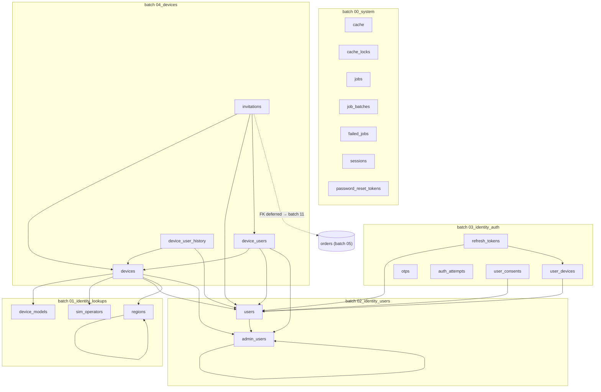
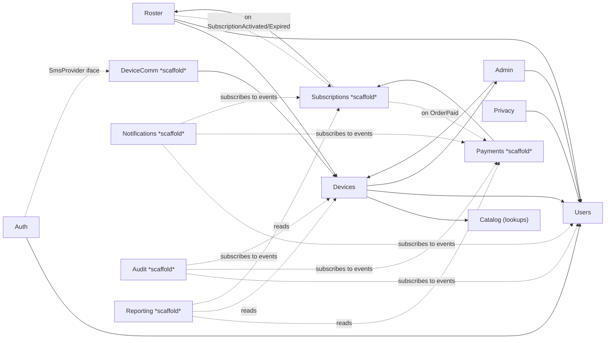

# Salam Həyətimiz — Review Package (Phase 1A foundations + migration batches 00–04)

**Version:** 1.0
**Date:** 2026-06-13
**Scope under review:** the foundations commit only — Laravel 12 skeleton, domain module structure, base architecture, and migration batches **00–04**. Nothing from batches 05–11 and no module business logic is in scope.
**Source of truth:** [PROJECT_CONSTITUTION.md](PROJECT_CONSTITUTION.md) + the frozen v1.1 documents.
**Verification already run:** `php -l` on all 118 PHP files → 0 syntax errors; `php docs/openapi/validate.php` → green (unchanged).

## How to read this package

- **§1 File tree** — everything generated, annotated.
- **§2 Traceability matrix** — every file: *why it exists*, *which specification section it implements*, *which constitution rules it satisfies*. This is the audit lens; it covers **all** files (Support, middleware, routes, seeders, lang, etc.), not only the embedded categories.
- **§3 Diagrams** — migration dependency graph, domain module dependency graph, Laravel boot sequence.
- **§4 Embedded source** — full verbatim source of the explicitly requested categories: `composer.json`, `bootstrap/app.php`, **all configuration files**, **all service providers**, **all enums**, **all models**, **all migrations**. (Support/middleware/exception/route/seeder/lang files are covered in the matrix with their exact paths for line-level review in-repo, to avoid duplicating a large surface that could drift from the canonical files.)

> This is a read-only audit artifact. No code was generated or changed to produce it.

---

## 1. Complete File Tree

```
salam/
├── composer.json                         # Laravel 12 / PHP 8.4 project manifest, pinned deps
├── artisan                               # console entrypoint (L12)
├── phpunit.xml                           # Pest/PHPUnit; Feature/Integration → MariaDB
├── phpstan.neon                          # Larastan level 8
├── .env.example                          # env template (az default, Redis logical split, JWT keys)
├── .gitignore
├── README.md
├── bootstrap/
│   ├── app.php                           # L12 bootstrap: routing split, middleware, exceptions
│   ├── providers.php                     # provider registration list
│   └── cache/.gitignore
├── public/
│   └── index.php                         # HTTP entrypoint
├── storage/                              # framework dirs (.gitignore placeholders) + keys/ (JWT pem)
├── config/
│   ├── app.php                           # locale=az, UTC, schedule tz Asia/Baku, available_locales
│   ├── auth.php                          # eloquent providers (users/admins); JWT guards land later
│   ├── audit.php                         # retention + immutable-table + DB role config
│   ├── cache.php                         # redis store (DB0) + lock connection (DB2)
│   ├── database.php                      # MariaDB read/write split + Redis logical DB 0–4
│   ├── queue.php                         # redis queue (DB1) + failed-jobs (database-uuids)
│   ├── broadcasting.php                  # Reverb + redis (DB3)
│   ├── horizon.php                       # 7 named queues (high/default/device-comm/…)
│   ├── domain/
│   │   ├── devices.php                   # cooldowns, offline threshold, whitelist guard
│   │   ├── subscriptions.php             # term/grace/reminder days, default prices (minor)
│   │   ├── payments.php                  # callback timeout, refund window, getOrderStatus flag
│   │   ├── notifications.php             # channel bitmask, mutable categories
│   │   ├── device_comm.php               # operator_default_drivers, transient codes, voice CB
│   │   └── privacy.php                   # anonymise-on-soft-delete, reactivation window
│   └── integrations/
│       ├── kapital.php                   # base url, hmac secret, ip allowlist
│       ├── sms.php                       # provider, inbound hmac
│       ├── voice.php                     # two gateways
│       └── fcm.php                       # push
├── app/
│   ├── Providers/
│   │   ├── AppServiceProvider.php        # Clock binding; migration-subfolder loader; strict models
│   │   ├── DomainServiceProvider.php     # auto-discovers 13 ModuleServiceProviders
│   │   ├── IntegrationsServiceProvider.php # integration interface bindings (stub now)
│   │   ├── AuthServiceProvider.php       # policy map + coarse role gates
│   │   ├── EventServiceProvider.php      # per-module events (no-op now)
│   │   ├── RouteServiceProvider.php      # rate-limit buckets (§9.5)
│   │   └── BroadcastServiceProvider.php  # broadcasting (channels wired later)
│   ├── Support/
│   │   ├── Enums/Locale.php              # az(default)/ru/en
│   │   ├── Enums/ActorKind.php           # user/admin/system (history/audit)
│   │   ├── Money/Money.php               # integer minor-unit value object
│   │   ├── Phone/PhoneNumber.php         # E.164 canonicalisation + mask
│   │   ├── Time/Clock.php                # injectable clock interface
│   │   ├── Time/SystemClock.php          # UTC system clock
│   │   ├── Locale/LocaleResolver.php     # Accept-Language ∩ supported → az
│   │   ├── Redaction/Redactor.php        # phone/PAN/email redaction
│   │   └── Pagination/Cursor.php         # opaque cursor encode/decode
│   ├── Exceptions/
│   │   ├── Contracts/DomainException.php  # base for domain exceptions
│   │   └── Renderers/ApiExceptionRenderer.php # standard error envelope
│   ├── Http/
│   │   ├── Middleware/RequestId.php       # X-Request-Id (ULID) + Context
│   │   ├── Middleware/LocaleNegotiator.php
│   │   ├── Middleware/EnforceJson.php
│   │   └── Api/V1/Controllers/Health/HealthController.php
│   └── Domain/
│       ├── Auth/        ModuleServiceProvider · Enums(OtpPurpose, Platform, RefreshTokenRevocationReason,
│       │                AuthActorKind, AuthOutcome) · Models(UserDevice, RefreshToken, Otp, AuthAttempt)
│       ├── Users/       ModuleServiceProvider · Enums(UserStatus) · Models(User)
│       ├── Catalog/     ModuleServiceProvider · Models(SimOperator, DeviceModel, Region)
│       ├── Devices/     ModuleServiceProvider · Enums(DeviceStatus, DriverType, SimStatus) · Models(Device)
│       ├── Roster/      ModuleServiceProvider · Enums(DeviceUserRole, DeviceUserStatus, InvitationStatus,
│       │                InvitationPayer, RosterEventType) · Models(DeviceUser, DeviceUserHistory, Invitation)
│       ├── Admin/       ModuleServiceProvider · Enums(AdminRole, AdminStatus) · Models(AdminUser)
│       ├── Privacy/     ModuleServiceProvider · Enums(ConsentKind) · Models(UserConsent)
│       ├── DeviceComm/      ModuleServiceProvider (skeleton)
│       ├── Subscriptions/   ModuleServiceProvider (skeleton)
│       ├── Payments/        ModuleServiceProvider (skeleton)
│       ├── Notifications/   ModuleServiceProvider (skeleton)
│       ├── Audit/           ModuleServiceProvider (skeleton)
│       └── Reporting/       ModuleServiceProvider (skeleton)
├── database/
│   ├── migrations/
│   │   ├── 00_system/            create_cache · create_jobs · create_sessions · create_password_reset_tokens
│   │   ├── 01_identity_lookups/  create_sim_operators · create_device_models · create_regions
│   │   ├── 02_identity_users/    create_admin_users · create_users
│   │   ├── 03_identity_auth/     create_user_devices · create_refresh_tokens · create_otps ·
│   │   │                         create_auth_attempts · create_user_consents
│   │   └── 04_devices/           create_devices · create_device_users · create_device_user_history ·
│   │                             create_invitations
│   └── seeders/
│       ├── DatabaseSeeder.php
│       └── Lookups/  SimOperatorSeeder · DeviceModelSeeder · RegionSeeder
├── lang/
│   ├── az/  errors.php · validation.php · common.php   (source of truth)
│   ├── ru/  errors.php · validation.php · common.php
│   └── en/  errors.php · validation.php · common.php
├── routes/
│   ├── api.php       # /v1 (health wired; rest per increment)
│   ├── admin.php     # /admin/v1
│   ├── webhooks.php  # /v1 webhooks (signature-auth)
│   ├── channels.php  # Reverb channels
│   ├── console.php   # scheduler
│   └── web.php       # admin Blade root
└── docs/
    ├── PROJECT_CONSTITUTION.md
    ├── REVIEW_PACKAGE.md                 # (this file)
    └── decisions/laravel12-skeleton-mapping.md
```

**Counts:** 18 migration tables · 14 Eloquent models · 17 domain enums (+2 Support enums) · 7 framework service providers · 13 module service providers · 16 config files · 9 lang files · 6 route files · 3 lookup seeders.

---

## 2. Traceability Matrix

Legend: **Spec §** cites the frozen v1.1 doc (TS = TECHNICAL_SPECIFICATION, DB = DATABASE_ARCHITECTURE, BE = BACKEND_ARCHITECTURE, LOC = LOCALIZATION_SPECIFICATION, API = openapi/v1.yaml). **Rules** cite PROJECT_CONSTITUTION IDs.

### 2.1 Root & bootstrap

| File | Why it exists | Spec § | Constitution rules |
|---|---|---|---|
| `composer.json` | Project manifest; pins Laravel 12 / PHP 8.4 and the mandated libraries (horizon, reverb, lcobucci/jwt, spatie/laravel-data, pest, larastan). | TS §0 stack; TS §3.5 | R-ARCH-01, R-CODE-01, R-CODE-03, R-CODE-09, R-CODE-10 |
| `artisan` | Console entrypoint (L12). | — | R-ARCH-01 |
| `public/index.php` | HTTP entrypoint (L12). | — | R-ARCH-01 |
| `bootstrap/app.php` | Wires surface separation (/v1, /admin/v1, webhooks), the middleware stack (§6.5), and the error-envelope render hooks. | BE §6.1, §6.5, §6.6 | R-API-03, R-API-05, R-ARCH-04; decision: laravel12-skeleton-mapping |
| `bootstrap/providers.php` | Registers framework + project providers (Domain/Integrations). | BE §3 | R-ARCH-02 |
| `phpunit.xml` | Test config; Feature/Integration bound to MariaDB. | TS §20 | R-CODE-09 |
| `phpstan.neon` | Static analysis at Larastan level 8. | TS §3.5 | R-CODE-01 |
| `.env.example` | Env template: az locale, Redis logical DBs, JWT key paths. | TS §18; LOC §6 | R-LOC-01, R-ARCH-10, R-SEC-08 |

### 2.2 Configuration

| File | Why it exists | Spec § | Constitution rules |
|---|---|---|---|
| `config/app.php` | App name/env/key; **locale=az, fallback=az**; UTC; schedule tz Asia/Baku; `available_locales`. | TS §6.6; LOC §1, §15.1 | R-LOC-01, R-DOM-16 |
| `config/auth.php` | Eloquent providers for `users`/`admins`; JWT guards added in Auth increment. | BE §7.1 | R-API-03, R-SEC-05 |
| `config/audit.php` | Retention windows; immutable tables; runtime/migrator DB roles. | TS §16; DB §8.1 | R-SEC-12, R-WF-11 |
| `config/cache.php` | Redis cache store (DB0) + lock connection (DB2). | BE §11.1.1 | R-ARCH-10 |
| `config/database.php` | MariaDB read/write split; utf8mb4_unicode_ci; Redis logical DBs 0–4. | DB §0, §13.4; BE §11.1.1 | R-ARCH-10, R-ARCH-11, R-DOM-16 |
| `config/queue.php` | Redis queue (DB1); failed-jobs `database-uuids`. | BE §9 | R-WF-08 |
| `config/broadcasting.php` | Reverb connection + redis pub/sub (DB3). | TS §6.4; §18.2.1 | R-ARCH-12 |
| `config/horizon.php` | The 7 named queues + worker sizing. | BE §9.1 | R-WF-08 |
| `config/domain/devices.php` | Cooldowns (5s/2s), offline threshold, whitelist capacity/burst-guard defaults. | TS App. B; §3.1 | R-DOM-09, R-DOM-14, R-GSM-08 |
| `config/domain/subscriptions.php` | term 365, grace 7, reminders [30,15,7,1], default prices (minor). | TS §13, App. B | R-DOM-08, R-DOM-09 |
| `config/domain/payments.php` | Callback timeout, refund window, one-authorising-per-sub, getOrderStatus flag. | TS §14, App. B | R-PAY-04, R-PAY-09, R-PAY-11, R-PAY-13 |
| `config/domain/notifications.php` | Channel bitmask, mutable categories, payload cap. | TS §17; DB §7.1 | R-LOC-03 (content in DB), MED-06 |
| `config/domain/device_comm.php` | `operator_default_drivers`, transient/non-transient codes, expected-completion defaults, voice circuit-breaker. | TS §12.6.1, §12.7, §12.10 | R-GSM-02, R-GSM-04, R-GSM-05, R-GSM-09 |
| `config/domain/privacy.php` | Immediate anonymise-on-soft-delete; reactivation 30 days; hash algo. | TS §3.7 | R-DOM-02 |
| `config/integrations/kapital.php` | Hosted-3DS base url, HMAC secret, IP allowlist. | TS §14.1, §14.3 | R-PAY-01, R-PAY-03, R-PAY-07 |
| `config/integrations/sms.php` | SMS provider + inbound HMAC (fake default). | TS §12.8, §17 | R-ARCH-08, R-API-08 |
| `config/integrations/voice.php` | Two voice gateways + timeouts. | TS §12.6.2 | R-GSM-05 |
| `config/integrations/fcm.php` | FCM push credentials. | TS §17.1 | R-ARCH-08 |

### 2.3 Service providers

| File | Why it exists | Spec § | Constitution rules |
|---|---|---|---|
| `AppServiceProvider` | Binds `Clock`; loads migration subfolders (DB §11 batch dirs); enables strict-model checks. | BE §3, §11; §13.1 | R-CODE-08, R-WF-03, R-DOM-15 |
| `DomainServiceProvider` | Auto-discovers each `app/Domain/*/ModuleServiceProvider` so new modules need no central edit. | BE §3.1 | R-ARCH-02 |
| `IntegrationsServiceProvider` | Single home for vendor-replaceable interface bindings (stub now; bindings land per module). | BE §13 | R-ARCH-08 |
| `AuthServiceProvider` | Policy map (empty now) + coarse role gates (`admin.role.super/technical`, `maintenance.bypass`). | BE §7.2, §7.3 | R-SEC-11 |
| `EventServiceProvider` | Placeholder; domain events registered per-module. | BE §8 | R-ARCH-07 |
| `RouteServiceProvider` | Defines the rate-limit buckets (otp-request/verify, open, mobile, admin, public). | TS §9.5; BE §6.5 | R-SEC-16 |
| `BroadcastServiceProvider` | Explicit provider per §3; channel auth wired with the realtime increment. | BE §3, §6.4 | R-ARCH-12 |

### 2.4 Support, exceptions, middleware, HTTP

| File | Why it exists | Spec § | Constitution rules |
|---|---|---|---|
| `Support/Enums/Locale` | Canonical locale set; az default. | LOC §1 | R-LOC-01 |
| `Support/Enums/ActorKind` | user/admin/system for append-only history & audit. | DB §3.3, §8.1 | R-DOM-11, R-SEC-12 |
| `Support/Money/Money` | Integer minor-unit value object; no floats. | DB §0.1 | R-DOM-15, R-CODE-11 |
| `Support/Phone/PhoneNumber` | E.164 canonicalisation + display mask. | API phone pattern; MED-03; TS §16.4 | R-API-07, R-CODE-11 |
| `Support/Time/Clock` + `SystemClock` | Injectable UTC clock for testability. | BE §13.1 | R-CODE-08, R-DOM-16 |
| `Support/Locale/LocaleResolver` | Accept-Language ∩ supported → az. | LOC §6 | R-LOC-08 |
| `Support/Redaction/Redactor` | phone/PAN/email log redaction. | TS §16.4 | R-SEC-15 |
| `Support/Pagination/Cursor` | Opaque cursor for cursor pagination. | API; TS §9.1 | R-API-06 |
| `Exceptions/Contracts/DomainException` | Base hooks (httpStatus/errorCode/messageKey/details). | BE §6.6 | R-CODE-04 |
| `Exceptions/Renderers/ApiExceptionRenderer` | Renders the standard error + validation envelopes. | TS §9.1; API | R-API-05 |
| `Http/Middleware/RequestId` | ULID X-Request-Id + log Context correlation. | BE §6.5; TS §16.2 | R-API-05 (request_id), R-SEC-15 |
| `Http/Middleware/LocaleNegotiator` | Sets request locale (profile → header → az). | LOC §6 | R-LOC-08 |
| `Http/Middleware/EnforceJson` | Rejects non-JSON mutating bodies. | BE §6.5 | R-API-03 |
| `Http/Api/V1/Controllers/Health/HealthController` | `getHealthLive`/`getHealthReady` probes. | TS §3.6; API | R-API-02 |

### 2.5 Domain enums

| File | Why it exists | Spec § (column) | Constitution rules |
|---|---|---|---|
| `Users/Enums/UserStatus` | `users.status` (active/blocked/self_deleted). | DB §1.1 | R-DOM-06, R-CODE-02 |
| `Admin/Enums/AdminRole` | `admin_users.role`. | DB §1.2 | R-SEC-11, R-CODE-02 |
| `Admin/Enums/AdminStatus` | `admin_users.status`. | DB §1.2 | R-CODE-02 |
| `Auth/Enums/OtpPurpose` | `otps.purpose`. | DB §1.5 | R-SEC-03, R-CODE-02 |
| `Auth/Enums/Platform` | `user_devices.platform`. | DB §1.3 | R-CODE-02 |
| `Auth/Enums/RefreshTokenRevocationReason` | `refresh_tokens.revocation_reason`. | DB §1.4 | R-SEC-02, R-CODE-02 |
| `Auth/Enums/AuthActorKind` | `auth_attempts.actor_kind`. | DB §1.6 | R-CODE-02 |
| `Auth/Enums/AuthOutcome` | `auth_attempts.outcome`. | DB §1.6 | R-SEC-16, R-CODE-02 |
| `Privacy/Enums/ConsentKind` | `user_consents.consent_kind`. | DB §1.7 | R-CODE-02 |
| `Devices/Enums/DeviceStatus` | `devices.status`. | DB §3.1 | R-DOM-06, R-CODE-02 |
| `Devices/Enums/DriverType` | `devices.driver_type` / model defaults. | DB §3.1, §2.2 | R-GSM-01, R-CODE-02 |
| `Devices/Enums/SimStatus` | `devices.sim_status` (placeholder). | DB §3.1; HIGH-04 | R-GSM-11, R-CODE-02 |
| `Roster/Enums/DeviceUserRole` | `device_users.role`. | DB §3.2 | R-CODE-02 |
| `Roster/Enums/DeviceUserStatus` | `device_users.status`. | DB §3.2 | R-DOM-10, R-CODE-02 |
| `Roster/Enums/InvitationStatus` | `invitations.status`. | DB §3.4 | R-CODE-02 |
| `Roster/Enums/InvitationPayer` | `invitations.payer`. | DB §3.4; TS §13 | R-DOM-04, R-CODE-02 |
| `Roster/Enums/RosterEventType` | `device_user_history.event`. | DB §3.3 | R-DOM-11, R-CODE-02 |

### 2.6 Models

| File | Why it exists | Spec § | Constitution rules |
|---|---|---|---|
| `Catalog/Models/SimOperator` | Lookup; analytics/driver routing without hardcoded strings. | DB §2.1 | R-ARCH-09, R-GSM-02 |
| `Catalog/Models/DeviceModel` | Hardware catalogue; capacity + fallback driver. | DB §2.2 | R-DOM-14, R-GSM-04 |
| `Catalog/Models/Region` | Reporting grouping (self-referencing). | DB §2.3 | R-ARCH-09 |
| `Users/Models/User` | Mobile identity; soft-delete; enum casts. | DB §1.1; BE §14.2 | R-DOM-01, R-DOM-02, R-CODE-02 |
| `Admin/Models/AdminUser` | Back-office identity; encrypted TOTP secret, hashed password, recovery-code array, preferred_language. | DB §1.2; BE §14.13 | R-SEC-05, R-SEC-06, R-SEC-13, R-LOC-08 |
| `Auth/Models/UserDevice` | Mobile install; push token hidden. | DB §1.3; BE §14.1 | R-SEC-02 |
| `Auth/Models/RefreshToken` | Rotated refresh token; hash hidden; no updated_at. | DB §1.4 | R-SEC-02 |
| `Auth/Models/Otp` | OTP; code hash hidden; created_at only. | DB §1.5 | R-SEC-03 |
| `Auth/Models/AuthAttempt` | Append-only auth attempt. | DB §1.6 | R-SEC-16 |
| `Privacy/Models/UserConsent` | Append-only consent ledger. | DB §1.7; BE §14.11 | R-DOM (privacy) |
| `Devices/Models/Device` | Access controller; soft-delete; enum casts incl. driver/sim status. | DB §3.1; BE §14.4 | R-DOM-06, R-GSM-01, R-DOM-17 |
| `Roster/Models/DeviceUser` | Roster association (sub anchors here); is_active read-only. | DB §3.2; BE §14.5 | R-DOM-03, R-DOM-10 |
| `Roster/Models/DeviceUserHistory` | Append-only roster history. | DB §3.3 | R-DOM-11 |
| `Roster/Models/Invitation` | Pending invitation; token hidden; payer enum. | DB §3.4 | R-DOM-04, R-DOM-13 |

### 2.7 Module service providers

| File | Module owns (BE §14.x) | Status |
|---|---|---|
| `Auth/ModuleServiceProvider` | OTP, JWT, refresh rotation, biometrics (§14.1) | scaffold |
| `Users/ModuleServiceProvider` | profile, language, anonymisation (§14.2) | scaffold |
| `Catalog/ModuleServiceProvider` | sim_operators, device_models, regions (§14.3) | scaffold |
| `Devices/ModuleServiceProvider` | device lifecycle, DeviceAccessQuery (§14.4) | scaffold |
| `Roster/ModuleServiceProvider` | roster, invitations, capacity/burst guard (§14.5) | scaffold |
| `DeviceComm/ModuleServiceProvider` | driver layer, gateways, whitelist outbox (§14.6) | scaffold |
| `Subscriptions/ModuleServiceProvider` | entitlement lifecycle, periods, sweeps (§14.7) | scaffold |
| `Payments/ModuleServiceProvider` | orders, Kapital, callback, refunds (§14.8) | scaffold |
| `Notifications/ModuleServiceProvider` | template fan-out (§14.9) | scaffold |
| `Audit/ModuleServiceProvider` | immutable audit log (§14.10) | scaffold |
| `Privacy/ModuleServiceProvider` | consents, DSR, anonymisation (§14.11) | scaffold |
| `Reporting/ModuleServiceProvider` | daily stats, report jobs (§14.12) | scaffold |
| `Admin/ModuleServiceProvider` | admins, settings, flags, templates (§14.13) | scaffold |

All satisfy **R-ARCH-02** (per-bounded-context module with auto-discovered provider) and **R-ARCH-06** (public surface = Services/Events only).

### 2.8 Migrations

| File (batch) | Table(s) | Spec § | Constitution rules |
|---|---|---|---|
| `00_system/…_create_cache_table` | cache, cache_locks | DB §10 | R-ARCH-10, R-WF-03 |
| `00_system/…_create_jobs_table` | jobs, job_batches, failed_jobs | DB §10 | R-WF-08, R-WF-03 |
| `00_system/…_create_sessions_table` | sessions | DB §10 | R-WF-03 |
| `00_system/…_create_password_reset_tokens_table` | password_reset_tokens | DB §10 | R-SEC-05 |
| `01_identity_lookups/…_create_sim_operators_table` | sim_operators | DB §2.1 | R-GSM-02, R-WF-03 |
| `01_identity_lookups/…_create_device_models_table` | device_models | DB §2.2 | R-DOM-14, R-GSM-04 |
| `01_identity_lookups/…_create_regions_table` | regions | DB §2.3 | R-DOM-17 |
| `02_identity_users/…_create_admin_users_table` | admin_users | DB §1.2 | R-SEC-05, R-SEC-06, **R-LOC-08 (preferred_language fix — Appendix A.3)** |
| `02_identity_users/…_create_users_table` | users | DB §1.1 | R-DOM-01, R-DOM-02, R-DOM-17 |
| `03_identity_auth/…_create_user_devices_table` | user_devices | DB §1.3 | R-SEC-02 |
| `03_identity_auth/…_create_refresh_tokens_table` | refresh_tokens | DB §1.4 | R-SEC-02 |
| `03_identity_auth/…_create_otps_table` | otps | DB §1.5 | R-SEC-03 |
| `03_identity_auth/…_create_auth_attempts_table` | auth_attempts | DB §1.6 | R-SEC-16 |
| `03_identity_auth/…_create_user_consents_table` | user_consents | DB §1.7 | privacy / AZ law |
| `04_devices/…_create_devices_table` | devices | DB §3.1 | R-DOM-06, R-GSM-01, R-DOM-14, R-DOM-17 |
| `04_devices/…_create_device_users_table` | device_users | DB §3.2 | R-DOM-03, **R-DOM-10 (STORED is_active unique, HIGH-07)** |
| `04_devices/…_create_device_user_history_table` | device_user_history | DB §3.3 | R-DOM-11 |
| `04_devices/…_create_invitations_table` | invitations | DB §3.4 | R-DOM-04, R-DOM-13; **linked_order_id FK deferred to batch 11** |

### 2.9 Seeders, lang, routes

| File | Why | Spec § | Rules |
|---|---|---|---|
| `seeders/DatabaseSeeder` | orchestrates lookup seeders | DB §11.1 | R-WF-03 |
| `seeders/Lookups/SimOperatorSeeder` | Azercell/Bakcell/Nar | DB §11.1 | R-GSM-02 |
| `seeders/Lookups/DeviceModelSeeder` | initial reference model | DB §11.1 | R-DOM-14 |
| `seeders/Lookups/RegionSeeder` | Baku + districts | DB §11.1 | — |
| `lang/{az,ru,en}/errors.php` | error-code → message; az source | LOC §5, §11 | R-LOC-02, R-LOC-05 |
| `lang/{az,ru,en}/validation.php` | validation baseline + custom phone | LOC §5; Roadmap 1A | R-LOC-04 |
| `lang/{az,ru,en}/common.php` | shared UI atoms | LOC §5.2 | R-LOC-04 |
| `routes/api.php` | /v1 (health now) | BE §6.1; API | R-API-02, R-API-03 |
| `routes/admin.php` | /admin/v1 | BE §6.1 | R-API-03, R-SEC-16 |
| `routes/webhooks.php` | signature-auth webhooks | BE §6.1; API | R-API-08, R-PAY-03 |
| `routes/channels.php` | Reverb channels | TS §6.4 | R-ARCH-12 |
| `routes/console.php` | scheduler aggregation | BE §10 | R-WF-09 |
| `routes/web.php` | admin Blade root | BE §11 | R-ARCH-01 |

---

## 3. Diagrams

### 3.1 Migration dependency graph

Arrows point **child → parent** (the child declares the FK). Batch order is enforced by date-prefixed filenames; each batch references only its own or earlier tables (DB §11). The single forward dependency (`invitations.linked_order_id → orders`) is intentionally **deferred to batch 11** because `orders` is created in batch 05.



### 3.2 Domain module dependency graph

Solid arrow = direct dependency through the other module's **Services/Models** (`A → B` means A depends on B). Dashed arrow = **event-driven** reaction (the cross-cutting consumers Audit/Notifications subscribe to events; no compile-time coupling). Lookups (Catalog) are leaf reference data. Direction follows the BE §14 ordering (later may depend on earlier). Modules marked *scaffold* have only a `ModuleServiceProvider` so far.



### 3.3 Laravel boot sequence

```mermaid
sequenceDiagram
    participant E as public/index.php
    participant C as Composer autoload
    participant A as bootstrap/app.php
    participant P as Providers (register)
    participant D as DomainServiceProvider
    participant B as Providers (boot)
    participant K as Kernel (HTTP)
    participant M as Middleware
    participant R as Router

    E->>C: require vendor/autoload.php
    E->>A: require bootstrap/app.php
    A->>A: Application::configure()->withRouting(api=/v1, then: /admin/v1, webhooks)
    A->>A: ->withMiddleware(prepend RequestId, append LocaleNegotiator, group webhook)
    A->>A: ->withExceptions(DomainException → ApiExceptionRenderer; ValidationException)
    A->>P: register providers (bootstrap/providers.php order)
    Note over P: App, Auth, Event, Route, Broadcast, Integrations, Domain
    P->>P: AppServiceProvider::register → bind Clock = SystemClock
    P->>D: DomainServiceProvider::register
    D->>D: glob app/Domain/* → register 13 ModuleServiceProviders
    P->>B: boot phase
    B->>B: AppServiceProvider::boot → loadMigrationsFrom(00..04 subfolders); Model::shouldBeStrict
    B->>B: RouteServiceProvider::boot → define rate-limit buckets
    B->>B: AuthServiceProvider::boot → register policies + role gates
    E->>K: $app->handleRequest(Request::capture())
    K->>M: api group: RequestId → (auth later) → LocaleNegotiator
    M->>R: dispatch (e.g. GET /v1/health/live → HealthController@live)
    R-->>E: JSON response (X-Request-Id propagated)
```

---

## 4. Embedded Source

> Verbatim source of the explicitly requested categories. Listed in dependency order.

### 4.1 `composer.json`

*Why:* project manifest pinning Laravel 12 / PHP 8.4 and the mandated libraries. *Spec:* TS §0, §3.5. *Rules:* R-ARCH-01, R-CODE-01/03/09/10.

```json
{
    "name": "salam/hayetimiz",
    "type": "project",
    "description": "Salam Həyətimiz — remote GSM access-control management platform (backend).",
    "keywords": ["laravel", "access-control", "gsm"],
    "license": "proprietary",
    "require": {
        "php": "^8.4",
        "laravel/framework": "^12.0",
        "laravel/horizon": "^5.30",
        "laravel/reverb": "^1.4",
        "laravel/tinker": "^2.10",
        "lcobucci/jwt": "^5.4",
        "predis/predis": "^2.2",
        "spatie/laravel-data": "^4.11"
    },
    "require-dev": {
        "fakerphp/faker": "^1.23",
        "larastan/larastan": "^3.1",
        "laravel/pint": "^1.18",
        "mockery/mockery": "^1.6",
        "nunomaduro/collision": "^8.5",
        "pestphp/pest": "^3.7",
        "pestphp/pest-plugin-laravel": "^3.1"
    },
    "autoload": {
        "psr-4": {
            "App\\": "app/",
            "Database\\Factories\\": "database/factories/",
            "Database\\Seeders\\": "database/seeders/"
        }
    },
    "autoload-dev": {
        "psr-4": {
            "Tests\\": "tests/"
        }
    },
    "scripts": {
        "post-autoload-dump": [
            "@php artisan package:discover --ansi"
        ],
        "post-update-cmd": [
            "@php artisan vendor:publish --tag=laravel-assets --ansi --force"
        ],
        "post-root-package-install": [
            "@php -r \"file_exists('.env') || copy('.env.example', '.env');\""
        ],
        "post-create-project-cmd": [
            "@php artisan key:generate --ansi"
        ],
        "test": [
            "@php artisan test"
        ],
        "analyse": [
            "vendor/bin/phpstan analyse --memory-limit=1G"
        ],
        "lint": [
            "vendor/bin/pint"
        ]
    },
    "extra": {
        "laravel": {
            "dont-discover": []
        }
    },
    "config": {
        "optimize-autoloader": true,
        "preferred-install": "dist",
        "sort-packages": true,
        "allow-plugins": {
            "pestphp/pest-plugin": true,
            "php-http/discovery": true
        }
    },
    "minimum-stability": "stable",
    "prefer-stable": true
}
```

### 4.2 `bootstrap/app.php`

*Why:* L12 bootstrap — surface separation, middleware stack, exception envelope hooks. *Spec:* BE §6.1, §6.5, §6.6. *Rules:* R-API-03, R-API-05, R-ARCH-04; decision `laravel12-skeleton-mapping`.

```php
<?php

use App\Http\Middleware\EnforceJson;
use App\Http\Middleware\LocaleNegotiator;
use App\Http\Middleware\RequestId;
use Illuminate\Foundation\Application;
use Illuminate\Foundation\Configuration\Exceptions;
use Illuminate\Foundation\Configuration\Middleware;
use Illuminate\Support\Facades\Route;

return Application::configure(basePath: dirname(__DIR__))
    ->withRouting(
        api: __DIR__.'/../routes/api.php',
        apiPrefix: 'v1',
        commands: __DIR__.'/../routes/console.php',
        channels: __DIR__.'/../routes/channels.php',
        web: __DIR__.'/../routes/web.php',
        then: function (): void {
            Route::middleware('api')
                ->prefix('admin/v1')
                ->name('admin.')
                ->group(base_path('routes/admin.php'));

            Route::middleware('webhook')
                ->prefix('v1')
                ->group(base_path('routes/webhooks.php'));
        },
    )
    ->withMiddleware(function (Middleware $middleware): void {
        $middleware->api(prepend: [
            RequestId::class,
        ]);
        $middleware->api(append: [
            LocaleNegotiator::class,
        ]);

        $middleware->alias([
            'enforce.json' => EnforceJson::class,
        ]);

        $middleware->group('webhook', [
            RequestId::class,
        ]);
    })
    ->withExceptions(function (Exceptions $exceptions): void {
        $exceptions->render(function (\App\Exceptions\Contracts\DomainException $e, \Illuminate\Http\Request $request) {
            return app(\App\Exceptions\Renderers\ApiExceptionRenderer::class)->renderDomain($e, $request);
        });

        $exceptions->render(function (\Illuminate\Validation\ValidationException $e, \Illuminate\Http\Request $request) {
            if ($request->expectsJson() || $request->is('v1/*', 'admin/*')) {
                return app(\App\Exceptions\Renderers\ApiExceptionRenderer::class)->renderValidation($e, $request);
            }

            return null;
        });
    })
    ->create();
```

*(Comments trimmed for the package; the in-repo file carries the full skeleton-mapping note.)*

### 4.3 Configuration — framework

#### `config/app.php`
*Why:* az default locale, UTC, Asia/Baku schedule tz, available_locales. *Spec:* TS §6.6; LOC §1, §15.1. *Rules:* R-LOC-01, R-DOM-16.

```php
<?php

return [

    'name' => env('APP_NAME', 'Salam Həyətimiz'),

    'env' => env('APP_ENV', 'production'),

    'debug' => (bool) env('APP_DEBUG', false),

    'url' => env('APP_URL', 'http://localhost'),

    'timezone' => env('APP_TIMEZONE', 'UTC'),

    'schedule_timezone' => env('APP_SCHEDULE_TIMEZONE', 'Asia/Baku'),

    'locale' => env('APP_LOCALE', 'az'),

    'fallback_locale' => env('APP_FALLBACK_LOCALE', 'az'),

    'faker_locale' => env('APP_FAKER_LOCALE', 'az_AZ'),

    'available_locales' => ['az', 'ru', 'en'],

    'cipher' => 'AES-256-CBC',

    'key' => env('APP_KEY'),

    'previous_keys' => array_filter(explode(',', (string) env('APP_PREVIOUS_KEYS', ''))),

    'maintenance' => [
        'driver' => env('APP_MAINTENANCE_DRIVER', 'file'),
        'store' => env('APP_MAINTENANCE_STORE', 'database'),
    ],

];
```

#### `config/auth.php`
*Why:* eloquent providers for users/admins; JWT guards land in Auth increment. *Spec:* BE §7.1. *Rules:* R-API-03, R-SEC-05.

```php
<?php

return [

    'defaults' => [
        'guard' => env('AUTH_GUARD', 'web'),
        'passwords' => env('AUTH_PASSWORD_BROKER', 'admins'),
    ],

    'guards' => [
        'web' => [
            'driver' => 'session',
            'provider' => 'admins',
        ],
    ],

    'providers' => [
        'users' => [
            'driver' => 'eloquent',
            'model' => App\Domain\Users\Models\User::class,
        ],
        'admins' => [
            'driver' => 'eloquent',
            'model' => App\Domain\Admin\Models\AdminUser::class,
        ],
    ],

    'passwords' => [
        'admins' => [
            'provider' => 'admins',
            'table' => 'password_reset_tokens',
            'expire' => 60,
            'throttle' => 60,
        ],
    ],

    'password_timeout' => 10800,

];
```

#### `config/audit.php`
*Why:* retention windows, immutable tables, DB roles. *Spec:* TS §16; DB §8.1. *Rules:* R-SEC-12, R-WF-11.

```php
<?php

return [

    'retention' => [
        'audit_log_years' => 5,
        'payment_logs_years' => 5,
        'payment_callbacks_years' => 5,
        'open_commands_months' => 24,
        'device_diagnostics_months' => 12,
        'notifications_inapp_months' => 12,
        'notifications_other_days' => 90,
    ],

    'hot_partition_months' => 12,

    'db_roles' => [
        'runtime' => env('DB_RUNTIME_ROLE', 'salam_runtime'),
        'migrator' => env('DB_MIGRATOR_ROLE', 'salam_migrator'),
    ],

    'immutable_tables' => ['audit_log', 'payment_logs'],

];
```

#### `config/cache.php`
*Why:* redis cache store (DB0) + lock connection (DB2). *Spec:* BE §11.1.1. *Rules:* R-ARCH-10.

```php
<?php

return [

    'default' => env('CACHE_STORE', 'redis'),

    'stores' => [

        'array' => [
            'driver' => 'array',
            'serialize' => false,
        ],

        'redis' => [
            'driver' => 'redis',
            'connection' => 'cache',
            'lock_connection' => 'locks',
        ],

        'database' => [
            'driver' => 'database',
            'connection' => env('DB_CACHE_CONNECTION'),
            'table' => env('DB_CACHE_TABLE', 'cache'),
            'lock_connection' => env('DB_CACHE_LOCK_CONNECTION'),
            'lock_table' => env('DB_CACHE_LOCK_TABLE', 'cache_locks'),
        ],

    ],

    'prefix' => env('CACHE_PREFIX', 'salam_cache_'),

];
```

#### `config/database.php`
*Why:* MariaDB read/write split + Redis logical DB 0–4. *Spec:* DB §0, §13.4; BE §11.1.1. *Rules:* R-ARCH-10, R-ARCH-11, R-DOM-16.

```php
<?php

use Illuminate\Support\Str;

return [

    'default' => env('DB_CONNECTION', 'mariadb'),

    'connections' => [

        'mariadb' => [
            'driver' => 'mariadb',
            'read' => [
                'host' => [env('DB_READ_HOST', env('DB_HOST', '127.0.0.1'))],
            ],
            'write' => [
                'host' => [env('DB_HOST', '127.0.0.1')],
            ],
            'sticky' => true,
            'port' => env('DB_PORT', '3306'),
            'database' => env('DB_DATABASE', 'salam'),
            'username' => env('DB_USERNAME', 'root'),
            'password' => env('DB_PASSWORD', ''),
            'unix_socket' => env('DB_SOCKET', ''),
            'charset' => env('DB_CHARSET', 'utf8mb4'),
            'collation' => env('DB_COLLATION', 'utf8mb4_unicode_ci'),
            'prefix' => '',
            'prefix_indexes' => true,
            'strict' => true,
            'engine' => 'InnoDB',
            'options' => extension_loaded('pdo_mysql') ? array_filter([
                PDO::MYSQL_ATTR_SSL_CA => env('MYSQL_ATTR_SSL_CA'),
            ]) : [],
        ],

    ],

    'migrations' => [
        'table' => 'migrations',
        'update_date_on_publish' => true,
    ],

    'redis' => [

        'client' => env('REDIS_CLIENT', 'phpredis'),

        'options' => [
            'cluster' => env('REDIS_CLUSTER', 'redis'),
            'prefix' => env('REDIS_PREFIX', Str::slug(env('APP_NAME', 'salam'), '_').'_'.env('APP_ENV', 'local').'_database_'),
        ],

        'default' => [
            'url' => env('REDIS_URL'),
            'host' => env('REDIS_HOST', '127.0.0.1'),
            'username' => env('REDIS_USERNAME'),
            'password' => env('REDIS_PASSWORD'),
            'port' => env('REDIS_PORT', '6379'),
            'database' => env('REDIS_DB_CACHE', '0'),
        ],

        'cache' => [
            'url' => env('REDIS_URL'),
            'host' => env('REDIS_HOST', '127.0.0.1'),
            'username' => env('REDIS_USERNAME'),
            'password' => env('REDIS_PASSWORD'),
            'port' => env('REDIS_PORT', '6379'),
            'database' => env('REDIS_DB_CACHE', '0'),
        ],

        'queue' => [
            'url' => env('REDIS_URL'),
            'host' => env('REDIS_HOST', '127.0.0.1'),
            'username' => env('REDIS_USERNAME'),
            'password' => env('REDIS_PASSWORD'),
            'port' => env('REDIS_PORT', '6379'),
            'database' => env('REDIS_DB_QUEUE', '1'),
        ],

        'locks' => [
            'url' => env('REDIS_URL'),
            'host' => env('REDIS_HOST', '127.0.0.1'),
            'username' => env('REDIS_USERNAME'),
            'password' => env('REDIS_PASSWORD'),
            'port' => env('REDIS_PORT', '6379'),
            'database' => env('REDIS_DB_LOCKS', '2'),
        ],

        'broadcasting' => [
            'url' => env('REDIS_URL'),
            'host' => env('REDIS_HOST', '127.0.0.1'),
            'username' => env('REDIS_USERNAME'),
            'password' => env('REDIS_PASSWORD'),
            'port' => env('REDIS_PORT', '6379'),
            'database' => env('REDIS_DB_BROADCASTING', '3'),
        ],

        'idempotency' => [
            'url' => env('REDIS_URL'),
            'host' => env('REDIS_HOST', '127.0.0.1'),
            'username' => env('REDIS_USERNAME'),
            'password' => env('REDIS_PASSWORD'),
            'port' => env('REDIS_PORT', '6379'),
            'database' => env('REDIS_DB_IDEMPOTENCY', '4'),
        ],

    ],

];
```

#### `config/queue.php`
*Why:* redis queue (DB1) + failed-jobs (database-uuids). *Spec:* BE §9. *Rules:* R-WF-08.

```php
<?php

return [

    'default' => env('QUEUE_CONNECTION', 'redis'),

    'connections' => [

        'sync' => [
            'driver' => 'sync',
        ],

        'redis' => [
            'driver' => 'redis',
            'connection' => 'queue',
            'queue' => env('REDIS_QUEUE', 'default'),
            'retry_after' => 300,
            'block_for' => null,
            'after_commit' => true,
        ],

        'database' => [
            'driver' => 'database',
            'connection' => env('DB_QUEUE_CONNECTION'),
            'table' => env('DB_QUEUE_TABLE', 'jobs'),
            'queue' => env('DB_QUEUE', 'default'),
            'retry_after' => 300,
            'after_commit' => true,
        ],

    ],

    'batching' => [
        'database' => env('DB_CONNECTION', 'mariadb'),
        'table' => 'job_batches',
    ],

    'failed' => [
        'driver' => env('QUEUE_FAILED_DRIVER', 'database-uuids'),
        'database' => env('DB_CONNECTION', 'mariadb'),
        'table' => 'failed_jobs',
    ],

];
```

#### `config/broadcasting.php`
*Why:* Reverb + redis pub/sub (DB3). *Spec:* TS §6.4, §18.2.1. *Rules:* R-ARCH-12.

```php
<?php

return [

    'default' => env('BROADCAST_CONNECTION', 'reverb'),

    'connections' => [

        'reverb' => [
            'driver' => 'reverb',
            'key' => env('REVERB_APP_KEY'),
            'secret' => env('REVERB_APP_SECRET'),
            'app_id' => env('REVERB_APP_ID'),
            'options' => [
                'host' => env('REVERB_HOST'),
                'port' => env('REVERB_PORT', 443),
                'scheme' => env('REVERB_SCHEME', 'https'),
                'useTLS' => env('REVERB_SCHEME', 'https') === 'https',
            ],
            'client_options' => [],
        ],

        'redis' => [
            'driver' => 'redis',
            'connection' => 'broadcasting',
        ],

        'null' => [
            'driver' => 'null',
        ],

    ],

];
```

#### `config/horizon.php`
*Why:* the 7 named queues + worker sizing. *Spec:* BE §9.1. *Rules:* R-WF-08.

```php
<?php

use Illuminate\Support\Str;

return [

    'domain' => env('HORIZON_DOMAIN'),
    'path' => env('HORIZON_PATH', 'horizon'),
    'use' => 'queue',
    'prefix' => env('HORIZON_PREFIX', Str::slug(env('APP_NAME', 'salam'), '_').'_horizon:'),
    'middleware' => ['web'],

    'waits' => [
        'redis:high' => 30,
        'redis:payments' => 60,
    ],

    'trim' => [
        'recent' => 60,
        'pending' => 60,
        'completed' => 60,
        'recent_failed' => 10080,
        'failed' => 43200,
        'monitored' => 10080,
    ],

    'silenced' => [],

    'metrics' => [
        'trim_snapshots' => ['job' => 24, 'queue' => 24],
    ],

    'fast_termination' => false,
    'memory_limit' => 256,

    'defaults' => [
        'supervisor-high' => ['connection' => 'redis', 'queue' => ['high'], 'balance' => 'auto', 'maxProcesses' => 8, 'tries' => 3, 'timeout' => 60],
        'supervisor-default' => ['connection' => 'redis', 'queue' => ['default'], 'balance' => 'auto', 'maxProcesses' => 4, 'tries' => 3, 'timeout' => 120],
        'supervisor-device-comm' => ['connection' => 'redis', 'queue' => ['device-comm'], 'balance' => 'auto', 'maxProcesses' => 8, 'tries' => 5, 'timeout' => 120],
        'supervisor-notifications' => ['connection' => 'redis', 'queue' => ['notifications'], 'balance' => 'auto', 'maxProcesses' => 6, 'tries' => 5, 'timeout' => 120],
        'supervisor-payments' => ['connection' => 'redis', 'queue' => ['payments'], 'balance' => 'auto', 'maxProcesses' => 3, 'tries' => 5, 'timeout' => 120],
        'supervisor-reports' => ['connection' => 'redis', 'queue' => ['reports'], 'balance' => 'simple', 'maxProcesses' => 2, 'tries' => 1, 'timeout' => 3600],
        'supervisor-privacy' => ['connection' => 'redis', 'queue' => ['privacy'], 'balance' => 'simple', 'maxProcesses' => 2, 'tries' => 2, 'timeout' => 600],
    ],

    'environments' => [
        'production' => [
            'supervisor-high' => ['maxProcesses' => 8],
            'supervisor-default' => ['maxProcesses' => 4],
            'supervisor-device-comm' => ['maxProcesses' => 8],
            'supervisor-notifications' => ['maxProcesses' => 6],
            'supervisor-payments' => ['maxProcesses' => 3],
            'supervisor-reports' => ['maxProcesses' => 2],
            'supervisor-privacy' => ['maxProcesses' => 2],
        ],
        'local' => [
            'supervisor-high' => ['maxProcesses' => 3],
            'supervisor-default' => ['maxProcesses' => 2],
            'supervisor-device-comm' => ['maxProcesses' => 2],
            'supervisor-notifications' => ['maxProcesses' => 2],
            'supervisor-payments' => ['maxProcesses' => 1],
            'supervisor-reports' => ['maxProcesses' => 1],
            'supervisor-privacy' => ['maxProcesses' => 1],
        ],
    ],

];
```

### 4.4 Configuration — domain

#### `config/domain/devices.php`
*Spec:* TS App. B, §3.1. *Rules:* R-DOM-09, R-DOM-14, R-GSM-08.

```php
<?php

return [

    'cooldowns' => [
        'user_device_seconds' => 5,
        'device_global_seconds' => 2,
    ],

    'offline_threshold_hours' => 24,

    'diagnostics_interval_hours' => 6,

    'whitelist' => [
        'default_capacity' => 100,
        'max_pending_changes' => 5,
        'priority_routine' => 50,
        'priority_admin_resync' => 10,
        'max_sync_attempts' => 5,
    ],

];
```

#### `config/domain/subscriptions.php`
*Spec:* TS §13, App. B. *Rules:* R-DOM-08, R-DOM-09.

```php
<?php

return [

    'term_days' => 365,
    'grace_days' => 7,
    'reminder_days' => [30, 15, 7, 1],

    'default_prices_minor' => [
        'device_sale' => 13500,
        'sub_main' => 1200,
        'sub_additional' => 600,
    ],

    'currency' => 'AZN',
    'auto_renew_enabled' => false,

];
```

#### `config/domain/payments.php`
*Spec:* TS §14, App. B. *Rules:* R-PAY-04, R-PAY-09, R-PAY-11, R-PAY-13.

```php
<?php

return [

    'provider' => 'kapital',
    'currency' => 'AZN',
    'callback_timeout_minutes' => 30,
    'authorising_recheck_after_minutes' => 30,
    'refund_window_days' => 365,
    'one_authorising_order_per_subscription' => true,
    'always_verify_with_get_order_status' => true,

];
```

#### `config/domain/notifications.php`
*Spec:* TS §17; DB §7.1. *Rules:* R-LOC-03, MED-06.

```php
<?php

return [

    'channels' => [
        'push' => 1,
        'sms' => 2,
        'inapp' => 4,
        'email' => 8,
    ],

    'mutable_categories' => ['marketing'],
    'email_enabled' => false,
    'payload_max_bytes' => 4096,

];
```

#### `config/domain/device_comm.php`
*Spec:* TS §12.6.1, §12.7, §12.10. *Rules:* R-GSM-02, R-GSM-04, R-GSM-05, R-GSM-09.

```php
<?php

return [

    'drivers' => ['clip', 'sms', 'clip_sms', 'mqtt'],

    'operator_default_drivers' => [
        'azercell' => env('DRIVER_AZERCELL', 'clip_sms'),
        'bakcell' => env('DRIVER_BAKCELL', 'clip_sms'),
        'nar' => env('DRIVER_NAR', 'clip_sms'),
    ],

    'transient_failure_codes' => ['busy', 'no_answer', 'network_temporary', 'gateway_unhealthy'],
    'non_transient_failure_codes' => ['device_disabled', 'driver_unsupported', 'cooldown'],

    'expected_completion_ms_defaults' => [
        'clip' => 3000,
        'sms' => 10000,
        'clip_sms' => 3000,
        'mqtt' => 2000,
    ],

    'expected_completion_rolling_window' => 100,
    'diagnostics_interval_hours' => 6,

    'voice' => [
        'selection' => 'health_aware_round_robin',
        'circuit_breaker' => [
            'failure_threshold' => 10,
            'window_seconds' => 60,
            'open_seconds' => 30,
        ],
        'fail_open_synchronously_when_all_unhealthy' => true,
    ],

];
```

#### `config/domain/privacy.php`
*Spec:* TS §3.7. *Rules:* R-DOM-02.

```php
<?php

return [

    'anonymise_immediately_on_soft_delete' => true,
    'reactivation_window_days' => 30,
    'hash_algo' => 'sha256',
    'anonymised_prefix' => 'deleted:',
    'export_url_ttl_hours' => 72,

];
```

### 4.5 Configuration — integrations

#### `config/integrations/kapital.php`
*Spec:* TS §14.1, §14.3. *Rules:* R-PAY-01, R-PAY-03, R-PAY-07.

```php
<?php

return [

    'base_url' => env('KAPITAL_BASE_URL'),
    'merchant_id' => env('KAPITAL_MERCHANT_ID'),
    'hmac_secret' => env('KAPITAL_HMAC_SECRET'),
    'ip_allowlist' => array_filter(array_map('trim', explode(',', (string) env('KAPITAL_IP_ALLOWLIST', '')))),
    'timeout_seconds' => 15,
    'connect_timeout_seconds' => 5,
    'retries' => 2,
    'return_url_scheme' => 'salam://payment/return',

];
```

#### `config/integrations/sms.php`
*Spec:* TS §12.8, §17. *Rules:* R-ARCH-08, R-API-08.

```php
<?php

return [

    'provider' => env('SMS_PROVIDER', 'fake'),
    'base_url' => env('SMS_BASE_URL'),
    'api_key' => env('SMS_API_KEY'),
    'sender_id' => env('SMS_SENDER_ID', 'SalamHayet'),
    'inbound_hmac_secret' => env('SMS_INBOUND_HMAC_SECRET'),
    'timeout_seconds' => 10,
    'fallback_provider' => env('SMS_FALLBACK_PROVIDER'),

];
```

#### `config/integrations/voice.php`
*Spec:* TS §12.6.2. *Rules:* R-GSM-05.

```php
<?php

return [

    'gateways' => array_values(array_filter([
        env('VOICE_GATEWAY_1_URL') ? [
            'id' => 'gw-1',
            'url' => env('VOICE_GATEWAY_1_URL'),
            'facility' => env('VOICE_GATEWAY_1_FACILITY', 'dc-a'),
        ] : null,
        env('VOICE_GATEWAY_2_URL') ? [
            'id' => 'gw-2',
            'url' => env('VOICE_GATEWAY_2_URL'),
            'facility' => env('VOICE_GATEWAY_2_FACILITY', 'dc-b'),
        ] : null,
    ])),

    'timeout_seconds' => 8,
    'connect_timeout_seconds' => 3,

];
```

#### `config/integrations/fcm.php`
*Spec:* TS §17.1. *Rules:* R-ARCH-08.

```php
<?php

return [

    'project_id' => env('FCM_PROJECT_ID'),
    'credentials_path' => env('FCM_CREDENTIALS_PATH'),
    'timeout_seconds' => 10,

];
```

### 4.6 Service providers

#### `app/Providers/AppServiceProvider.php`
*Rules:* R-CODE-08, R-WF-03, R-DOM-15.

```php
<?php

namespace App\Providers;

use App\Support\Time\Clock;
use App\Support\Time\SystemClock;
use Illuminate\Database\Eloquent\Model;
use Illuminate\Support\ServiceProvider;

class AppServiceProvider extends ServiceProvider
{
    public function register(): void
    {
        $this->app->bind(Clock::class, SystemClock::class);
    }

    public function boot(): void
    {
        $paths = glob(database_path('migrations').'/*', GLOB_ONLYDIR);

        if (is_array($paths) && $paths !== []) {
            $this->loadMigrationsFrom($paths);
        }

        Model::shouldBeStrict(! $this->app->isProduction());
        Model::preventSilentlyDiscardingAttributes(! $this->app->isProduction());
    }
}
```

#### `app/Providers/DomainServiceProvider.php`
*Rules:* R-ARCH-02.

```php
<?php

namespace App\Providers;

use Illuminate\Support\ServiceProvider;

class DomainServiceProvider extends ServiceProvider
{
    public function register(): void
    {
        foreach ($this->moduleProviders() as $provider) {
            $this->app->register($provider);
        }
    }

    /**
     * @return list<class-string<\Illuminate\Support\ServiceProvider>>
     */
    protected function moduleProviders(): array
    {
        $domainPath = app_path('Domain');

        if (! is_dir($domainPath)) {
            return [];
        }

        $providers = [];

        foreach (glob($domainPath.'/*', GLOB_ONLYDIR) ?: [] as $moduleDir) {
            $module = basename($moduleDir);
            $class = "App\\Domain\\{$module}\\ModuleServiceProvider";

            if (is_file($moduleDir.'/ModuleServiceProvider.php') && class_exists($class)) {
                $providers[] = $class;
            }
        }

        sort($providers);

        return $providers;
    }
}
```

#### `app/Providers/IntegrationsServiceProvider.php`
*Rules:* R-ARCH-08.

```php
<?php

namespace App\Providers;

use Illuminate\Support\ServiceProvider;

class IntegrationsServiceProvider extends ServiceProvider
{
    public function register(): void
    {
        // Concrete vs Fake selection keys off app()->environment('testing').
        // Bindings (VoiceGateway, SmsProvider, DeviceDriver, PaymentGateway, PushClient,
        // ObjectStorage) are added by their owning module increments.
    }

    public function boot(): void
    {
        //
    }
}
```

#### `app/Providers/AuthServiceProvider.php`
*Rules:* R-SEC-11.

```php
<?php

namespace App\Providers;

use App\Domain\Admin\Enums\AdminRole;
use App\Domain\Admin\Models\AdminUser;
use Illuminate\Support\Facades\Gate;
use Illuminate\Support\ServiceProvider;

class AuthServiceProvider extends ServiceProvider
{
    /** @var array<class-string, class-string> */
    protected array $policies = [];

    public function boot(): void
    {
        foreach ($this->policies as $model => $policy) {
            Gate::policy($model, $policy);
        }

        Gate::define('admin.role.super', static fn ($actor): bool => $actor instanceof AdminUser
            && $actor->role === AdminRole::SuperAdmin);

        Gate::define('admin.role.technical', static fn ($actor): bool => $actor instanceof AdminUser
            && in_array($actor->role, [AdminRole::Technical, AdminRole::SuperAdmin], true));

        Gate::define('maintenance.bypass', static fn ($actor): bool => $actor instanceof AdminUser
            && $actor->role === AdminRole::SuperAdmin);
    }
}
```

#### `app/Providers/EventServiceProvider.php`
*Rules:* R-ARCH-07.

```php
<?php

namespace App\Providers;

use Illuminate\Support\ServiceProvider;

class EventServiceProvider extends ServiceProvider
{
    public function boot(): void
    {
        //
    }
}
```

#### `app/Providers/RouteServiceProvider.php`
*Rules:* R-SEC-16.

```php
<?php

namespace App\Providers;

use Illuminate\Cache\RateLimiting\Limit;
use Illuminate\Http\Request;
use Illuminate\Support\Facades\RateLimiter;
use Illuminate\Support\ServiceProvider;

class RouteServiceProvider extends ServiceProvider
{
    public function boot(): void
    {
        $this->configureRateLimiting();
    }

    protected function configureRateLimiting(): void
    {
        RateLimiter::for('otp-request', function (Request $request) {
            $phone = (string) $request->input('phone');

            return [
                Limit::perMinutes(10, 3)->by('otp-req-phone:'.$phone),
                Limit::perHour(30)->by('otp-req-ip:'.$request->ip()),
            ];
        });

        RateLimiter::for('otp-verify', fn (Request $request) => Limit::perMinutes(10, 10)
            ->by('otp-verify-phone:'.(string) $request->input('phone')));

        RateLimiter::for('open', function (Request $request) {
            $userId = optional($request->user())->getAuthIdentifier() ?? $request->ip();
            $deviceId = (string) $request->route('deviceId');

            return [
                Limit::perMinute(12)->by('open-user:'.$userId),
                Limit::perMinute(4)->by('open-device:'.$deviceId),
            ];
        });

        RateLimiter::for('mobile', fn (Request $request) => Limit::perMinute(120)
            ->by(optional($request->user())->getAuthIdentifier() ?? $request->ip()));

        RateLimiter::for('admin', fn (Request $request) => Limit::perMinute(600)
            ->by(optional($request->user())->getAuthIdentifier() ?? $request->ip()));

        RateLimiter::for('public', fn (Request $request) => Limit::perMinute(30)->by($request->ip()));
    }
}
```

#### `app/Providers/BroadcastServiceProvider.php`
*Rules:* R-ARCH-12.

```php
<?php

namespace App\Providers;

use Illuminate\Support\ServiceProvider;

class BroadcastServiceProvider extends ServiceProvider
{
    public function boot(): void
    {
        //
    }
}
```

### 4.7 Enums

All are PHP 8.1 backed enums (R-CODE-02); backing values match the DB ENUM columns exactly (R-DOM-06).

#### `app/Support/Enums/Locale.php`
```php
<?php

namespace App\Support\Enums;

enum Locale: string
{
    case Az = 'az';
    case Ru = 'ru';
    case En = 'en';

    public static function default(): self
    {
        return self::Az;
    }

    /** @return list<string> */
    public static function values(): array
    {
        return array_map(static fn (self $c): string => $c->value, self::cases());
    }

    public static function tryFromString(?string $value): ?self
    {
        if ($value === null) {
            return null;
        }

        return self::tryFrom(strtolower(trim($value)));
    }
}
```

#### `app/Support/Enums/ActorKind.php`
```php
<?php

namespace App\Support\Enums;

enum ActorKind: string
{
    case User = 'user';
    case Admin = 'admin';
    case System = 'system';
}
```

#### `app/Domain/Users/Enums/UserStatus.php`
```php
<?php

namespace App\Domain\Users\Enums;

enum UserStatus: string
{
    case Active = 'active';
    case Blocked = 'blocked';
    case SelfDeleted = 'self_deleted';
}
```

#### `app/Domain/Admin/Enums/AdminRole.php`
```php
<?php

namespace App\Domain\Admin\Enums;

enum AdminRole: string
{
    case SuperAdmin = 'super_admin';
    case Technical = 'technical';
}
```

#### `app/Domain/Admin/Enums/AdminStatus.php`
```php
<?php

namespace App\Domain\Admin\Enums;

enum AdminStatus: string
{
    case Active = 'active';
    case Suspended = 'suspended';
    case Offboarded = 'offboarded';
}
```

#### `app/Domain/Auth/Enums/OtpPurpose.php`
```php
<?php

namespace App\Domain\Auth\Enums;

enum OtpPurpose: string
{
    case Login = 'login';
    case Recover = 'recover';
    case EmailVerify = 'email_verify';
}
```

#### `app/Domain/Auth/Enums/Platform.php`
```php
<?php

namespace App\Domain\Auth\Enums;

enum Platform: string
{
    case Ios = 'ios';
    case Android = 'android';
}
```

#### `app/Domain/Auth/Enums/RefreshTokenRevocationReason.php`
```php
<?php

namespace App\Domain\Auth\Enums;

enum RefreshTokenRevocationReason: string
{
    case Rotated = 'rotated';
    case Logout = 'logout';
    case PasswordChange = 'password_change';
    case Admin = 'admin';
    case Security = 'security';
    case Expired = 'expired';
}
```

#### `app/Domain/Auth/Enums/AuthActorKind.php`
```php
<?php

namespace App\Domain\Auth\Enums;

enum AuthActorKind: string
{
    case User = 'user';
    case Admin = 'admin';
}
```

#### `app/Domain/Auth/Enums/AuthOutcome.php`
```php
<?php

namespace App\Domain\Auth\Enums;

enum AuthOutcome: string
{
    case Success = 'success';
    case WrongCredential = 'wrong_credential';
    case Locked = 'locked';
    case RateLimited = 'rate_limited';
    case OtpExpired = 'otp_expired';
    case OtpMaxAttempts = 'otp_max_attempts';
    case TwoFactorFailed = '2fa_failed';
}
```

#### `app/Domain/Privacy/Enums/ConsentKind.php`
```php
<?php

namespace App\Domain\Privacy\Enums;

enum ConsentKind: string
{
    case Terms = 'terms';
    case Privacy = 'privacy';
    case MarketingPush = 'marketing_push';
    case MarketingSms = 'marketing_sms';
    case DataProcessing = 'data_processing';
}
```

#### `app/Domain/Devices/Enums/DeviceStatus.php`
```php
<?php

namespace App\Domain\Devices\Enums;

enum DeviceStatus: string
{
    case Unassigned = 'unassigned';
    case Active = 'active';
    case Suspended = 'suspended';
    case Disabled = 'disabled';
    case Decommissioned = 'decommissioned';
}
```

#### `app/Domain/Devices/Enums/DriverType.php`
```php
<?php

namespace App\Domain\Devices\Enums;

enum DriverType: string
{
    case Clip = 'clip';
    case Sms = 'sms';
    case ClipSms = 'clip_sms';
    case Mqtt = 'mqtt';
}
```

#### `app/Domain/Devices/Enums/SimStatus.php`
```php
<?php

namespace App\Domain\Devices\Enums;

enum SimStatus: string
{
    case Active = 'active';
    case LowCredit = 'low_credit';
    case Suspended = 'suspended';
    case Unknown = 'unknown';
}
```

#### `app/Domain/Roster/Enums/DeviceUserRole.php`
```php
<?php

namespace App\Domain\Roster\Enums;

enum DeviceUserRole: string
{
    case Owner = 'owner';
    case User = 'user';
}
```

#### `app/Domain/Roster/Enums/DeviceUserStatus.php`
```php
<?php

namespace App\Domain\Roster\Enums;

enum DeviceUserStatus: string
{
    case Active = 'active';
    case Revoked = 'revoked';
}
```

#### `app/Domain/Roster/Enums/InvitationStatus.php`
```php
<?php

namespace App\Domain\Roster\Enums;

enum InvitationStatus: string
{
    case Pending = 'pending';
    case Accepted = 'accepted';
    case Declined = 'declined';
    case Expired = 'expired';
    case Cancelled = 'cancelled';
}
```

#### `app/Domain/Roster/Enums/InvitationPayer.php`
```php
<?php

namespace App\Domain\Roster\Enums;

enum InvitationPayer: string
{
    case Owner = 'owner';
    case Invitee = 'invitee';
}
```

#### `app/Domain/Roster/Enums/RosterEventType.php`
```php
<?php

namespace App\Domain\Roster\Enums;

enum RosterEventType: string
{
    case Added = 'added';
    case Revoked = 'revoked';
    case RoleChanged = 'role_changed';
    case ReAdded = 're_added';
}
```

### 4.8 Models

#### `app/Domain/Catalog/Models/SimOperator.php`
```php
<?php

namespace App\Domain\Catalog\Models;

use App\Domain\Devices\Models\Device;
use Illuminate\Database\Eloquent\Model;
use Illuminate\Database\Eloquent\Relations\HasMany;

class SimOperator extends Model
{
    protected $table = 'sim_operators';

    protected $guarded = ['id'];

    protected function casts(): array
    {
        return [
            'is_active' => 'boolean',
        ];
    }

    public function devices(): HasMany
    {
        return $this->hasMany(Device::class, 'sim_operator_id');
    }
}
```

#### `app/Domain/Catalog/Models/DeviceModel.php`
```php
<?php

namespace App\Domain\Catalog\Models;

use App\Domain\Devices\Enums\DriverType;
use App\Domain\Devices\Models\Device;
use Illuminate\Database\Eloquent\Model;
use Illuminate\Database\Eloquent\Relations\HasMany;

class DeviceModel extends Model
{
    protected $table = 'device_models';

    protected $guarded = ['id'];

    protected function casts(): array
    {
        return [
            'supports_clip' => 'boolean',
            'supports_sms' => 'boolean',
            'supports_mqtt' => 'boolean',
            'default_driver_type' => DriverType::class,
            'fallback_open_driver' => DriverType::class,
            'whitelist_capacity' => 'integer',
            'is_active' => 'boolean',
        ];
    }

    public function devices(): HasMany
    {
        return $this->hasMany(Device::class, 'device_model_id');
    }
}
```

#### `app/Domain/Catalog/Models/Region.php`
```php
<?php

namespace App\Domain\Catalog\Models;

use App\Domain\Devices\Models\Device;
use Illuminate\Database\Eloquent\Model;
use Illuminate\Database\Eloquent\Relations\BelongsTo;
use Illuminate\Database\Eloquent\Relations\HasMany;

class Region extends Model
{
    protected $table = 'regions';

    protected $guarded = ['id'];

    protected function casts(): array
    {
        return [
            'is_active' => 'boolean',
        ];
    }

    public function parent(): BelongsTo
    {
        return $this->belongsTo(self::class, 'parent_id');
    }

    public function children(): HasMany
    {
        return $this->hasMany(self::class, 'parent_id');
    }

    public function devices(): HasMany
    {
        return $this->hasMany(Device::class, 'region_id');
    }
}
```

#### `app/Domain/Users/Models/User.php`
```php
<?php

namespace App\Domain\Users\Models;

use App\Domain\Auth\Models\UserDevice;
use App\Domain\Devices\Models\Device;
use App\Domain\Privacy\Models\UserConsent;
use App\Domain\Roster\Models\DeviceUser;
use App\Domain\Users\Enums\UserStatus;
use App\Support\Enums\Locale;
use Illuminate\Database\Eloquent\Relations\HasMany;
use Illuminate\Database\Eloquent\SoftDeletes;
use Illuminate\Foundation\Auth\User as Authenticatable;

class User extends Authenticatable
{
    use SoftDeletes;

    protected $table = 'users';

    protected $guarded = ['id'];

    protected $hidden = [];

    protected function casts(): array
    {
        return [
            'preferred_language' => Locale::class,
            'status' => UserStatus::class,
            'email_verified_at' => 'datetime',
            'last_login_at' => 'datetime',
        ];
    }

    public function userDevices(): HasMany
    {
        return $this->hasMany(UserDevice::class, 'user_id');
    }

    public function deviceUsers(): HasMany
    {
        return $this->hasMany(DeviceUser::class, 'user_id');
    }

    public function ownedDevices(): HasMany
    {
        return $this->hasMany(Device::class, 'owner_user_id');
    }

    public function consents(): HasMany
    {
        return $this->hasMany(UserConsent::class, 'user_id');
    }
}
```

#### `app/Domain/Admin/Models/AdminUser.php`
```php
<?php

namespace App\Domain\Admin\Models;

use App\Domain\Admin\Enums\AdminRole;
use App\Domain\Admin\Enums\AdminStatus;
use App\Support\Enums\Locale;
use Illuminate\Foundation\Auth\User as Authenticatable;

class AdminUser extends Authenticatable
{
    protected $table = 'admin_users';

    protected $guarded = ['id'];

    protected $hidden = [
        'password',
        'totp_secret',
        'recovery_codes_hashes',
        'remember_token',
    ];

    protected function casts(): array
    {
        return [
            'role' => AdminRole::class,
            'status' => AdminStatus::class,
            'preferred_language' => Locale::class,
            'password' => 'hashed',
            'totp_secret' => 'encrypted',
            'recovery_codes_hashes' => 'array',
            'is_2fa_enabled' => 'boolean',
            'is_2fa_enforced_at' => 'datetime',
            'recovery_codes_generated_at' => 'datetime',
            'password_changed_at' => 'datetime',
            'failed_login_count' => 'integer',
            'locked_until' => 'datetime',
            'last_login_at' => 'datetime',
        ];
    }
}
```

#### `app/Domain/Auth/Models/UserDevice.php`
```php
<?php

namespace App\Domain\Auth\Models;

use App\Domain\Auth\Enums\Platform;
use App\Domain\Users\Models\User;
use Illuminate\Database\Eloquent\Model;
use Illuminate\Database\Eloquent\Relations\BelongsTo;

class UserDevice extends Model
{
    protected $table = 'user_devices';

    protected $guarded = ['id'];

    protected $hidden = ['push_token'];

    protected function casts(): array
    {
        return [
            'platform' => Platform::class,
            'push_token_updated_at' => 'datetime',
            'push_invalid' => 'boolean',
            'biometric_enrolled' => 'boolean',
            'last_seen_at' => 'datetime',
            'revoked_at' => 'datetime',
        ];
    }

    public function user(): BelongsTo
    {
        return $this->belongsTo(User::class, 'user_id');
    }
}
```

#### `app/Domain/Auth/Models/RefreshToken.php`
```php
<?php

namespace App\Domain\Auth\Models;

use App\Domain\Auth\Enums\RefreshTokenRevocationReason;
use App\Domain\Users\Models\User;
use Illuminate\Database\Eloquent\Model;
use Illuminate\Database\Eloquent\Relations\BelongsTo;

class RefreshToken extends Model
{
    public $timestamps = false;

    protected $table = 'refresh_tokens';

    protected $guarded = ['id'];

    protected $hidden = ['token_hash'];

    protected function casts(): array
    {
        return [
            'revocation_reason' => RefreshTokenRevocationReason::class,
            'issued_at' => 'datetime',
            'last_used_at' => 'datetime',
            'expires_at' => 'datetime',
            'revoked_at' => 'datetime',
        ];
    }

    public function user(): BelongsTo
    {
        return $this->belongsTo(User::class, 'user_id');
    }

    public function userDevice(): BelongsTo
    {
        return $this->belongsTo(UserDevice::class, 'user_device_id');
    }
}
```

#### `app/Domain/Auth/Models/Otp.php`
```php
<?php

namespace App\Domain\Auth\Models;

use App\Domain\Auth\Enums\OtpPurpose;
use Illuminate\Database\Eloquent\Model;

class Otp extends Model
{
    public const UPDATED_AT = null;

    protected $table = 'otps';

    protected $guarded = ['id'];

    protected $hidden = ['code_hash'];

    protected function casts(): array
    {
        return [
            'purpose' => OtpPurpose::class,
            'attempts' => 'integer',
            'max_attempts' => 'integer',
            'expires_at' => 'datetime',
            'consumed_at' => 'datetime',
        ];
    }
}
```

#### `app/Domain/Auth/Models/AuthAttempt.php`
```php
<?php

namespace App\Domain\Auth\Models;

use App\Domain\Auth\Enums\AuthActorKind;
use App\Domain\Auth\Enums\AuthOutcome;
use Illuminate\Database\Eloquent\Model;

class AuthAttempt extends Model
{
    public const UPDATED_AT = null;

    protected $table = 'auth_attempts';

    protected $guarded = ['id'];

    protected function casts(): array
    {
        return [
            'actor_kind' => AuthActorKind::class,
            'outcome' => AuthOutcome::class,
            'created_at' => 'datetime',
        ];
    }
}
```

#### `app/Domain/Privacy/Models/UserConsent.php`
```php
<?php

namespace App\Domain\Privacy\Models;

use App\Domain\Privacy\Enums\ConsentKind;
use App\Domain\Users\Models\User;
use Illuminate\Database\Eloquent\Model;
use Illuminate\Database\Eloquent\Relations\BelongsTo;

class UserConsent extends Model
{
    public const UPDATED_AT = null;

    protected $table = 'user_consents';

    protected $guarded = ['id'];

    protected function casts(): array
    {
        return [
            'consent_kind' => ConsentKind::class,
            'granted' => 'boolean',
            'created_at' => 'datetime',
        ];
    }

    public function user(): BelongsTo
    {
        return $this->belongsTo(User::class, 'user_id');
    }
}
```

#### `app/Domain/Devices/Models/Device.php`
```php
<?php

namespace App\Domain\Devices\Models;

use App\Domain\Admin\Models\AdminUser;
use App\Domain\Catalog\Models\DeviceModel;
use App\Domain\Catalog\Models\Region;
use App\Domain\Catalog\Models\SimOperator;
use App\Domain\Devices\Enums\DeviceStatus;
use App\Domain\Devices\Enums\DriverType;
use App\Domain\Devices\Enums\SimStatus;
use App\Domain\Roster\Models\DeviceUser;
use App\Domain\Users\Models\User;
use Illuminate\Database\Eloquent\Model;
use Illuminate\Database\Eloquent\Relations\BelongsTo;
use Illuminate\Database\Eloquent\Relations\HasMany;
use Illuminate\Database\Eloquent\SoftDeletes;

class Device extends Model
{
    use SoftDeletes;

    protected $table = 'devices';

    protected $guarded = ['id'];

    protected function casts(): array
    {
        return [
            'driver_type' => DriverType::class,
            'status' => DeviceStatus::class,
            'sim_status' => SimStatus::class,
            'latitude' => 'decimal:7',
            'longitude' => 'decimal:7',
            'last_online_at' => 'datetime',
            'last_signal_strength' => 'integer',
            'consecutive_offline_diagnostics' => 'integer',
            'sim_credit_minor' => 'integer',
            'sim_credit_checked_at' => 'datetime',
            'metadata' => 'array',
            'activated_at' => 'datetime',
            'decommissioned_at' => 'datetime',
        ];
    }

    public function model(): BelongsTo
    {
        return $this->belongsTo(DeviceModel::class, 'device_model_id');
    }

    public function simOperator(): BelongsTo
    {
        return $this->belongsTo(SimOperator::class, 'sim_operator_id');
    }

    public function region(): BelongsTo
    {
        return $this->belongsTo(Region::class, 'region_id');
    }

    public function owner(): BelongsTo
    {
        return $this->belongsTo(User::class, 'owner_user_id');
    }

    public function registeredByAdmin(): BelongsTo
    {
        return $this->belongsTo(AdminUser::class, 'registered_by_admin_id');
    }

    public function deviceUsers(): HasMany
    {
        return $this->hasMany(DeviceUser::class, 'device_id');
    }
}
```

#### `app/Domain/Roster/Models/DeviceUser.php`
```php
<?php

namespace App\Domain\Roster\Models;

use App\Domain\Devices\Models\Device;
use App\Domain\Roster\Enums\DeviceUserRole;
use App\Domain\Roster\Enums\DeviceUserStatus;
use App\Domain\Users\Models\User;
use Illuminate\Database\Eloquent\Model;
use Illuminate\Database\Eloquent\Relations\BelongsTo;

class DeviceUser extends Model
{
    protected $table = 'device_users';

    protected $guarded = ['id'];

    protected $appends = [];

    protected function casts(): array
    {
        return [
            'role' => DeviceUserRole::class,
            'status' => DeviceUserStatus::class,
            'last_open_at' => 'datetime',
            'revoked_at' => 'datetime',
        ];
    }

    public function device(): BelongsTo
    {
        return $this->belongsTo(Device::class, 'device_id');
    }

    public function user(): BelongsTo
    {
        return $this->belongsTo(User::class, 'user_id');
    }
}
```

#### `app/Domain/Roster/Models/DeviceUserHistory.php`
```php
<?php

namespace App\Domain\Roster\Models;

use App\Domain\Devices\Models\Device;
use App\Domain\Roster\Enums\DeviceUserRole;
use App\Domain\Roster\Enums\RosterEventType;
use App\Domain\Users\Models\User;
use App\Support\Enums\ActorKind;
use Illuminate\Database\Eloquent\Model;
use Illuminate\Database\Eloquent\Relations\BelongsTo;

class DeviceUserHistory extends Model
{
    public const UPDATED_AT = null;

    protected $table = 'device_user_history';

    protected $guarded = ['id'];

    protected function casts(): array
    {
        return [
            'event' => RosterEventType::class,
            'from_role' => DeviceUserRole::class,
            'to_role' => DeviceUserRole::class,
            'actor_kind' => ActorKind::class,
            'created_at' => 'datetime',
        ];
    }

    public function device(): BelongsTo
    {
        return $this->belongsTo(Device::class, 'device_id');
    }

    public function user(): BelongsTo
    {
        return $this->belongsTo(User::class, 'user_id');
    }
}
```

#### `app/Domain/Roster/Models/Invitation.php`
```php
<?php

namespace App\Domain\Roster\Models;

use App\Domain\Devices\Models\Device;
use App\Domain\Roster\Enums\DeviceUserRole;
use App\Domain\Roster\Enums\InvitationPayer;
use App\Domain\Roster\Enums\InvitationStatus;
use App\Domain\Users\Models\User;
use Illuminate\Database\Eloquent\Model;
use Illuminate\Database\Eloquent\Relations\BelongsTo;

class Invitation extends Model
{
    protected $table = 'invitations';

    protected $guarded = ['id'];

    protected $hidden = ['token'];

    protected function casts(): array
    {
        return [
            'role' => DeviceUserRole::class,
            'payer' => InvitationPayer::class,
            'status' => InvitationStatus::class,
            'expires_at' => 'datetime',
            'accepted_at' => 'datetime',
        ];
    }

    public function device(): BelongsTo
    {
        return $this->belongsTo(Device::class, 'device_id');
    }

    public function invitedBy(): BelongsTo
    {
        return $this->belongsTo(User::class, 'invited_by_user_id');
    }

    public function invitee(): BelongsTo
    {
        return $this->belongsTo(User::class, 'invitee_user_id');
    }
}
```

### 4.9 Migrations (batch order)

All are anonymous-class migrations; global charset/engine come from `config/database.php` (utf8mb4_unicode_ci / InnoDB). Date-prefixed filenames enforce cross-batch order; subfolders are registered by `AppServiceProvider`.

#### `database/migrations/00_system/..._create_cache_table.php`
```php
<?php

use Illuminate\Database\Migrations\Migration;
use Illuminate\Database\Schema\Blueprint;
use Illuminate\Support\Facades\Schema;

return new class extends Migration
{
    public function up(): void
    {
        Schema::create('cache', function (Blueprint $table) {
            $table->string('key')->primary();
            $table->mediumText('value');
            $table->integer('expiration');
        });

        Schema::create('cache_locks', function (Blueprint $table) {
            $table->string('key')->primary();
            $table->string('owner');
            $table->integer('expiration');
        });
    }

    public function down(): void
    {
        Schema::dropIfExists('cache_locks');
        Schema::dropIfExists('cache');
    }
};
```

#### `database/migrations/00_system/..._create_jobs_table.php`
```php
<?php

use Illuminate\Database\Migrations\Migration;
use Illuminate\Database\Schema\Blueprint;
use Illuminate\Support\Facades\Schema;

return new class extends Migration
{
    public function up(): void
    {
        Schema::create('jobs', function (Blueprint $table) {
            $table->id();
            $table->string('queue')->index();
            $table->longText('payload');
            $table->unsignedTinyInteger('attempts');
            $table->unsignedInteger('reserved_at')->nullable();
            $table->unsignedInteger('available_at');
            $table->unsignedInteger('created_at');
        });

        Schema::create('job_batches', function (Blueprint $table) {
            $table->string('id')->primary();
            $table->string('name');
            $table->integer('total_jobs');
            $table->integer('pending_jobs');
            $table->integer('failed_jobs');
            $table->longText('failed_job_ids');
            $table->mediumText('options')->nullable();
            $table->integer('cancelled_at')->nullable();
            $table->integer('created_at');
            $table->integer('finished_at')->nullable();
        });

        Schema::create('failed_jobs', function (Blueprint $table) {
            $table->id();
            $table->string('uuid')->unique();
            $table->text('connection');
            $table->text('queue');
            $table->longText('payload');
            $table->longText('exception');
            $table->timestamp('failed_at')->useCurrent();
        });
    }

    public function down(): void
    {
        Schema::dropIfExists('failed_jobs');
        Schema::dropIfExists('job_batches');
        Schema::dropIfExists('jobs');
    }
};
```

#### `database/migrations/00_system/..._create_sessions_table.php`
```php
<?php

use Illuminate\Database\Migrations\Migration;
use Illuminate\Database\Schema\Blueprint;
use Illuminate\Support\Facades\Schema;

return new class extends Migration
{
    public function up(): void
    {
        Schema::create('sessions', function (Blueprint $table) {
            $table->string('id')->primary();
            $table->foreignId('user_id')->nullable()->index();
            $table->string('ip_address', 45)->nullable();
            $table->text('user_agent')->nullable();
            $table->longText('payload');
            $table->integer('last_activity')->index();
        });
    }

    public function down(): void
    {
        Schema::dropIfExists('sessions');
    }
};
```

#### `database/migrations/00_system/..._create_password_reset_tokens_table.php`
```php
<?php

use Illuminate\Database\Migrations\Migration;
use Illuminate\Database\Schema\Blueprint;
use Illuminate\Support\Facades\Schema;

return new class extends Migration
{
    public function up(): void
    {
        Schema::create('password_reset_tokens', function (Blueprint $table) {
            $table->string('email')->primary();
            $table->string('token');
            $table->timestamp('created_at')->nullable();
        });
    }

    public function down(): void
    {
        Schema::dropIfExists('password_reset_tokens');
    }
};
```

#### `database/migrations/01_identity_lookups/..._create_sim_operators_table.php`
```php
<?php

use Illuminate\Database\Migrations\Migration;
use Illuminate\Database\Schema\Blueprint;
use Illuminate\Support\Facades\Schema;

return new class extends Migration
{
    public function up(): void
    {
        Schema::create('sim_operators', function (Blueprint $table) {
            $table->smallIncrements('id');
            $table->string('code', 20);
            $table->string('name', 60);
            $table->char('country_iso', 2)->default('AZ');
            $table->string('mcc_mnc', 10)->nullable();
            $table->boolean('is_active')->default(true);
            $table->timestamps();

            $table->unique('code', 'uq_sim_operators_code');
        });
    }

    public function down(): void
    {
        Schema::dropIfExists('sim_operators');
    }
};
```

#### `database/migrations/01_identity_lookups/..._create_device_models_table.php`
```php
<?php

use Illuminate\Database\Migrations\Migration;
use Illuminate\Database\Schema\Blueprint;
use Illuminate\Support\Facades\Schema;

return new class extends Migration
{
    public function up(): void
    {
        Schema::create('device_models', function (Blueprint $table) {
            $table->smallIncrements('id');
            $table->string('vendor', 60);
            $table->string('model_code', 60);
            $table->boolean('supports_clip')->default(true);
            $table->boolean('supports_sms')->default(true);
            $table->boolean('supports_mqtt')->default(false);
            $table->enum('default_driver_type', ['clip', 'sms', 'clip_sms', 'mqtt'])->default('clip_sms');
            $table->enum('fallback_open_driver', ['clip', 'sms', 'clip_sms', 'mqtt'])->nullable();
            $table->unsignedSmallInteger('whitelist_capacity')->default(100);
            $table->string('sms_open_command', 40)->nullable();
            $table->string('notes', 255)->nullable();
            $table->boolean('is_active')->default(true);
            $table->timestamps();

            $table->unique(['vendor', 'model_code'], 'uq_device_models_vendor_model');
        });
    }

    public function down(): void
    {
        Schema::dropIfExists('device_models');
    }
};
```

#### `database/migrations/01_identity_lookups/..._create_regions_table.php`
```php
<?php

use Illuminate\Database\Migrations\Migration;
use Illuminate\Database\Schema\Blueprint;
use Illuminate\Support\Facades\Schema;

return new class extends Migration
{
    public function up(): void
    {
        Schema::create('regions', function (Blueprint $table) {
            $table->smallIncrements('id');
            $table->string('code', 20);
            $table->string('name', 80);
            $table->unsignedSmallInteger('parent_id')->nullable();
            $table->boolean('is_active')->default(true);
            $table->timestamps();

            $table->unique('code', 'uq_regions_code');
            $table->index('parent_id', 'idx_regions_parent');

            $table->foreign('parent_id', 'fk_regions_parent_id')
                ->references('id')->on('regions')
                ->cascadeOnUpdate()->restrictOnDelete();
        });
    }

    public function down(): void
    {
        Schema::dropIfExists('regions');
    }
};
```

#### `database/migrations/02_identity_users/..._create_admin_users_table.php`
```php
<?php

use Illuminate\Database\Migrations\Migration;
use Illuminate\Database\Schema\Blueprint;
use Illuminate\Support\Facades\Schema;

return new class extends Migration
{
    public function up(): void
    {
        Schema::create('admin_users', function (Blueprint $table) {
            $table->id();
            $table->string('email', 160);
            $table->string('password', 255);
            $table->string('name', 120);
            $table->enum('role', ['super_admin', 'technical'])->default('technical');
            $table->string('phone', 20)->nullable();
            $table->binary('totp_secret', 255)->nullable();
            $table->boolean('is_2fa_enabled')->default(false);
            $table->timestamp('is_2fa_enforced_at')->nullable();
            $table->json('recovery_codes_hashes')->nullable();
            $table->timestamp('recovery_codes_generated_at')->nullable();
            $table->timestamp('password_changed_at')->nullable();
            $table->unsignedSmallInteger('failed_login_count')->default(0);
            $table->timestamp('locked_until')->nullable();
            $table->enum('status', ['active', 'suspended', 'offboarded'])->default('active');
            $table->enum('preferred_language', ['az', 'ru', 'en'])->default('az');
            $table->timestamp('last_login_at')->nullable();
            $table->string('last_login_ip', 45)->nullable();
            $table->string('remember_token', 100)->nullable();
            $table->timestamps();
            $table->unsignedBigInteger('created_by_admin_id')->nullable();
            $table->unsignedBigInteger('updated_by_admin_id')->nullable();

            $table->unique('email', 'uq_admin_users_email');
            $table->index('status', 'idx_admin_users_status');
            $table->index('role', 'idx_admin_users_role');

            $table->foreign('created_by_admin_id', 'fk_admin_users_created_by')
                ->references('id')->on('admin_users')
                ->cascadeOnUpdate()->nullOnDelete();
            $table->foreign('updated_by_admin_id', 'fk_admin_users_updated_by')
                ->references('id')->on('admin_users')
                ->cascadeOnUpdate()->nullOnDelete();
        });
    }

    public function down(): void
    {
        Schema::dropIfExists('admin_users');
    }
};
```

#### `database/migrations/02_identity_users/..._create_users_table.php`
```php
<?php

use Illuminate\Database\Migrations\Migration;
use Illuminate\Database\Schema\Blueprint;
use Illuminate\Support\Facades\Schema;

return new class extends Migration
{
    public function up(): void
    {
        Schema::create('users', function (Blueprint $table) {
            $table->id();
            $table->string('phone', 20);
            $table->char('phone_country', 2)->default('AZ');
            $table->string('full_name', 120)->nullable();
            $table->string('email', 160)->nullable();
            $table->timestamp('email_verified_at')->nullable();
            $table->enum('preferred_language', ['az', 'ru', 'en'])->default('az');
            $table->enum('status', ['active', 'blocked', 'self_deleted'])->default('active');
            $table->string('blocked_reason', 255)->nullable();
            $table->unsignedBigInteger('blocked_by_admin_id')->nullable();
            $table->timestamp('last_login_at')->nullable();
            $table->string('last_login_ip', 45)->nullable();
            $table->timestamps();
            $table->softDeletes();

            $table->unique('phone', 'uq_users_phone');
            $table->unique('email', 'uq_users_email');
            $table->index(['status', 'created_at'], 'idx_users_status_created_at');
            $table->index('last_login_at', 'idx_users_last_login_at');

            $table->foreign('blocked_by_admin_id', 'fk_users_blocked_by_admin_id')
                ->references('id')->on('admin_users')
                ->cascadeOnUpdate()->nullOnDelete();
        });
    }

    public function down(): void
    {
        Schema::dropIfExists('users');
    }
};
```

#### `database/migrations/03_identity_auth/..._create_user_devices_table.php`
```php
<?php

use Illuminate\Database\Migrations\Migration;
use Illuminate\Database\Schema\Blueprint;
use Illuminate\Support\Facades\Schema;

return new class extends Migration
{
    public function up(): void
    {
        Schema::create('user_devices', function (Blueprint $table) {
            $table->id();
            $table->unsignedBigInteger('user_id');
            $table->char('install_uuid', 36);
            $table->enum('platform', ['ios', 'android']);
            $table->string('os_version', 40)->nullable();
            $table->string('app_version', 20)->nullable();
            $table->string('device_model', 80)->nullable();
            $table->string('push_token', 255)->nullable();
            $table->timestamp('push_token_updated_at')->nullable();
            $table->boolean('push_invalid')->default(false);
            $table->boolean('biometric_enrolled')->default(false);
            $table->timestamp('last_seen_at')->nullable();
            $table->string('last_seen_ip', 45)->nullable();
            $table->timestamp('revoked_at')->nullable();
            $table->timestamps();

            $table->unique(['user_id', 'install_uuid'], 'uq_user_devices_user_install');
            $table->index('push_token', 'idx_user_devices_push_token');
            $table->index(['user_id', 'revoked_at'], 'idx_user_devices_user_revoked');

            $table->foreign('user_id', 'fk_user_devices_user_id')
                ->references('id')->on('users')
                ->cascadeOnUpdate()->cascadeOnDelete();
        });
    }

    public function down(): void
    {
        Schema::dropIfExists('user_devices');
    }
};
```

#### `database/migrations/03_identity_auth/..._create_refresh_tokens_table.php`
```php
<?php

use Illuminate\Database\Migrations\Migration;
use Illuminate\Database\Schema\Blueprint;
use Illuminate\Support\Facades\Schema;

return new class extends Migration
{
    public function up(): void
    {
        Schema::create('refresh_tokens', function (Blueprint $table) {
            $table->id();
            $table->unsignedBigInteger('user_id');
            $table->unsignedBigInteger('user_device_id');
            $table->char('token_hash', 64);
            $table->timestamp('issued_at')->useCurrent();
            $table->timestamp('last_used_at')->nullable();
            $table->timestamp('expires_at');
            $table->timestamp('revoked_at')->nullable();
            $table->enum('revocation_reason', ['rotated', 'logout', 'password_change', 'admin', 'security', 'expired'])->nullable();
            $table->unsignedBigInteger('replaced_by_id')->nullable();
            $table->string('ip', 45)->nullable();
            $table->string('user_agent', 255)->nullable();

            $table->unique('token_hash', 'uq_refresh_tokens_token_hash');
            $table->index(['user_id', 'revoked_at'], 'idx_refresh_tokens_user_revoked');
            $table->index('expires_at', 'idx_refresh_tokens_expires_at');

            $table->foreign('user_id', 'fk_refresh_tokens_user_id')
                ->references('id')->on('users')
                ->cascadeOnUpdate()->cascadeOnDelete();
            $table->foreign('user_device_id', 'fk_refresh_tokens_user_device_id')
                ->references('id')->on('user_devices')
                ->cascadeOnUpdate()->cascadeOnDelete();
            $table->foreign('replaced_by_id', 'fk_refresh_tokens_replaced_by_id')
                ->references('id')->on('refresh_tokens')
                ->cascadeOnUpdate()->nullOnDelete();
        });
    }

    public function down(): void
    {
        Schema::dropIfExists('refresh_tokens');
    }
};
```

#### `database/migrations/03_identity_auth/..._create_otps_table.php`
```php
<?php

use Illuminate\Database\Migrations\Migration;
use Illuminate\Database\Schema\Blueprint;
use Illuminate\Support\Facades\Schema;

return new class extends Migration
{
    public function up(): void
    {
        Schema::create('otps', function (Blueprint $table) {
            $table->id();
            $table->string('phone', 20);
            $table->char('code_hash', 64);
            $table->enum('purpose', ['login', 'recover', 'email_verify'])->default('login');
            $table->unsignedTinyInteger('attempts')->default(0);
            $table->unsignedTinyInteger('max_attempts')->default(5);
            $table->timestamp('expires_at');
            $table->timestamp('consumed_at')->nullable();
            $table->string('issued_ip', 45)->nullable();
            $table->timestamp('created_at')->nullable();

            $table->index(['phone', 'purpose'], 'idx_otps_phone_purpose');
            $table->index('expires_at', 'idx_otps_expires_at');
        });
    }

    public function down(): void
    {
        Schema::dropIfExists('otps');
    }
};
```

#### `database/migrations/03_identity_auth/..._create_auth_attempts_table.php`
```php
<?php

use Illuminate\Database\Migrations\Migration;
use Illuminate\Database\Schema\Blueprint;
use Illuminate\Support\Facades\Schema;

return new class extends Migration
{
    public function up(): void
    {
        Schema::create('auth_attempts', function (Blueprint $table) {
            $table->id();
            $table->enum('actor_kind', ['user', 'admin']);
            $table->string('identifier', 160);
            $table->enum('outcome', [
                'success', 'wrong_credential', 'locked', 'rate_limited',
                'otp_expired', 'otp_max_attempts', '2fa_failed',
            ]);
            $table->string('ip', 45);
            $table->string('user_agent', 255)->nullable();
            $table->char('request_id', 26)->nullable();
            $table->timestamp('created_at', 3)->useCurrent();

            $table->index(['identifier', 'created_at'], 'idx_auth_attempts_identifier_time');
            $table->index(['ip', 'created_at'], 'idx_auth_attempts_ip_time');
            $table->index(['outcome', 'created_at'], 'idx_auth_attempts_outcome_time');
        });
    }

    public function down(): void
    {
        Schema::dropIfExists('auth_attempts');
    }
};
```

#### `database/migrations/03_identity_auth/..._create_user_consents_table.php`
```php
<?php

use Illuminate\Database\Migrations\Migration;
use Illuminate\Database\Schema\Blueprint;
use Illuminate\Support\Facades\Schema;

return new class extends Migration
{
    public function up(): void
    {
        Schema::create('user_consents', function (Blueprint $table) {
            $table->id();
            $table->unsignedBigInteger('user_id');
            $table->enum('consent_kind', ['terms', 'privacy', 'marketing_push', 'marketing_sms', 'data_processing']);
            $table->string('document_version', 20);
            $table->boolean('granted');
            $table->string('ip', 45)->nullable();
            $table->string('user_agent', 255)->nullable();
            $table->timestamp('created_at')->useCurrent();

            $table->index(['user_id', 'consent_kind', 'created_at'], 'idx_user_consents_user_kind');

            $table->foreign('user_id', 'fk_user_consents_user_id')
                ->references('id')->on('users')
                ->cascadeOnUpdate()->cascadeOnDelete();
        });
    }

    public function down(): void
    {
        Schema::dropIfExists('user_consents');
    }
};
```

#### `database/migrations/04_devices/..._create_devices_table.php`
```php
<?php

use Illuminate\Database\Migrations\Migration;
use Illuminate\Database\Schema\Blueprint;
use Illuminate\Support\Facades\Schema;

return new class extends Migration
{
    public function up(): void
    {
        Schema::create('devices', function (Blueprint $table) {
            $table->id();
            $table->string('serial', 64);
            $table->unsignedSmallInteger('device_model_id');
            $table->string('firmware_version', 40)->nullable();
            $table->string('sim_phone', 20);
            $table->unsignedSmallInteger('sim_operator_id')->nullable();
            $table->string('sim_iccid', 22)->nullable();
            $table->enum('driver_type', ['clip', 'sms', 'clip_sms', 'mqtt'])->default('clip_sms');
            $table->enum('status', ['unassigned', 'active', 'suspended', 'disabled', 'decommissioned'])->default('unassigned');
            $table->unsignedBigInteger('owner_user_id')->nullable();
            $table->unsignedSmallInteger('region_id')->nullable();
            $table->string('location_label', 160)->nullable();
            $table->decimal('latitude', 10, 7)->nullable();
            $table->decimal('longitude', 10, 7)->nullable();
            $table->timestamp('last_online_at')->nullable();
            $table->tinyInteger('last_signal_strength')->nullable();
            $table->unsignedSmallInteger('consecutive_offline_diagnostics')->default(0);
            $table->unsignedSmallInteger('whitelist_capacity_used')->default(0);
            $table->integer('sim_credit_minor')->nullable();
            $table->timestamp('sim_credit_checked_at')->nullable();
            $table->enum('sim_status', ['active', 'low_credit', 'suspended', 'unknown'])->default('unknown');
            $table->json('metadata')->nullable();
            $table->unsignedBigInteger('registered_by_admin_id')->nullable();
            $table->timestamp('activated_at')->nullable();
            $table->timestamp('decommissioned_at')->nullable();
            $table->string('decommission_reason', 255)->nullable();
            $table->timestamps();
            $table->softDeletes();
            $table->unsignedBigInteger('created_by_admin_id')->nullable();
            $table->unsignedBigInteger('updated_by_admin_id')->nullable();

            $table->unique('serial', 'uq_devices_serial');
            $table->unique('sim_phone', 'uq_devices_sim_phone');
            $table->index('owner_user_id', 'idx_devices_owner');
            $table->index('status', 'idx_devices_status');
            $table->index(['status', 'last_online_at'], 'idx_devices_status_last_online');
            $table->index(['region_id', 'status'], 'idx_devices_region_status');
            $table->index('device_model_id', 'idx_devices_model');

            $table->foreign('device_model_id', 'fk_devices_device_model_id')
                ->references('id')->on('device_models')->cascadeOnUpdate()->restrictOnDelete();
            $table->foreign('sim_operator_id', 'fk_devices_sim_operator_id')
                ->references('id')->on('sim_operators')->cascadeOnUpdate()->restrictOnDelete();
            $table->foreign('owner_user_id', 'fk_devices_owner_user_id')
                ->references('id')->on('users')->cascadeOnUpdate()->restrictOnDelete();
            $table->foreign('region_id', 'fk_devices_region_id')
                ->references('id')->on('regions')->cascadeOnUpdate()->restrictOnDelete();
            $table->foreign('registered_by_admin_id', 'fk_devices_registered_by_admin_id')
                ->references('id')->on('admin_users')->cascadeOnUpdate()->nullOnDelete();
            $table->foreign('created_by_admin_id', 'fk_devices_created_by_admin_id')
                ->references('id')->on('admin_users')->cascadeOnUpdate()->nullOnDelete();
            $table->foreign('updated_by_admin_id', 'fk_devices_updated_by_admin_id')
                ->references('id')->on('admin_users')->cascadeOnUpdate()->nullOnDelete();
        });
    }

    public function down(): void
    {
        Schema::dropIfExists('devices');
    }
};
```

#### `database/migrations/04_devices/..._create_device_users_table.php`
```php
<?php

use Illuminate\Database\Migrations\Migration;
use Illuminate\Database\Schema\Blueprint;
use Illuminate\Support\Facades\Schema;

return new class extends Migration
{
    public function up(): void
    {
        Schema::create('device_users', function (Blueprint $table) {
            $table->id();
            $table->unsignedBigInteger('device_id');
            $table->unsignedBigInteger('user_id');
            $table->enum('role', ['owner', 'user'])->default('user');
            $table->unsignedBigInteger('added_by_user_id')->nullable();
            $table->unsignedBigInteger('added_by_admin_id')->nullable();
            $table->time('access_window_start')->nullable();
            $table->time('access_window_end')->nullable();
            $table->unsignedTinyInteger('access_days_mask')->nullable();
            $table->enum('status', ['active', 'revoked'])->default('active');
            $table->unsignedTinyInteger('is_active')
                ->storedAs("CASE WHEN status = 'active' THEN 1 ELSE NULL END")
                ->nullable();
            $table->timestamp('last_open_at')->nullable();
            $table->timestamp('revoked_at')->nullable();
            $table->unsignedBigInteger('revoked_by_user_id')->nullable();
            $table->unsignedBigInteger('revoked_by_admin_id')->nullable();
            $table->timestamps();

            $table->unique(['device_id', 'user_id', 'is_active'], 'uq_device_users_active');
            $table->index(['user_id', 'status'], 'idx_device_users_user_status');
            $table->index(['device_id', 'status'], 'idx_device_users_device_status');
            $table->index(['device_id', 'role'], 'idx_device_users_role');

            $table->foreign('device_id', 'fk_device_users_device_id')
                ->references('id')->on('devices')->cascadeOnUpdate()->restrictOnDelete();
            $table->foreign('user_id', 'fk_device_users_user_id')
                ->references('id')->on('users')->cascadeOnUpdate()->restrictOnDelete();
            $table->foreign('added_by_user_id', 'fk_device_users_added_by_user_id')
                ->references('id')->on('users')->cascadeOnUpdate()->nullOnDelete();
            $table->foreign('revoked_by_user_id', 'fk_device_users_revoked_by_user_id')
                ->references('id')->on('users')->cascadeOnUpdate()->nullOnDelete();
            $table->foreign('added_by_admin_id', 'fk_device_users_added_by_admin_id')
                ->references('id')->on('admin_users')->cascadeOnUpdate()->nullOnDelete();
            $table->foreign('revoked_by_admin_id', 'fk_device_users_revoked_by_admin_id')
                ->references('id')->on('admin_users')->cascadeOnUpdate()->nullOnDelete();
        });
    }

    public function down(): void
    {
        Schema::dropIfExists('device_users');
    }
};
```

#### `database/migrations/04_devices/..._create_device_user_history_table.php`
```php
<?php

use Illuminate\Database\Migrations\Migration;
use Illuminate\Database\Schema\Blueprint;
use Illuminate\Support\Facades\Schema;

return new class extends Migration
{
    public function up(): void
    {
        Schema::create('device_user_history', function (Blueprint $table) {
            $table->id();
            $table->unsignedBigInteger('device_id');
            $table->unsignedBigInteger('user_id');
            $table->enum('event', ['added', 'revoked', 'role_changed', 're_added']);
            $table->enum('from_role', ['owner', 'user'])->nullable();
            $table->enum('to_role', ['owner', 'user'])->nullable();
            $table->enum('actor_kind', ['user', 'admin', 'system']);
            $table->unsignedBigInteger('actor_id')->nullable();
            $table->timestamp('created_at', 3)->useCurrent();

            $table->index(['device_id', 'created_at'], 'idx_dev_user_hist_device_time');
            $table->index(['user_id', 'created_at'], 'idx_dev_user_hist_user_time');

            $table->foreign('device_id', 'fk_dev_user_hist_device_id')
                ->references('id')->on('devices')->cascadeOnUpdate()->restrictOnDelete();
            $table->foreign('user_id', 'fk_dev_user_hist_user_id')
                ->references('id')->on('users')->cascadeOnUpdate()->restrictOnDelete();
        });
    }

    public function down(): void
    {
        Schema::dropIfExists('device_user_history');
    }
};
```

#### `database/migrations/04_devices/..._create_invitations_table.php`
```php
<?php

use Illuminate\Database\Migrations\Migration;
use Illuminate\Database\Schema\Blueprint;
use Illuminate\Support\Facades\Schema;

return new class extends Migration
{
    public function up(): void
    {
        Schema::create('invitations', function (Blueprint $table) {
            $table->id();
            $table->unsignedBigInteger('device_id');
            $table->unsignedBigInteger('invited_by_user_id');
            $table->string('invitee_phone', 20);
            $table->unsignedBigInteger('invitee_user_id')->nullable();
            $table->enum('role', ['user', 'owner'])->default('user');
            $table->enum('payer', ['owner', 'invitee'])->default('owner');
            $table->char('token', 40);
            $table->enum('status', ['pending', 'accepted', 'declined', 'expired', 'cancelled'])->default('pending');
            $table->unsignedTinyInteger('is_pending')
                ->storedAs("CASE WHEN status = 'pending' THEN 1 ELSE NULL END")
                ->nullable();
            $table->timestamp('expires_at');
            $table->timestamp('accepted_at')->nullable();
            $table->unsignedBigInteger('accepted_device_user_id')->nullable();
            $table->unsignedBigInteger('linked_order_id')->nullable(); // FK added in batch 11
            $table->timestamps();

            $table->unique('token', 'uq_invitations_token');
            $table->unique(['device_id', 'invitee_phone', 'is_pending'], 'uq_invitations_active_target');
            $table->index(['status', 'expires_at'], 'idx_invitations_status_expires');
            $table->index('invitee_phone', 'idx_invitations_invitee_phone');

            $table->foreign('device_id', 'fk_invitations_device_id')
                ->references('id')->on('devices')->cascadeOnUpdate()->restrictOnDelete();
            $table->foreign('invited_by_user_id', 'fk_invitations_invited_by_user_id')
                ->references('id')->on('users')->cascadeOnUpdate()->restrictOnDelete();
            $table->foreign('invitee_user_id', 'fk_invitations_invitee_user_id')
                ->references('id')->on('users')->cascadeOnUpdate()->nullOnDelete();
            $table->foreign('accepted_device_user_id', 'fk_invitations_accepted_device_user_id')
                ->references('id')->on('device_users')->cascadeOnUpdate()->nullOnDelete();
        });
    }

    public function down(): void
    {
        Schema::dropIfExists('invitations');
    }
};
```

*End of Review Package v1.0.*
