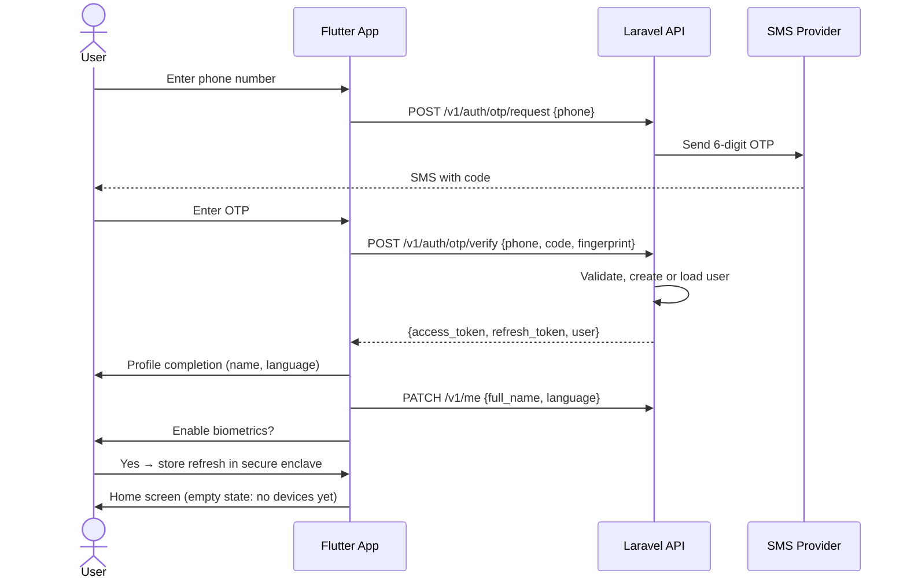
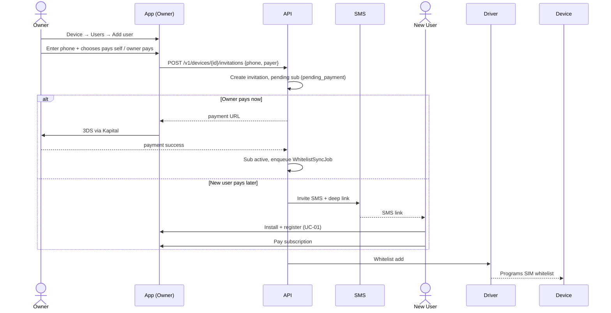
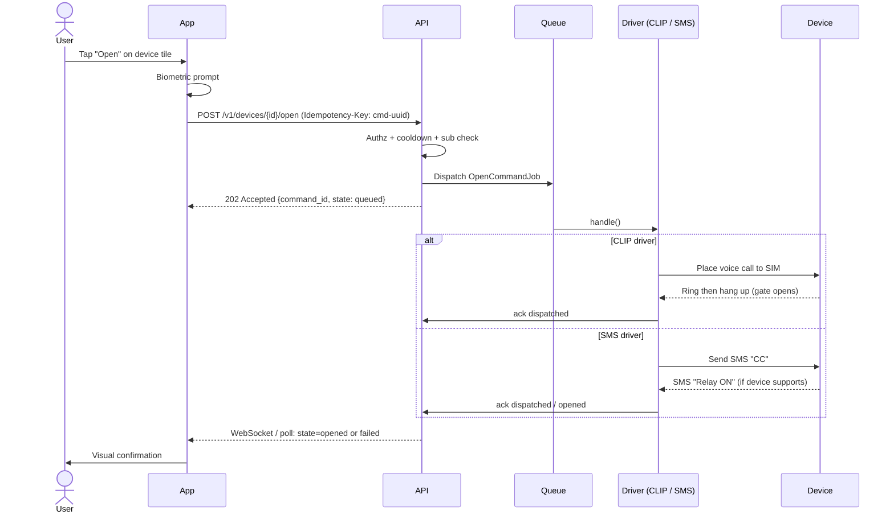
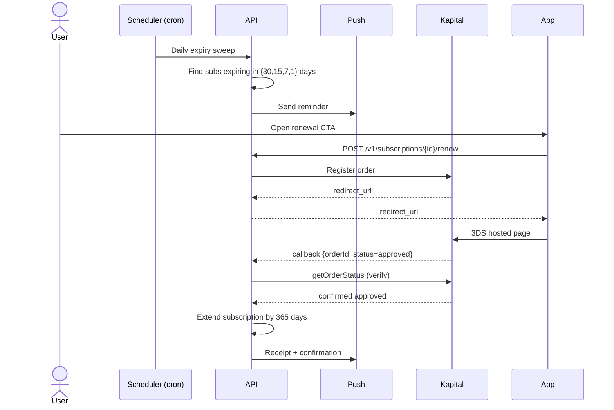
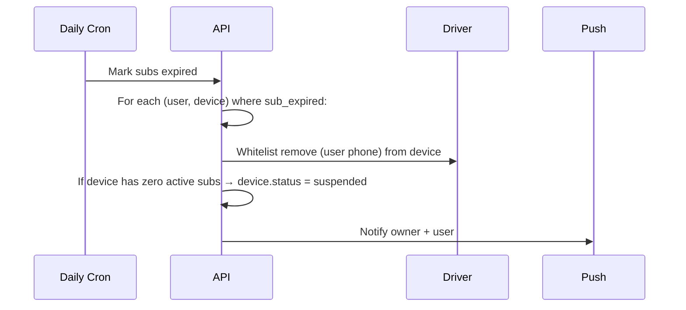
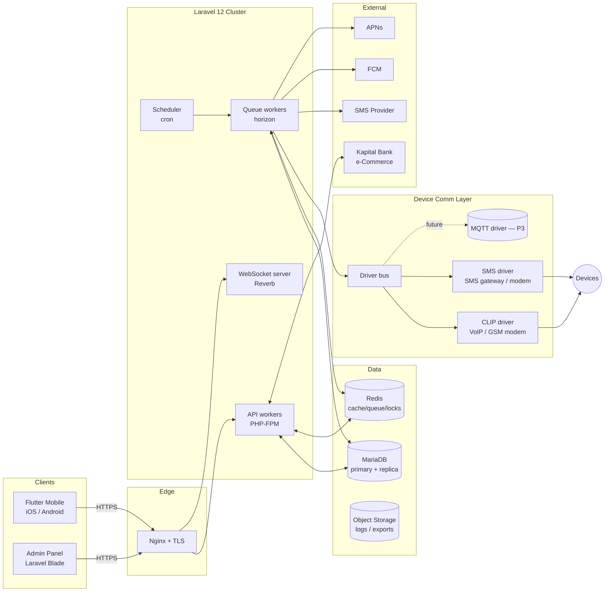
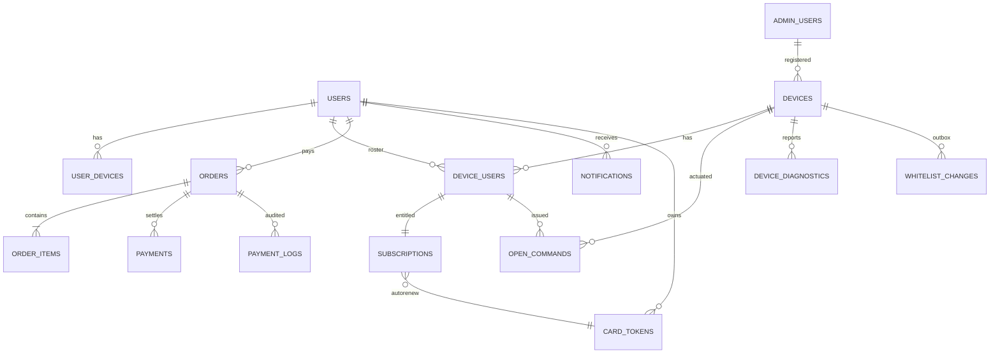

# Salam Həyətimiz — Technical Specification

**Version:** 1.2
**Date:** 2026-06-09 (v1.1) · 2026-06-14 (v1.2 transport amendment)
**Status:** Active; v1.2 applies the approved transport pivot
**Authors:** Senior Solution Architect / Laravel / Flutter / Database Architect
**Changelog:** see [CHANGELOG.md](CHANGELOG.md) and [TRANSPORT_MIGRATION_CHANGELOG.md](TRANSPORT_MIGRATION_CHANGELOG.md). v1.1 applied the audit resolutions; **v1.2 (2026-06-14)** applies [FINAL_TRANSPORT_DECISION.md](FINAL_TRANSPORT_DECISION.md) — the device-communication transport pivot to UMKa 310 / Traccar / BLE / SMS. **§12 is superseded by the v1.2 model** (see the banner at §12); the open-command pipeline framing is retained.

> **v1.2 TRANSPORT AMENDMENT.** Confirmed hardware is the GLONASSSoft **UMKa 310 v2L** telematics tracker (Wialon IPS/Combine), not a CLIP GSM relay. Device communication is a **hybrid**: **BLE** (local/in-person, primary) + **Traccar** (remote opening + telemetry + command delivery, primary for remote; mandatory self-hosted infra) + **SMS** (emergency fallback). The CLIP driver, voice gateway, per-operator CLI validation, and the on-device caller-ID whitelist are **retired**. Where this spec's prose/diagrams still describe CLIP/voice, [FINAL_TRANSPORT_DECISION.md](FINAL_TRANSPORT_DECISION.md) governs.

---

## 0. Document Purpose & Reading Order

This document is the single source of truth for the design and delivery of **Salam Həyətimiz**, a multi-platform remote access-control management system for barrier gates, garage doors, residential gates, and community entrance systems.

It is organized as follows. Read sequentially — later sections assume the vocabulary defined earlier.

| # | Section | Purpose |
|---|---|---|
| 1 | Software Requirements Specification (SRS) | Scope, stakeholders, glossary, business rules |
| 2 | Functional Requirements | What the system must do, by module |
| 3 | Non-Functional Requirements | Performance, security, reliability, compliance |
| 4 | Use Cases & Actors | Actor catalogue and use-case index |
| 5 | User Flows | End-to-end behavioural sequences |
| 6 | System Architecture | Component, deployment, and data-flow architecture |
| 7 | Database Schema | Logical model, tables, constraints, indexes |
| 8 | Entity Relationship Diagram | ER diagram (textual / Mermaid) |
| 9 | API Specification | REST endpoints, contracts, error model |
| 10 | Mobile App Screen Specification | Screen inventory, states, navigation |
| 11 | Admin Panel Specification | Module inventory, RBAC, screens |
| 12 | Device Communication Design | Modular GSM driver layer |
| 13 | Subscription System Design | Lifecycle, billing rules, notifications |
| 14 | Payment System Design | Kapital Bank e-Commerce integration |
| 15 | Security Design | AuthN/Z, secrets, hardening |
| 16 | Logging & Audit Design | Operational logs, audit log, retention |
| 17 | Notification System Design | Channels, templates, fan-out |
| 18 | Deployment Architecture | Servers, network, CI/CD |
| 19 | Development Phases | Milestones with deliverables and exit criteria |
| 20 | Testing Strategy | Unit/integration/E2E/load/security |

### Key Decisions Locked at Kick-off

| Decision | Choice |
|---|---|
| Device communication | **Modular driver layer** *(v1.2)* — `traccar` (remote, via self-hosted Traccar over Wialon IPS/Combine), `ble` (local/in-person), `sms` (fallback); future-ready for other protocols without core refactor |
| Subscription renewal | **Manual renewal by default**, optional auto-renew (tokenization-ready, not required at MVP) |
| Subscription expiry behaviour | Device-open suspended; owner can still manage users/devices; reminders at 30/15/7/1 days |
| Localization | **az** (default), **ru**, **en** |
| Mobile authentication | Phone + SMS OTP, device-bound JWT refresh, biometric to unlock the *open* action |
| Backend | Laravel 12 / PHP 8.4 / MariaDB / Redis / Queue workers |
| Mobile | Flutter (Android + iOS) |
| Admin | Laravel Blade + Bootstrap |
| Payments | Kapital Bank e-Commerce (3-D Secure) |

### Open Items Still Pending Sign-off

1. **Exact additional-user pricing** (the "discounted" tier). This spec uses a configurable `additional_user_price` admin setting; placeholder 6 AZN/year.
2. **Device model & firmware capabilities** — *(v1.2)* confirmed = GLONASSSoft **UMKa 310 v2L** (Wialon IPS/Combine, `cmdout.p`, BLE). The Phase-0 gate is now **transport validation** (Traccar→`cmdout.p`, BLE security, SMS fallback), replacing the retired per-operator CLI validation.
3. **SMS OTP provider** for AZ phone numbers (Atatech / Azertelecom / international fallback via Twilio).
4. **Kapital Bank tokenization availability** — confirmed manual flow for MVP; auto-renew flag exists but disabled until token API is available.
5. **VAT / invoicing requirements** — assumed standard AZ VAT 18 % included; invoice PDF generation deferred to Phase 2. (Counsel review needed on AZ tax-receipt obligations for MVP — see audit MED-12.)
6. **Data residency** — assumed Azerbaijan-hosted; confirm with hosting provider before infra build-out.

### Items Resolved at v1.1

Closed by audit resolutions; details inline at the cited sections:

- **Subscription edge cases** — §13.9 (CRIT-02).
- **GSM throughput NFR** — §3.1 revised to realistic burst profile (CRIT-03).
- **HA topology** — §18.2 / §18.3 (CRIT-03, CRIT-05, HIGH-11).
- **CLIP "opened" semantic** — §11.5 + S-12 (CRIT-06).
- **Bank-callback hardening** — §14.3 (CRIT-07).
- **Cert-pin and key rotation** — §15.5 / §15.8 with runbook references (CRIT-04, CRIT-08).
- **Admin 2FA recovery codes** — §15.2 (CRIT-09, promoted from P2).
- **Driver fallback policy** — §12.7 (HIGH-03).
- **Owner-self-delete successor policy** — §3.7 / §13.9 (HIGH-10).
- **Phone reuse policy** — phone is reusable; PII anonymised on soft-delete (HIGH-12).
- **Refund pro-rata math** — §14.5 (HIGH-08).
- **Device-sale ↔ device link** — §14.1 (HIGH-09).
- **Multi-tenant retrofit** — deferred; plan in [futures/multi-tenancy-retrofit.md](futures/multi-tenancy-retrofit.md) (HIGH-17, Accept Risk).

---

## 1. Software Requirements Specification (SRS)

### 1.1 Product Overview

Salam Həyətimiz lets residents and property owners remotely operate physical access-control hardware (barrier gates, garage doors, community entrances) from a mobile app, while owners manage which residents may use which devices and the platform monetises through device sales and an annual subscription.

The product has four delivery surfaces:

1. **Mobile App** (Flutter) for end users and device owners.
2. **Admin Panel** (Laravel Blade) for super admins and technical users.
3. **Backend API** (Laravel 12) serving both surfaces.
4. **Device-comm layer** that physically actuates GSM-controlled hardware.

### 1.2 Business Context & Revenue Model

| Revenue stream | Detail |
|---|---|
| Device sale | One-off, 135 AZN per device |
| Main-user subscription | 12 AZN/year |
| Additional-user subscription | Configurable; placeholder 6 AZN/year per extra user |

Subscription is **per user, per device** (see §13). A user with no active subscription on a given device cannot open it but can still be visible in the device's user roster.

### 1.3 Stakeholders

| Stakeholder | Interest |
|---|---|
| End user (resident) | Reliable, fast device opening; low friction renewals |
| Device owner (building manager / homeowner) | Roster control, transparency, accounting |
| Technical installer | Field provisioning, diagnostics, low support burden |
| Super admin (operator) | Health monitoring, revenue, customer support |
| Kapital Bank | Compliant 3-D Secure transactions, settlement |
| Hosting / infra team | Scalable, observable production |

### 1.4 Glossary

| Term | Definition |
|---|---|
| Device | A GSM-controlled access controller (gate, barrier, garage door) registered in the system |
| Owner | The legal/operational owner of a device; can add and revoke users |
| User | A person granted permission to open a device |
| Whitelist / Provisioning | *(v1.2)* The set of authorised access credentials provisioned for a device — BLE credentials and/or Traccar authorisation. (v1.1 defined this as caller-ID phone numbers stored on a CLIP relay; retired with the UMKa pivot.) |
| Subscription | Per-(user, device) annual entitlement to open commands |
| Open Command | A user-triggered intent to actuate a device |
| Driver | A backend module implementing the `DeviceDriver` device-comm contract. *(v1.2 drivers: `traccar` remote, `ble` local, `sms` fallback.)* |
| Cooldown | Server-side rate-limit window between open commands for a device |
| Suspension | Device-open blocked due to lapsed subscription; account otherwise active |

### 1.5 Assumptions

- *(v1.2)* Devices are GLONASSSoft **UMKa 310 v2L** telematics trackers on a Bakcell/Azercell/Nar data SIM (Wialon IPS/Combine over GPRS/LTE), with SMS capability for the fallback path and BLE for local opening.
- *(v1.2)* The device actuates the barrier by running its on-device `cmdout.p` script (1-second relay pulse), triggered remotely via Traccar over the live session, locally via BLE, or via SMS. There is no on-device caller-ID whitelist; authorisation is platform-side (Traccar + backend) and, for BLE, a provisioned device credential.
- Latency budget for end-user "open" action ≤ 5 s p95 (CLIP) / ≤ 15 s p95 (SMS).
- Internet access on user phones is required; the app does not currently support an offline open path.
- AZ regulatory regime applies (personal-data law, e-commerce, telecom).

### 1.6 Constraints

- Mobile must run on iOS 14+ and Android 8+ (API 26+).
- Server must run on Linux (Ubuntu 22.04 LTS or 24.04 LTS) with PHP 8.4 / Nginx.
- Payment provider is fixed to Kapital Bank e-Commerce for MVP.

### 1.7 Out of Scope (MVP)

- Smart-home protocol integrations (HomeKit, Matter, Google Home).
- Video-intercom or camera streaming.
- Reseller / multi-tenant white-label.
- Voice-assistant integration.
- Public REST API for third parties.

---

## 2. Functional Requirements

Requirements are tagged `FR-<module>-<n>`. All MUSTs are MVP unless marked **[P2]** (post-MVP) or **[P3]** (later).

### 2.1 Authentication & Identity (`FR-AUTH`)

- **FR-AUTH-01** Users register with a phone number; phone is verified by 6-digit SMS OTP.
- **FR-AUTH-02** OTP TTL is 120 s; max 5 attempts per OTP; max 3 OTPs per phone per 10 min.
- **FR-AUTH-03** Successful OTP → backend issues short-lived JWT access token (15 min) and long-lived refresh token (60 days) bound to a device fingerprint (platform + install UUID).
- **FR-AUTH-04** App MUST enforce a biometric unlock (Face ID / Touch ID / Android BiometricPrompt) before sending an *open* command, with PIN fallback.
- **FR-AUTH-05** Logout invalidates the refresh token server-side.
- **FR-AUTH-06** User profile fields: full_name, phone (unique), email (optional), preferred_language (`az` / `ru` / `en`).
- **FR-AUTH-07** Admin/technical users authenticate via the admin panel with **email + password + TOTP 2FA** (separate identity space from mobile users).
- **FR-AUTH-08** *(v1.1, ex-P2)* At TOTP enrollment each admin is issued **8 single-use recovery codes** (10 hex chars each), shown once and stored bcrypt-hashed. Login Step 2 accepts a recovery code in lieu of a TOTP; consumption marks the entry null. Recovery codes can be regenerated from the admin profile (invalidates the previous set). Production invariant: ≥ 2 super admins active at all times.

### 2.2 Device Lifecycle (`FR-DEV`)

- **FR-DEV-01** Technical user registers a device with: serial, SIM phone number, model, firmware version, location (lat/lng + label), driver type *(v1.2: `traccar` / `ble` / `sms`)*.
- **FR-DEV-02** Device starts in state `unassigned`; technical user assigns an Owner → state `active`.
- **FR-DEV-03** Owner can rename device, edit location label, view list of authorised users.
- **FR-DEV-04** Owner can add a user by phone number; system creates or links the user account and enqueues access provisioning *(v1.2: BLE credential and/or Traccar authorisation via the provisioning outbox)*.
- **FR-DEV-05** Owner can remove a user; whitelist sync to device removes the number.
- **FR-DEV-06** Device states: `unassigned`, `active`, `suspended` (no active subs across any user), `disabled` (admin action), `decommissioned`.
- **FR-DEV-07** Super admin can transfer ownership (audited).

### 2.3 Open Command (`FR-OPEN`)

- **FR-OPEN-01** Authenticated user requests open via API; backend validates: user is on device's user list, user's subscription on that device is active, device is not `disabled`, cooldown not violated.
- **FR-OPEN-02** Server-side cooldown per (user, device) default 5 s; per-device global 2 s.
- **FR-OPEN-03** Open command is queued to the device driver; driver returns `dispatched` / `failed` / `pending`.
- **FR-OPEN-04** Every command writes an `open_commands` row with full audit trail (see §16).
- **FR-OPEN-05** Mobile UI shows real-time status (`Requesting…` → `Sent` → `Opened` or `Failed`) via short-poll or WebSocket (see §6.4).
- **FR-OPEN-06** Failed opens within 60 s of a successful one are deduplicated to avoid double-trigger.
- **FR-OPEN-07** *(v1.1)* The mobile UX distinguishes between **dispatched** (we know the command went out) and **opened** (we have evidence the relay actuated). Only drivers that produce an actuation signal (e.g. SMS reply with relay status; future MQTT publish) may emit the `opened` terminal state; CLIP-only opens terminate at `dispatched` and the UI renders accordingly (see UI/UX S-12).
- **FR-OPEN-08** *(v1.1)* On a transient driver failure (`busy`, `no_answer`, `network_temporary`) the dispatcher retries once via the `device_models.fallback_open_driver` if defined. Both attempts are recorded as separate rows in `open_command_attempts` against the parent `open_commands` row (see §12.7).
- **FR-OPEN-09** *(v1.1)* The API returns `expected_completion_ms` computed server-side from a rolling p90 of recent successful opens per driver and per device, not a fixed constant.

### 2.4 Subscriptions (`FR-SUB`)

- **FR-SUB-01** A subscription record exists per (user, device) pair with status: `pending_payment`, `active`, `expired`, `cancelled`.
- **FR-SUB-02** Initial subscription is purchased by the Owner; additional-user subscriptions can be paid by the owner or by the additional user.
- **FR-SUB-03** Subscription term default = 365 days from successful payment; configurable.
- **FR-SUB-04** Renewal: 30 days before expiry the system marks the subscription `renewable`; user gets in-app + push reminder at D-30, D-15, D-7, D-1.
- **FR-SUB-05** On expiry: status → `expired`, device opening blocked for that user. Owner sees overall device "suspended" if **all** user subscriptions on the device are expired.
- **FR-SUB-06** Owner with expired sub can still: view devices, manage users, view statistics, initiate renewal. CANNOT open.
- **FR-SUB-07** **[P2]** Auto-renew: stored card token charged at D-1; on failure retry at D, D+1, D+2, then expire.

### 2.5 Payments (`FR-PAY`)

- **FR-PAY-01** Payment initiation creates an `order` (status `pending`) with amount, currency=AZN, payer, line items.
- **FR-PAY-02** Backend calls Kapital Bank to register order, receives redirect URL + bank order_id.
- **FR-PAY-03** Mobile/web opens the bank's hosted 3DS page in a system browser / WebView (see §14).
- **FR-PAY-04** Bank invokes our `payment.callback` endpoint with signed status; backend verifies, then queries bank's `getOrderStatus` for authoritative confirmation (defence-in-depth).
- **FR-PAY-05** On `approved`: order → `paid`; corresponding subscription(s) activated/extended.
- **FR-PAY-06** On `failed/declined/cancelled`: order → terminal failed state; subscriptions remain unchanged.
- **FR-PAY-07** Refunds: super-admin-initiated; if order is `paid` and < refund-window days, backend calls bank's `refund`; on success, subscription is revoked or shortened; an audit entry is written.
- **FR-PAY-08** Every payment-related call (request and response) is persisted in `payment_logs` with redacted card data.

### 2.6 Owner / Roster Management (`FR-OWN`)

- **FR-OWN-01** Owner sees list of all owned devices and per-device user roster with subscription status.
- **FR-OWN-02** Owner can invite a new user by phone number; user receives SMS with deep-link to install app and accept.
- **FR-OWN-03** Owner can set per-user "access window" **[P2]** (e.g. 08:00–22:00 only).
- **FR-OWN-04** Owner can revoke a user; revocation propagates to device access (de-provision BLE credential / Traccar authorisation) via the outbox within 30 s.

### 2.7 Admin Panel (`FR-ADM`)

- **FR-ADM-01** Super admin dashboard: live device count, online %, MRR/ARR, last-24h opens, failures.
- **FR-ADM-02** User search by phone/name/email; impersonation for support **[P2]** (audited).
- **FR-ADM-03** Device management: list, filter by status, view diagnostics (Traccar telemetry), force provisioning/whitelist resync, decommission.
- **FR-ADM-04** Payment monitoring: order list, transaction drill-down, retry callback, manual refund.
- **FR-ADM-05** Reporting: revenue by month, subs by status, open success rate per device, by region.
- **FR-ADM-06** Settings: pricing, cooldowns, notification templates, feature flags.

### 2.8 Notifications (`FR-NOT`)

- **FR-NOT-01** Push notifications via FCM (Android) and APNs (iOS) — see §17.
- **FR-NOT-02** SMS notifications for: OTP, invite, subscription expiry reminders.
- **FR-NOT-03** In-app inbox with read/unread state.
- **FR-NOT-04** Email **[P2]** for receipts.
- **FR-NOT-05** All templates localised (az/ru/en).

### 2.9 Localization (`FR-LOC`)

- **FR-LOC-01** App language follows user profile preference; default = device locale, fallback `az`.
- **FR-LOC-02** All user-facing strings stored in translation files (`lang/{locale}.json` server, `intl/` on Flutter).
- **FR-LOC-03** Admin panel supports `az`/`ru`/`en`.

### 2.10 Reporting & Statistics (`FR-RPT`)

- **FR-RPT-01** Per-owner device stats: open count, last 7/30 days, last open time, success rate.
- **FR-RPT-02** Per-user open history (filter by device, date range).
- **FR-RPT-03** Admin: signups/day, subs sold, revenue, churn, device-health distribution.

---

## 3. Non-Functional Requirements

### 3.1 Performance

| Metric | Target |
|---|---|
| API p95 latency (read) | ≤ 200 ms |
| API p95 latency (write) | ≤ 400 ms |
| Open command p95 end-to-end *(v1.2)* | ≤ 1 s (BLE local) / ≤ 3 s (Traccar remote, device online) / ≤ 30 s (SMS fallback) from tap to gate move |
| Open command p95 end-to-end (SMS) | ≤ 15 s |
| Mobile cold start | ≤ 3 s on mid-range Android |
| Concurrent open commands (sustained) | **≥ 5 RPS** *(revised v1.1 — residential workload, not a streaming workload)* |
| Concurrent open commands (1-min burst) | **≥ 50 RPS** with at least one GSM gateway healthy |
| Concurrent open commands (10-s peak) | **≥ 200 RPS** with both gateways healthy |
| Open-command degradation above peak | Reject with `state=failed, failure_reason=gateway_capacity`; never queue indefinitely |
| Admin dashboard load | ≤ 1.5 s |

### 3.2 Scalability

- Horizontal scale of API behind Nginx via additional PHP-FPM workers.
- Queue workers scaled per queue (default 3 workers, 8 processes each).
- Database read-replica supported via Laravel's read/write split when needed.
- GSM driver layer scales by adding more GSM-modem nodes or SMS gateway accounts; each driver instance is stateless except for outbound connection pools.

### 3.3 Availability & Reliability

- Target availability: **99.5 %** monthly (mobile/API). Maintenance windows declared in advance.
- All write paths idempotent where externally invokable (open, payment-callback).
- Open-command pipeline retries failed dispatches up to 3 times with backoff (1s, 4s, 10s).
- DB backed up: nightly full + hourly incremental, 30-day retention, off-site copy.
- DR target: RTO 4 h, RPO 1 h.

### 3.4 Security

- All transport TLS 1.2+ (prefer 1.3).
- At-rest encryption for DB volume; sensitive columns (card-tokens, OTPs hash) further encrypted at application layer with `app.key` plus per-table KMS-style key.
- OWASP ASVS Level 2 target for the backend.
- Mobile app cert-pins backend hosts.
- Detailed coverage in §15.

### 3.5 Maintainability

- Codebase follows PSR-12 (PHP), Effective Dart (Flutter).
- Static analysis required to pass in CI: PHPStan level 8, Larastan, `dart analyze`.
- Test coverage targets: ≥ 70 % backend lines, ≥ 60 % Flutter widget/unit.
- Every external dependency pinned by version with monthly upgrade review.

### 3.6 Observability

- Structured JSON logs.
- Metrics: Prometheus scrape from API (php-prometheus or Telescope-style).
- Traces: OpenTelemetry (optional, Phase 2).
- Health endpoints (`/health/live`, `/health/ready`) for load-balancer checks.

### 3.7 Compliance & Privacy

- Personal Data Law (AZ): user consent on first run, data-export and data-deletion on request.
- Card data: NEVER stored or logged in clear text. Only Kapital Bank order IDs and bank-issued tokens are stored. PCI scope kept minimal via hosted-payment-page model.
- Audit log immutable for 5 years (financial regulation alignment).
- *(v1.1)* **Soft-deletion of users anonymises PII immediately** (phone → `deleted:<sha256(phone)>`, email likewise). The 30-day window protects the *reactivation right* (support-assisted un-anonymise), not the data. Phone numbers are reusable for fresh signups under new `user_id`s.
- *(v1.1)* **Owner self-delete with active subs on owned devices is blocked** (`409 successor_required`). Owners must transfer ownership (admin-mediated via `adminTransferDevice`) or wind down before deletion proceeds. Anonymisation only runs after a clean successor state.

### 3.8 Internationalisation

- UTF-8 end-to-end. MySQL/MariaDB tables `utf8mb4_unicode_ci`.
- Date/number formatting via `intl` package on Flutter and PHP `IntlDateFormatter`.

### 3.9 Accessibility

- Mobile: WCAG 2.1 AA — text scaling, screen-reader labels, ≥ 4.5:1 contrast on primary CTAs.
- Admin: AA contrast, keyboard navigation for all primary workflows.

---

## 4. Use Cases & Actors

### 4.1 Actors

```
+----------------+         +-----------------+
|  End User      |         | Device Owner    |
| (Resident)     |         | (Mgr/Owner)     |
+----------------+         +-----------------+
        |                          |
        |                          |
+----------------+         +-----------------+
| Technical User |         | Super Admin     |
| (Installer)    |         | (Operator)      |
+----------------+         +-----------------+
        |                          |
        v                          v
+---------------------------------------------+
|              Salam Həyətimiz                |
|   (Mobile + API + Admin + Device Layer)     |
+---------------------------------------------+
        |                          |
        v                          v
   GSM Devices              Kapital Bank
```

### 4.2 Use Case Catalogue

| ID | Use case | Primary actor | Brief |
|---|---|---|---|
| UC-01 | Register & verify phone | End User | OTP-based onboarding |
| UC-02 | Open device | End User | Tap to open assigned device |
| UC-03 | View open history | End User | List of opens with timestamps |
| UC-04 | Receive notification | End User | Push / SMS receipt |
| UC-05 | Purchase device subscription | Device Owner | Pay annual fee |
| UC-06 | Add additional user | Device Owner | Invite + purchase add-on sub |
| UC-07 | Remove user | Device Owner | Revoke access |
| UC-08 | View device stats | Device Owner | Opens, failures |
| UC-09 | Renew subscription | End User / Owner | Manual renewal flow |
| UC-10 | Register device | Technical User | Add new hardware to system |
| UC-11 | Configure device | Technical User | Edit driver, sim, location |
| UC-12 | Assign owner | Technical User | Link device to first owner |
| UC-13 | Activate device | Technical User | Mark device live after testing |
| UC-14 | Test device | Technical User | Issue diagnostic ping |
| UC-15 | Manage users | Super Admin | CRUD users, search, audit |
| UC-16 | Manage devices (global) | Super Admin | Decommission, force resync |
| UC-17 | Monitor payments | Super Admin | View, refund, reconcile |
| UC-18 | Generate report | Super Admin | Revenue, health |
| UC-19 | Refund payment | Super Admin | Initiate refund via bank API |
| UC-20 | Tune system settings | Super Admin | Pricing, cooldowns |
| UC-21 | Audit access | Super Admin | Search audit log |

### 4.3 Use-Case Detail Example: UC-02 Open Device

| Field | Value |
|---|---|
| Precondition | User authenticated; user on device roster; subscription active; device not disabled |
| Main flow | 1. User taps device tile → biometric prompt. 2. App POSTs `/v1/devices/{id}/open`. 3. Backend validates, enqueues job. 4. Driver dispatches CLIP or SMS. 5. Backend marks `dispatched`. 6. App polls / receives push for terminal state. |
| Alt: subscription expired | API returns `403 subscription_required`; app shows renewal CTA. |
| Alt: cooldown active | API returns `429 cooldown`; app shows countdown. |
| Alt: device offline | Driver returns `failed`; mobile shows retry. |
| Postcondition | `open_commands` row written; metrics incremented. |

(Full use-case bodies for all 21 use cases live in Appendix A; abbreviated here.)

---

## 5. User Flows

The flows use Mermaid syntax — paste into any Mermaid-compatible viewer.

### 5.1 First-time User Onboarding



### 5.2 Owner Adds an Additional User



### 5.3 Open Device



### 5.4 Subscription Renewal (Manual)



### 5.5 Subscription Expiry Suspension



### 5.6 Technical User Provisions a Device

```mermaid
sequenceDiagram
    actor T as Technical
    participant App as Tech App (mobile or web)
    participant API
    participant Drv

    T->>App: Scan QR on device label
    App->>API: POST /v1/devices {serial, model, sim_phone, driver_type}
    API-->>App: device_id
    T->>App: Configure (location, label)
    App->>API: PATCH /v1/devices/{id}
    T->>App: Test open
    App->>API: POST /v1/devices/{id}/diagnostics/ping
    API->>Drv: Diagnostics call
    Drv-->>API: ok + signal strength
    T->>App: Assign owner (by phone)
    App->>API: POST /v1/devices/{id}/assign {owner_phone}
    API->>API: Create owner if missing; device.status=active
```

---

## 6. System Architecture

### 6.1 High-Level Component Diagram



### 6.2 Layered View

| Layer | Components | Notes |
|---|---|---|
| Presentation | Flutter app, Blade admin | Stateless from server perspective |
| API Gateway | Nginx | TLS termination, rate limit, request routing |
| Application | Laravel HTTP, Service classes, Form Requests | RESTful, versioned (`/v1/`) |
| Domain | Eloquent models + domain services (`App\Domain\*`) | Pure business logic, framework-isolated where reasonable |
| Integration | Driver bus + adapters (CLIP, SMS), Payment gateway adapter, SMS/Push providers | Each external dependency behind an interface |
| Data | MariaDB, Redis, S3-compatible object store | Read-replica optional |
| Async | Laravel Queue (Redis-backed), Horizon, Scheduler | Backed by named queues: `high`, `default`, `device-comm`, `notifications`, `payments` |

### 6.3 Domain Modules (Backend)

```
app/
  Domain/
    Auth/           # OTP, tokens, biometrics enrolment
    Users/
    Devices/        # Device aggregate, whitelist
    Subscriptions/  # Lifecycle, expiry sweep
    Payments/       # Orders, callbacks, refunds, KapitalBankClient
    DeviceComm/     # Driver bus, drivers
    Notifications/  # Channels, templates
    Audit/
    Reporting/
  Http/
    Api/V1/Controllers/
    Admin/Controllers/
    Middleware/
  Jobs/
  Console/Commands/
  Support/
```

### 6.4 Realtime Channel

- **Library:** Laravel Reverb (native WebSocket since L11/12).
- **Channels:**
  - `private-user.{userId}` — user-targeted (subscription notice, command status).
  - `private-device.{deviceId}` — device events (owner subscribes to all owned devices).
- **Auth:** Channel-auth endpoint validates the JWT + channel access.
- **Fallback:** Mobile clients fall back to 1 s polling of `/v1/commands/{id}` if WS is unhealthy.

### 6.5 Concurrency Controls

- **Per-(user, device) cooldown:** Redis `SETNX` with TTL=cooldown.
- **Per-device global cooldown:** Redis `SETNX` on `device:{id}:cd` TTL=2 s.
- **Idempotency keys** on `/open`, `/payment/init`: stored in Redis 24 h.

### 6.6 Time

- Server runs in UTC; all timestamps stored UTC; clients convert.
- Cron uses Asia/Baku for "human-time" notifications (e.g. send reminder at 10:00 local).

---

## 7. Database Schema

MariaDB 11, InnoDB, `utf8mb4_unicode_ci`, all PKs are `BIGINT UNSIGNED` unless noted.

### 7.1 Core Tables

#### `users` — mobile end users
| Col | Type | Notes |
|---|---|---|
| id | BIGINT UNSIGNED PK | |
| phone | VARCHAR(20) UNIQUE | E.164 |
| full_name | VARCHAR(120) NULL | |
| email | VARCHAR(160) NULL UNIQUE | |
| preferred_language | ENUM('az','ru','en') DEFAULT 'az' | |
| status | ENUM('active','blocked','deleted') DEFAULT 'active' | |
| created_at, updated_at | TIMESTAMP | |
| deleted_at | TIMESTAMP NULL | soft delete |

#### `admin_users` — admin panel principals
| Col | Type | Notes |
|---|---|---|
| id | BIGINT PK | |
| email | VARCHAR(160) UNIQUE | |
| password | VARCHAR(255) | bcrypt |
| name | VARCHAR(120) | |
| role | ENUM('super_admin','technical') | |
| totp_secret | VARBINARY(255) | encrypted |
| is_2fa_enabled | TINYINT | |
| status | ENUM('active','suspended') | |
| last_login_at | TIMESTAMP NULL | |
| timestamps | | |

#### `user_devices` — mobile installs (per user)
| Col | Notes |
|---|---|
| id, user_id FK, install_uuid UNIQUE, platform ENUM('ios','android'), push_token VARCHAR(255), app_version, os_version, last_seen_at |

#### `refresh_tokens`
| id, user_id FK, user_device_id FK, token_hash CHAR(64), expires_at, revoked_at NULL, created_at |

#### `otps`
| id, phone, code_hash CHAR(64), purpose ENUM('login','recover'), attempts TINYINT, expires_at, consumed_at NULL, created_at |
| INDEX(phone, purpose) |

#### `devices` — physical access controllers
| Col | Type | Notes |
|---|---|---|
| id | BIGINT PK | |
| serial | VARCHAR(64) UNIQUE | |
| model | VARCHAR(80) | |
| firmware_version | VARCHAR(40) | |
| sim_phone | VARCHAR(20) | unique; the device SIM number |
| sim_operator | VARCHAR(40) | Bakcell/Azercell/Nar |
| driver_type | ENUM('clip','sms','clip_sms','mqtt') | |
| status | ENUM('unassigned','active','suspended','disabled','decommissioned') | |
| owner_user_id | BIGINT NULL FK→users.id | nullable until assigned |
| location_label | VARCHAR(160) | |
| latitude | DECIMAL(10,7) NULL | |
| longitude | DECIMAL(10,7) NULL | |
| last_online_at | TIMESTAMP NULL | |
| last_signal_strength | TINYINT NULL | 0–31 (3GPP) |
| metadata | JSON | extensible per driver |
| created_by_admin_id | FK→admin_users.id | |
| timestamps + soft delete | | |

INDEXES: `(owner_user_id)`, `(status)`, `(sim_phone)`.

#### `device_users` — roster (M:N + permissions)
| Col | Notes |
|---|---|
| id, device_id FK, user_id FK, role ENUM('owner','user') DEFAULT 'user', added_by_user_id FK NULL, access_window_start TIME NULL [P2], access_window_end TIME NULL [P2], status ENUM('active','revoked') DEFAULT 'active', created_at, revoked_at NULL |
| UNIQUE(device_id, user_id) |

#### `subscriptions` — per (device_user)
| Col | Type | Notes |
|---|---|---|
| id | PK | |
| device_user_id | FK UNIQUE | one active sub per device-user |
| tier | ENUM('main','additional') | |
| price_minor | INT UNSIGNED | AZN in qəpik (1 AZN = 100) |
| starts_at, ends_at | TIMESTAMP | |
| status | ENUM('pending_payment','active','expired','cancelled') | |
| auto_renew | TINYINT DEFAULT 0 | |
| card_token_id | FK NULL | for future tokenization |
| last_reminder_sent_at | TIMESTAMP NULL | |
| created_at, updated_at | | |

INDEX: `(status, ends_at)`.

#### `orders` — payment intents
| Col | Notes |
|---|---|
| id PK, reference VARCHAR(40) UNIQUE (our ref), payer_user_id FK, amount_minor INT, currency CHAR(3) DEFAULT 'AZN', purpose ENUM('device_sale','sub_main','sub_additional','sub_renewal','add_on'), status ENUM('pending','authorising','paid','failed','cancelled','refunded','partially_refunded'), bank_order_id VARCHAR(80) NULL, bank_redirect_url TEXT NULL, idempotency_key VARCHAR(60) NULL, metadata JSON, timestamps |

INDEX: `(status, created_at)`, `(payer_user_id)`.

#### `order_items`
| id, order_id FK, item_type ENUM('device','subscription','add_on'), referenced_id BIGINT, qty, unit_amount_minor, total_minor |

#### `payments` — actual financial events
| Col | Notes |
|---|---|
| id, order_id FK, bank_transaction_id VARCHAR(80) NULL, type ENUM('charge','refund'), amount_minor, status ENUM('approved','declined','reversed','pending','error'), raw_response JSON ENCRYPTED, occurred_at TIMESTAMP, created_at |

#### `card_tokens` — *future* (auto-renew)
| id, user_id FK, bank_token VARCHAR(120), pan_masked VARCHAR(20), brand VARCHAR(20), expiry_month TINYINT, expiry_year SMALLINT, status ENUM('active','revoked','expired'), created_at |

#### `payment_logs` — every call/callback
| id, order_id FK NULL, direction ENUM('outbound','inbound'), endpoint VARCHAR(200), http_status SMALLINT NULL, request_redacted JSON, response_redacted JSON, ip VARCHAR(45) NULL, signature_valid TINYINT NULL, created_at |

INDEX: `(order_id, created_at)`.

#### `open_commands`
| Col | Type | Notes |
|---|---|---|
| id | PK | |
| device_id, user_id, device_user_id | FK | |
| idempotency_key | VARCHAR(60) NULL | client-supplied |
| driver | VARCHAR(20) | snapshot |
| state | ENUM('queued','dispatched','opened','failed','expired') | |
| failure_reason | VARCHAR(120) NULL | |
| dispatched_at, completed_at | TIMESTAMP NULL | |
| latency_ms | INT NULL | |
| metadata | JSON | e.g. SMS provider id |
| created_at | TIMESTAMP | |

INDEXES: `(device_id, created_at)`, `(user_id, created_at)`, `(state, created_at)`.

#### `device_diagnostics`
| id, device_id FK, signal_strength TINYINT, battery_level TINYINT NULL, firmware_version, raw JSON, reported_at TIMESTAMP |

#### `whitelist_changes` — outbox for device whitelist sync
| id, device_id FK, action ENUM('add','remove'), phone VARCHAR(20), status ENUM('pending','synced','failed'), attempt_count, last_error TEXT NULL, created_at, synced_at NULL |

#### `notifications`
| id, user_id FK, channel ENUM('push','sms','inapp','email'), template_key VARCHAR(80), payload JSON, status ENUM('queued','sent','failed','read'), sent_at, read_at NULL, created_at |

#### `audit_log` — immutable
| id, actor_type ENUM('user','admin','system'), actor_id BIGINT NULL, action VARCHAR(80), entity_type VARCHAR(40), entity_id BIGINT NULL, payload_redacted JSON, ip, user_agent, created_at |
| Partitioned monthly. |

#### `settings`
| key VARCHAR(80) PK, value JSON, updated_by_admin_id FK NULL, updated_at |

(Holds `prices.device`, `prices.sub_main_minor`, `prices.sub_additional_minor`, `cooldowns.user_device_s`, `notifications.reminder_days` etc.)

### 7.2 Constraints & Conventions

- All FKs `ON UPDATE CASCADE ON DELETE RESTRICT` unless explicitly noted.
- Money stored in **minor units** (qəpik) as integers — never floats.
- Soft delete only on `users` and `devices`; all other tables use status enums.
- All timestamps `TIMESTAMP(3)` for millisecond precision on event-heavy tables (`open_commands`, `audit_log`, `payment_logs`).

### 7.3 Indexes (additional)

- `open_commands(state, created_at)` for queue/expiry sweeps.
- `subscriptions(status, ends_at)` for daily expiry job.
- `orders(status, created_at)` for reconciliation.
- `audit_log(entity_type, entity_id, created_at)`.

### 7.4 Partitioning

- `open_commands`, `audit_log`, `payment_logs` — RANGE partition by month after first 6 months in production.

---

## 8. Entity Relationship Diagram



(Tables omitted from the diagram — `otps`, `refresh_tokens`, `settings`, `audit_log` — are utility tables not central to the domain.)

---

## 9. API Specification

### 9.1 Conventions

- Base URL: `https://api.salamhayetimiz.az/v1/`
- Auth header: `Authorization: Bearer <JWT>`
- Content type: `application/json; charset=utf-8`
- Locale: `Accept-Language: az|ru|en`
- Idempotency: `Idempotency-Key: <uuid>` on mutating endpoints (`POST`).
- Errors:

```json
{
  "error": {
    "code": "subscription_required",
    "message_key": "errors.subscription_required",
    "message": "Aboneliyiniz başa çatıb.",
    "details": { "device_id": 42 }
  }
}
```

Standard codes: `unauthenticated`, `forbidden`, `not_found`, `validation_failed`, `cooldown`, `subscription_required`, `device_disabled`, `device_offline`, `payment_required`, `rate_limited`, `internal_error`.

- Pagination: cursor-based (`?cursor=...&limit=`); response includes `next_cursor`.

### 9.2 Endpoint Catalogue (mobile / public)

| Method | Path | Purpose |
|---|---|---|
| POST | `/auth/otp/request` | Request OTP for phone |
| POST | `/auth/otp/verify` | Verify OTP → tokens |
| POST | `/auth/refresh` | Refresh access token |
| POST | `/auth/logout` | Revoke refresh |
| GET | `/me` | Current user profile |
| PATCH | `/me` | Update profile, language |
| POST | `/me/biometrics/enroll` | Bind biometric session |
| DELETE | `/me` | Self-delete (privacy) |
| GET | `/devices` | List user's devices |
| GET | `/devices/{id}` | Device detail (incl. sub status) |
| POST | `/devices/{id}/open` | Issue open command |
| GET | `/devices/{id}/commands?since=` | History |
| GET | `/devices/{id}/stats` | Aggregated stats |
| GET | `/devices/{id}/users` | Roster (owner only) |
| POST | `/devices/{id}/invitations` | Invite user (owner) |
| DELETE | `/devices/{id}/users/{userId}` | Revoke (owner) |
| GET | `/commands/{id}` | Poll command state |
| GET | `/subscriptions` | List my subs |
| POST | `/subscriptions/{id}/renew` | Init renewal payment |
| POST | `/subscriptions/{id}/cancel-autorenew` | Disable auto-renew [P2] |
| POST | `/orders` | Create order (device sale or sub) |
| GET | `/orders/{id}` | Order status |
| POST | `/payments/callback` | Bank callback (no auth header; signature instead) |
| GET | `/notifications?cursor=` | Inbox |
| POST | `/notifications/{id}/read` | Mark read |
| POST | `/notifications/read-all` | |
| GET | `/health/live` | Liveness |

### 9.3 Endpoint Catalogue (admin)

Under `/admin/v1/`:

| Path | Purpose |
|---|---|
| `POST /auth/login`, `POST /auth/2fa/verify`, `POST /auth/logout` | Admin login |
| `GET /metrics/overview` | Dashboard |
| `GET /users`, `GET /users/{id}`, `POST /users/{id}/block`, `POST /users/{id}/unblock` | User mgmt |
| `GET /devices`, `POST /devices`, `PATCH /devices/{id}`, `POST /devices/{id}/assign`, `POST /devices/{id}/decommission`, `POST /devices/{id}/diagnostics/ping`, `POST /devices/{id}/whitelist/resync` | Device mgmt |
| `GET /orders`, `GET /orders/{id}`, `POST /orders/{id}/refund`, `POST /orders/{id}/recheck` | Payment mgmt |
| `GET /reports/revenue`, `GET /reports/devices`, `GET /reports/subscriptions` | Reporting |
| `GET /audit?...` | Audit log search |
| `GET /settings`, `PATCH /settings/{key}` | Tunables |

### 9.4 Schemas (excerpt)

#### POST /v1/devices/{id}/open — Request
```json
{ "client_command_id": "uuid" }
```
Headers: `Idempotency-Key: <client_command_id>`

#### Response 202
```json
{
  "command_id": 891234,
  "state": "queued",
  "device_id": 42,
  "expected_completion_ms": 5000
}
```

#### Possible error responses
- `403 subscription_required` — user's subscription on this device is not `active`
- `403 device_disabled`
- `409 cooldown` — `{"retry_after_seconds": 3}`
- `502 device_offline`

#### POST /v1/orders — Request
```json
{
  "purpose": "sub_main",
  "subject": { "device_id": 42, "user_id": 17 },
  "auto_renew": false,
  "return_url": "salam://payment/return"
}
```

#### Response 201
```json
{
  "order_id": 776,
  "amount_minor": 1200,
  "currency": "AZN",
  "bank_redirect_url": "https://e-commerce.kapitalbank.az/...",
  "expires_at": "2026-06-09T13:42:00Z"
}
```

### 9.5 Rate Limiting

| Endpoint group | Limit |
|---|---|
| `/auth/otp/*` | 3/phone/10min, 30/IP/hour |
| `/devices/*/open` | 12/user/min, 4/device/min |
| Generic authenticated | 120 req/min/user |
| Admin | 600 req/min/admin |

### 9.6 OpenAPI

A machine-readable OpenAPI 3.1 spec is the binding contract; this document describes intent. Spec lives at `docs/openapi/v1.yaml` (to be authored Phase 1).

---

## 10. Mobile App Screen Specification

### 10.1 Navigation Map

```
Splash ─► Locale picker (first run only) ─► Onboarding 3 slides ─► Phone entry
                                                                     │
                                                                     ▼
                                                                   OTP entry
                                                                     │
                                                                     ▼
                                                                Profile complete
                                                                     │
                                                                     ▼
                                                       ┌────────► Home (devices) ◄──────┐
                                                       │           │                    │
                                                       │           ▼                    │
                                                       │    Device detail               │
                                                       │    ├─ Open                     │
                                                       │    ├─ History                  │
                                                       │    ├─ Users (owner)            │
                                                       │    └─ Settings (owner)         │
                                                       │                                │
                                                       ▼                                │
                                                Subscriptions ── Renew ── Payment WebView
                                                       │
                                                       ▼
                                                Notifications
                                                       │
                                                       ▼
                                                  Profile / Language / Logout
```

### 10.2 Screen Inventory

| ID | Screen | Key states | Notes |
|---|---|---|---|
| S-01 | Splash | loading, error | Cert-pin handshake; refresh token check |
| S-02 | Locale Picker | — | az / ru / en (first run only) |
| S-03 | Onboarding | 3 slides | Skippable |
| S-04 | Phone Entry | idle, submitting, error | E.164 input, country fixed AZ (+994) |
| S-05 | OTP Entry | idle, submitting, error, resend timer | 6-digit autofill |
| S-06 | Profile Complete | idle, submitting | Name, preferred language |
| S-07 | Biometrics Enroll | prompt | Skippable, can be enabled later |
| S-08 | Home / Devices | empty, populated, refreshing | List with status pill |
| S-09 | Device Detail | active, suspended, disabled | Big "Open" button, status chip |
| S-10 | Open Flow | requesting, sent, opened, failed | Visual progress + haptic |
| S-11 | Device History | empty, list | Filter by date range |
| S-12 | Device Users (owner only) | list, add, confirm-remove | Includes per-user sub status |
| S-13 | Invite User | form, paying, success | Choose payer; opens payment WebView |
| S-14 | Subscriptions | list (per device) | Status, days remaining |
| S-15 | Renew | order summary, paying | Calls `/orders` then opens bank URL |
| S-16 | Payment WebView | bank-page | Handles return URL deep link |
| S-17 | Payment Result | success, failed | Auto-close, refreshes subs |
| S-18 | Notifications | empty, list | Group by date |
| S-19 | Profile | view, edit | Language, name, logout, delete account |
| S-20 | Help / Support | static + contact | WhatsApp + phone CTA |
| S-21 | Error / Maintenance | static | Backend-pushed flag |

### 10.3 Component States Standards

Every async screen MUST handle: `idle / loading / success / empty / error (retryable) / offline`.

### 10.4 Tech notes

- State management: `Riverpod` (recommended) or `Bloc` (acceptable).
- Networking: `dio` + `retrofit`-style codegen; interceptors for JWT refresh and cert pinning.
- Local storage: `flutter_secure_storage` for tokens; `Hive`/`isar` for cached lists.
- Push: `firebase_messaging` (Android) + APNs via `firebase_messaging`'s iOS wiring; permission requested on first device open.
- Deep links: `salam://payment/return?orderId=...`, `salam://invite?token=...`.
- Biometric: `local_auth` with strong-auth class on Android, `LAPolicy.deviceOwnerAuthenticationWithBiometrics` on iOS.

### 10.5 Technical-User Mobile Mode

The mobile app has a **Technical Mode** unlocked by admin role; screens unique to it:

| ID | Screen |
|---|---|
| T-01 | Tech Login (email+password+2FA) |
| T-02 | Scan device QR |
| T-03 | New device form |
| T-04 | Diagnostics ping |
| T-05 | Assign owner |
| T-06 | Activation summary |

(Alternative: ship this as a thin web app to keep the consumer app focused — decision pending §1.7.)

---

## 11. Admin Panel Specification

Built with Laravel Blade + Bootstrap 5; server-rendered with light Alpine.js or htmx for interactivity.

### 11.1 Modules

| Module | Description |
|---|---|
| Dashboard | KPI cards, last-24h opens, sub-revenue trend, device health |
| Users | Search/filter, profile, devices, sub status, audit |
| Devices | CRUD, filter (status, owner, region), diagnostics, manual whitelist resync |
| Owners | View by owner: their devices, users, revenue |
| Subscriptions | Filter by status; bulk actions (mass-renew reminder) |
| Payments | Orders + transactions, manual refund, callback replay |
| Reports | Revenue, churn, device-uptime, conversion funnel |
| Notifications | Templates per locale and channel |
| Audit Log | Search by actor, entity, date |
| Settings | Pricing, cooldowns, feature flags, reminder schedule |
| Admin Users | CRUD admins, role assignment, force 2FA |

### 11.2 RBAC

| Role | Allowed |
|---|---|
| super_admin | All modules, all actions |
| technical | Devices module (CRUD + assign + diagnostics + activate), Users (read-only) |

(Roles are pre-defined; no custom-role builder in MVP.)

### 11.3 Standard Screen Layout

- Sidebar nav (collapsed by default on mobile).
- Topbar: org name, current admin, locale switch, alerts bell.
- Content: filter bar → server-paginated table → row-click drawer for detail.
- All forms use Laravel form-request validation with inline field errors.

### 11.4 Critical Screens

#### Device Detail (admin)
- Header: serial, model, status pill, owner link, last online.
- Tabs: Overview / Users / Commands / Diagnostics / Whitelist sync queue / Audit.
- Actions: edit, force resync, disable, decommission, send test open.

#### Order Detail
- Order header + items.
- Timeline (created, redirect issued, callback received, verified, paid).
- Payments table.
- Buttons: re-check with bank, refund (with reason).

#### Audit Search
- Filters: actor type/id, action, entity, date range, IP.
- Export CSV (queued job → email link).

---

## 12. Device Communication Design

> ## ⚠️ §12 SUPERSEDED BY THE v1.2 TRANSPORT MODEL
>
> The confirmed hardware is the GLONASSSoft **UMKa 310 v2L** telematics tracker (Wialon IPS/Combine, on-device `cmdout.p` relay-pulse script, BLE-triggered output script) — **not** a CLIP caller-ID GSM relay. The original §12 design (CLIP architecture options §12.6, the voice gateway, the driver bus dispatching CLIP calls, the on-device phone-number whitelist) is **retired**. The authoritative model is:
>
> | Path | Role | Transport |
> |---|---|---|
> | Local / in-person | **Primary** | **BLE** → on-device BLE script → `cmdout.p` → 1 s pulse (offline-capable, no server round-trip) |
> | Remote (incl. guest/family/courier/service) | **Primary for remote** | **Traccar** REST command → live Wialon session → `cmdout.p`; also telemetry + online status + command confirmation |
> | Device offline from Traccar | **Emergency fallback** | **SMS** command → `cmdout.p` |
>
> What is **retained** from §12: the `DeviceDriver` interface (§12.2), the open-command pipeline + state machine, the **whitelist/provisioning outbox** (§12.4, re-scoped to device-config/BLE-credential/Traccar-sync), driver fallback (§12.7, fallback = SMS), and `expected_completion_ms`. What is **retired**: §12.3 CLIP driver bus specifics, **§12.6 CLIP architecture options + per-operator CLI validation (CRIT-01)**, the voice gateway / `VoiceGatewaySelector` / circuit breaker (CRIT-03). CRIT-06 is **resolved** (Traccar output read-back / BLE ack confirm actuation → `opened`). Authoritative detail: [FINAL_TRANSPORT_DECISION.md](FINAL_TRANSPORT_DECISION.md); build scope: [BATCH_09B_SCOPE.md](BATCH_09B_SCOPE.md). The subsections below remain for historical context and are read **through** this banner.

### 12.1 Goals

- **Open command latency** ≤ 5 s (CLIP) / ≤ 15 s (SMS) p95.
- **Driver pluggability** — adding MQTT/HTTP later must not require core code change.
- **Resilience** — driver outage degrades feature, not system; commands queue and retry.
- **Cost control** — minimise SMS spend; CLIP preferred when device supports it.

### 12.2 Driver Interface

A device record's `driver_type` determines which adapter executes a command.

```
interface DeviceDriver {
  open(Device, OpenContext): DispatchResult     // sync or async per driver
  whitelistAdd(Device, phone): DispatchResult
  whitelistRemove(Device, phone): DispatchResult
  diagnose(Device): DiagnosticsResult            // signal strength, online, fw version
  supports(capability): bool                     // 'open', 'whitelist', 'diagnostics'
}
```

Implementations (initial):
- `ClipDriver` — issues a voice call via an **outbound voice provider** (e.g. SIP trunk / VoIP→PSTN gateway / dedicated GSM-modem cluster). Drops the call after ring detection.
- `SmsDriver` — sends an SMS via SMS provider; parses inbound delivery report and optional device reply.
- `HybridDriver` — combines `ClipDriver.open` with `SmsDriver` for whitelist/diagnostics.
- `MqttDriver` **[P3]** — for future devices with persistent data link.

### 12.3 Driver Bus

- Jobs of type `OpenCommandJob`, `WhitelistSyncJob`, `DiagnosticsJob` on queue `device-comm`.
- A `DeviceCommBus` resolves the driver by `driver_type` and dispatches.
- Each driver has its own concurrency limit (Horizon `maxProcesses` per supervisor), e.g. CLIP=10, SMS=20.
- Outbound voice and SMS providers behind interfaces, swappable.

### 12.4 Whitelist Sync (Outbox Pattern)

Whitelist changes are NEVER applied inline:

1. On owner action, write to `whitelist_changes` (`pending`).
2. `WhitelistSyncJob` (per device) drains the outbox in order, applies via SMS programming commands.
3. Each row goes through retry policy (max 5 attempts, exponential backoff).
4. Status surfaced in admin UI; alerts on `failed`.

This isolates user-facing requests from GSM latency.

### 12.5 Diagnostics

- Periodic job (every 6 h) sends a diagnostic ping (SMS query) to each `active` device.
- Result written to `device_diagnostics` and `devices.last_online_at` / `last_signal_strength`.
- If a device misses N consecutive diagnostics → alert.

### 12.6 CLIP Architecture Options (Operational)

| Option | Pros | Cons | Recommendation |
|---|---|---|---|
| **VoIP SIP trunk → PSTN** with hosted call termination | Cloud-scalable, no on-prem hardware | Some carriers strip/replace Caller-ID across networks (CLIP spoofing rules); must verify CallerID actually reaches the device's SIM operator | **Test before commit** |
| **GSM-modem cluster on-prem** (multi-SIM gateway, e.g. 32-port appliance) | Caller-ID guaranteed (real SIM-to-SIM call), no carrier rewriting risk | Hardware ownership, room/power, SIM management | **Recommended for guaranteed CLIP** |
| **Outbound calls through a partner aggregator** with CLI guarantee | Hybrid | Contract risk | Acceptable fallback |

A pragmatic MVP path: provision a small GSM-modem gateway (8 ports) co-located with the API; abstract via a `VoiceGateway` interface so cloud migration is later possible.

#### 12.6.1 Per-Operator CLI Validation *(v1.1, Phase 0 gate G1)*

Before Phase 1 kickoff, CLI preservation MUST be empirically validated for each Azerbaijani operator we accept SIMs from. The validation produces three versioned artefacts under `docs/phase0/clip-validation-{operator}.md` recording whether the originating CLI survives the chosen voice path. The result determines the **default** driver per `sim_operator` and is overridable per device in `devices.driver_type`.

| Operator | If CLI preserved | If CLI rewritten |
|---|---|---|
| Azercell | `clip_sms` | `sms` |
| Bakcell | `clip_sms` | `sms` |
| Nar | `clip_sms` | `sms` |

The mapping lives in `config/domain/device_comm.php` (`operator_default_drivers`) and is consulted by `DriverResolver::for(Device)`. If any operator fails validation, that operator's SIMs ship with the `sms` driver and CLIP is disabled for them.

#### 12.6.2 Voice Gateway Topology *(v1.1)*

The voice gateway is deployed as a network-addressable service (HTTP from Laravel to a thin daemon), not an in-process library. Two gateways are deployed from day 1 in separate facilities with SIMs across at least two operators distributed across both. `VoiceGatewaySelector` (see Backend Architecture §14.6) chooses per call with health-aware round-robin; per-gateway circuit breaker degrades to the alternate. With both gateways down, opens **immediately** transition to `failed` with `failure_reason=gateway_unavailable` rather than queueing.

### 12.7 Driver Fallback Policy *(v1.1)*

Each device model declares a `fallback_open_driver` (nullable). If the primary driver returns a transient failure code (`busy`, `no_answer`, `network_temporary`, `gateway_unhealthy`), the dispatcher MAY retry **once** using the fallback driver. Both attempts are persisted as rows in `open_command_attempts` against the parent `open_commands` row; the parent's `state` is the terminal state of the last attempt.

Non-transient failures (`device_disabled`, `driver_unsupported`, `cooldown`) never trigger fallback. Whitelist-sync and diagnostics commands do not fall back; they use the driver specified by `devices.driver_type` only.

### 12.8 SMS Architecture

- Use AZ-local SMS provider (operator-direct connectivity preferred for delivery reliability) plus fallback international provider.
- Two-way SMS required for device replies → provider must support **inbound** receipts to a webhook.
- Webhook authenticated by HMAC; routes message to `SmsReplyHandler` which correlates to an `open_commands` row via phone number + window.

### 12.9 Modularity for MQTT (Future)

When MQTT-capable hardware is introduced:
- Add `MqttDriver` and an EMQX/HiveMQ broker outside Laravel.
- Devices subscribe to `device/{id}/cmd` and publish to `device/{id}/status`.
- `MqttDriver.open()` becomes a publish, with ACK awaited via subscription.
- All other layers unchanged.

### 12.10 Failure Modes & Responses

| Failure | Behaviour |
|---|---|
| Transient driver error (per §12.7) | Single fallback-driver attempt; on terminal fail, `open_commands.state = failed` with `failure_reason` |
| Non-transient driver error | No fallback; `failed` immediately |
| Device offline (no diagnostics for > 24 h) | Show in UI; opens still attempted (CLIP can succeed even when SMS path is unreliable) |
| Provider outage | Circuit breaker after 10 failures in 60 s; surface to admin alert; fallback provider engaged where configured |
| Both voice gateways unhealthy | Opens with `driver=clip` immediately return `failed` with `failure_reason=gateway_unavailable` (do not queue) |

---

## 13. Subscription System Design

### 13.1 Conceptual Model

A subscription belongs to a **(user, device)** pair. The owner of a device pays for the *main* user's subscription (themselves or designated main user); each *additional* user has their own subscription record. The device-level "is opening allowed" check is: does the requesting user have an `active` subscription on this device?

### 13.2 State Machine

```
                +----------------+
                | pending_payment |
                +--------+--------+
                         | order paid
                         v
                  +-------------+
        +-------- |   active    | -------+
        |         +-------------+        |
expired |                                | cancelled (admin/refund)
        v                                v
  +------------+                  +-----------+
  |  expired   |                  | cancelled |
  +------------+                  +-----------+
        | manual renewal payment
        v
  +-------------+
  |   active    |  (ends_at extended by 365d from previous ends_at if renewed in
  +-------------+   grace window; else from today)
```

### 13.3 Pricing

Read from `settings`:
- `prices.sub_main_minor` = 1200 (12.00 AZN)
- `prices.sub_additional_minor` = 600 (placeholder)
- `prices.device_sale_minor` = 13500 (135.00 AZN)
- `subscription.term_days` = 365

### 13.4 Reminder Schedule

Daily cron job `subscriptions:reminders`:

- For each `active` sub with `ends_at - now` in {30d, 15d, 7d, 1d} **and** `last_reminder_sent_at` not yet covering that threshold → fan-out push + in-app + SMS (D-7 and D-1 also send SMS).

### 13.5 Expiry Sweep

Daily cron `subscriptions:expire` (02:00 Asia/Baku):
1. Update subs where `ends_at < now` → `expired`.
2. Re-evaluate device status: if any user has `active` → device stays `active`; else device → `suspended`.
3. Enqueue whitelist remove for expired users.
4. Send "subscription ended" notification.

### 13.6 Renewal Semantics

- If renewed **before** expiry: new ends_at = old ends_at + term_days.
- If renewed **after** expiry: new ends_at = now + term_days. (No retroactive credit.)
- Grace period for "renewed before" extension behaviour is 7 days post-expiry by default (configurable).

### 13.7 Suspension Behaviour Per Role

| Role | When subscription expires |
|---|---|
| End user | Cannot open; sees prominent "Renew" CTA; can still view history |
| Device owner | Cannot open; can still manage users (add/remove), view stats, view devices, initiate renewal |
| Super admin | Unaffected |

### 13.8 Auto-Renew (Conditional)

If Kapital Bank tokenization becomes available:
- Stored `card_token` referenced from `subscriptions.card_token_id`.
- D-1 02:00 local: charge via token. On success → extend.
- On failure → retry D, D+1, D+2 then expire normally.
- User can toggle `auto_renew` from app.

Until then, the column exists but is always `0` and the cron skips.

### 13.9 Edge-case Behaviours *(v1.1)*

The per-(user, device) model produces mixed-state situations whose behaviour must be explicit. Every case below MUST be reflected in the UX (see UI/UX §7.3 S-09/S-11) and audit log.

| Situation | Owner experience | Invitee experience | API rule |
|---|---|---|---|
| Owner sub expired, ≥ 1 invitee active | Device shows `suspension_reason=owner_sub_expired_others_active`; owner can still manage users / initiate renewal; cannot open | Device active; can open | `DeviceAccessQuery` per-user; `Device.suspension_reason` is the per-caller derived field |
| Owner active, all invitees expired | Device active for owner; each invitee suspended individually | Per-invitee suspended chip; Renew CTA | as above |
| All subs expired | `device.status` derives to `suspended`; same view both roles | Same | persistence `devices.status = suspended` |
| Refund of owner main sub (full) | Owner sub → `refunded`, owner removed from whitelist; others unaffected | Unchanged | See §14.5 for whitelist removal step |
| Refund of owner main sub (partial) | Owner sub `ends_at` shortened per §14.5 pro-rata math; remains `active` if days > 0 | Unchanged | as above |
| Owner attempts self-delete with any active sub on owned devices | Blocked `409 successor_required` with the list of blocking devices | Unchanged | See §3.7 |
| Invitee renews on day 366 (1 day late) | Unchanged | `ends_at = now + 365d`; no retroactive credit per §13.6 | as documented |
| Invitee accepts invite while owner's main sub is expired | Unchanged | New invitee sub activates normally; device opens for invitee but not for owner until owner renews | The owner's sub state has no bearing on invitee provisioning |

The first row is the most counter-intuitive: a device is "suspended for the owner" while "active for invitees." The UX MUST present a different copy and CTA to each caller, never a single shared device-wide status string.

---

## 14. Payment System Design

### 14.1 Provider

Kapital Bank e-Commerce — hosted 3-D Secure payment page (eliminates PCI scope on our backend; we never touch PAN).

#### 14.1.1 Device-sale Order Sequencing *(v1.1)*

Orders with `purpose=device_sale` MUST reference a `devices` row that already exists in `unassigned` state. `OrderService::create` validates this; a sale order cannot exist before its asset. This guarantees that every paid device sale has a one-to-one durable link to a physical device and removes the need for a separate purchase-intent table. The technical workflow is:

1. Technical user provisions the device → `devices.status = unassigned`, `owner_user_id = NULL`.
2. Customer is shown the device and proceeds to checkout; `order_items.referenced_id = device.id`.
3. On `OrderPaid`, the `DeviceAssigner` runs against that device with the payer as owner.

### 14.2 Flow

```mermaid
sequenceDiagram
    participant App
    participant API as API
    participant Bank as Kapital
    App->>API: POST /orders (purpose, items, return_url)
    API->>API: Create order(status=pending), idempotency check
    API->>Bank: SetOrder (amount, currency, returnUrl, callbackUrl)
    Bank-->>API: orderId + redirectUrl
    API->>API: Save bank_order_id; order.status=authorising
    API-->>App: redirectUrl
    App->>Bank: Open redirectUrl in WebView
    Bank-->>App: 3DS challenge → success/cancel
    Bank-->>API: Callback (signed) → /v1/payments/callback
    API->>API: Verify signature; record payment_logs
    API->>Bank: getOrderStatus(orderId) — defence in depth
    Bank-->>API: APPROVED / DECLINED / CANCELED
    alt APPROVED
        API->>API: order.status=paid; activate subscription; emit Receipt
    else DECLINED / CANCELED
        API->>API: order.status=failed/cancelled
    end
    Bank-->>App: Redirect to return_url
    App->>API: GET /orders/{id}
```

### 14.3 Callback Endpoint

`POST /v1/payments/callback` — accessible without JWT.

Security *(v1.1, hardened per CRIT-07)*:
- **IP allowlist** for Kapital Bank source IPs. Separate metrics on `signature_invalid` partitioned by `ip_in_allowlist={true,false}`: failed-and-out-of-list = likely attack; failed-but-in-list = probable bank-side drift (alert separately).
- **HMAC signature verification reads RAW request bytes**, never the JSON-parsed body. A `CaptureRawBody` middleware (see Backend Architecture §6.5) runs *before* JSON parsing and stashes the byte buffer on the request. Nginx is configured with `proxy_request_buffering on;` and no body-rewriting modules on this path.
- **Replay protection**: stored `payload_hash` (SHA-256 of canonical body) unique in `payment_callbacks`; second arrival yields 200 idempotent.
- **Explicit handling of `PENDING`**: the callback handler does NOT mutate `orders` for `PENDING`. It persists the `payment_callbacks` row and schedules a `RecheckOrderStatusJob` with backoff.
- **Defence-in-depth**: even if signature passes and status is APPROVED, backend **always** calls `getOrderStatus` and applies state from the bank's authoritative response, not the callback body. This is non-negotiable; documented in the `ProcessPaymentCallbackJob` docblock.

### 14.4 Reconciliation Job

Hourly:
- For orders in `authorising` older than 30 minutes → call `getOrderStatus`; resolve.
- For orders in `paid` but with no `payments` row → backfill.
- For orders in `failed` but bank says approved → alert; rare but possible after callback losses.

### 14.5 Refund Flow

- Initiated by super admin from order detail screen.
- Pre-checks: order is `paid`, within bank's refund window (typically 365 days), no prior full refund.
- Backend issues refund API call with idempotency key.
- On success: refunded amount → `payments` row (type=refund), order → `refunded` or `partially_refunded`.
- Audit log entry with actor, reason, amount.

#### 14.5.1 Subscription Impact of Refunds *(v1.1)*

Refund impact on the subscription that the order funded is computed by `RefundService::executeApprovedRefund` using the following algorithm:

- **Full refund** (`refund_amount == order.amount`):
  - `subscription.status = 'refunded'`, `ends_at = now()`.
  - Negative `subscription_periods` row recording `-order.amount` and `period_end = period_start` (zero-length).
  - `DeviceUserRevoked` fires; whitelist removal queued.
- **Partial refund** (`refund_amount < order.amount`):
  - `price_per_day_minor = floor(price_minor / term_days)`.
  - `days_to_remove = floor(refund_amount / price_per_day_minor)`.
  - `new_ends_at = max(now(), current_ends_at - days_to_remove)`.
  - If `new_ends_at <= now()` → fall through to **full refund** semantics.
  - Otherwise `subscription.status = 'active'`, new `subscription_periods` row of `kind='refund'`, `amount_minor = -refund_amount`, `period_start = original.period_start`, `period_end = original.period_end - days_to_remove`.

**Worked example.** 12 AZN main sub, 365-day term, paid 2026-01-01 → `ends_at = 2027-01-01`. Partial refund of 4 AZN on 2026-04-01.

- `price_per_day_minor = floor(1200 / 365) = 3` qəpik (3.29 truncated; conservative for the customer).
- `days_to_remove = floor(400 / 3) = 133`.
- `new_ends_at = max(2026-04-01, 2027-01-01 − 133 d) = 2026-08-21`.
- Audit log entry: `order.refunded` with old/new `ends_at`.
- Notification template `subscription.refunded_partial` sent.

The customer-impact UI in the receipt and the admin order-detail screen MUST show this computed `days_to_remove` so the action is reversible (refundable refund) and auditable.

### 14.6 Data Stored

Allowed:
- `bank_order_id`, `bank_transaction_id`
- Masked PAN (last 4) and brand from callback
- Card token (if and when available)
- Currency, amount, timestamps
- Full response bodies in `payment_logs` with secrets redacted

Forbidden (never stored or logged):
- Full PAN, CVV, 3DS authentication value, raw cardholder data

### 14.7 Receipts

- In-app receipt screen on success.
- Email receipt **[P2]**.
- Downloadable invoice PDF **[P2]**.

---

## 15. Security Design

### 15.1 Threat Model (abridged STRIDE)

| Threat | Mitigation |
|---|---|
| Spoofing user identity | OTP + device-bound refresh token + biometric for open |
| Spoofing payment callback | HMAC + IP allowlist + getOrderStatus verification |
| Tampering with API requests | TLS, server-side authorisation on every endpoint, no client-trust |
| Tampering with whitelist | Outbox + audit log + admin alerts on failed sync |
| Repudiation | Immutable audit log; per-action signed entries |
| Information disclosure | TLS, at-rest disk encryption, application-layer encryption for sensitive cols, redaction in logs |
| Denial of service | Rate limits, Cloudflare/edge WAF (recommended), queue backpressure, per-device cooldown |
| Elevation of privilege | RBAC enforced via middleware + policy classes; admin 2FA |

### 15.2 Authentication

- **Mobile:** Phone+OTP → JWT (RS256, 15 min) + opaque refresh (60 d, rotated on use).
- **Admin:** Email+password (bcrypt cost 12) + TOTP (RFC 6238).
- **Tokens:** access tokens carry `sub`, `kind` (`user|admin`), `roles`, `device_fp`, **`kid`** *(v1.1)*. Refresh tokens stored hashed (SHA-256) in DB.
- **Session invalidation:** logout, password change, suspected compromise, 2FA reset all revoke refresh tokens.

#### 15.2.1 Admin Recovery Codes *(v1.1 — promoted from P2 per CRIT-09)*

- At TOTP enrollment each admin is issued **8 single-use recovery codes** (10 hex chars each, ~40 bits each), shown once.
- Persisted as `admin_users.recovery_codes_hashes JSON` (array of bcrypt hashes; consumed entries replaced with `null`).
- Login Step 2 accepts a recovery code in lieu of TOTP. Consumed entries cannot be reused.
- Admin profile screen (A-99) exposes "Regenerate recovery codes" — invalidates previous, shows new set once.
- Two operational invariants:
  - **≥ 2 super admins active at all times.** Monitored by a daily health check; alert on violation.
  - **Recovery-by-peer**: if all 8 codes are also lost, another active super admin can request a 2FA reset for a colleague via a documented two-person workflow with `audit_log` entries `admin.2fa.reset_requested` / `admin.2fa.reset_completed`.

### 15.3 Authorization

- Laravel policies + gates per domain model.
- Server is **the** authority; client UI is advisory.
- All `device` actions checked against `device_users` roster + role + subscription state.

### 15.4 Transport Security

- TLS 1.2+ with HSTS (`max-age=31536000; includeSubDomains; preload`).
- Mobile pins **two SPKI hashes** (public keys, not certificates) per backend hostname — primary + backup. Rotation is by app release, not by cert renewal. See §15.8 for the runbook reference.

### 15.5 Secrets Management

- `.env` is **not** the prod source of truth — secrets in HashiCorp Vault or cloud KMS; `.env` is generated at deploy.
- `app.key` rotated only with re-encryption migration; documented runbook.
- Keys per environment, never shared.

#### 15.5.1 Key Rotation Cadence & Runbooks *(v1.1)*

Every long-lived secret has an explicit owner, cadence, and runbook. Each rotation writes an `audit_log` entry `secret.rotated` with `payload = {kind, kid_old, kid_new, actor}`.

| Secret | Cadence | Runbook | Overlap window |
|---|---|---|---|
| JWT mobile signing (RS256) | 12 months | `runbooks/key-rotation/jwt-mobile.md` | 60 d (= refresh TTL) — two `kid`s valid simultaneously |
| JWT admin signing (RS256) | 6 months | `runbooks/key-rotation/jwt-admin.md` | 24 h |
| App encryption key (`app.key`) | On compromise only | `runbooks/key-rotation/app-encryption-key.md` | Re-encrypts affected columns in batches under `APP_PREVIOUS_KEYS` |
| Kapital HMAC | 12 months | `runbooks/key-rotation/kapital-hmac.md` | Bank-coordinated dual-valid period |
| SMS / voice provider keys | 12 months | `runbooks/key-rotation/provider-keys.md` | Provider-supports overlap |
| TLS public-key pins (mobile) | App-release-driven | `runbooks/key-rotation/cert-pin.md` | 2-pin overlap |

Admin clients can discover the current valid JWT signing keys via **`GET /.well-known/jwks.json`** (admin host only). Mobile clients pin and do not consume JWKS; the endpoint exists to allow future mobile-key delivery if pinning is ever relaxed.

### 15.6 Data at Rest

- DB encrypted via filesystem-level (LUKS) and InnoDB tablespace encryption.
- Application-layer encryption (`Crypt::encryptString` with per-table key) for `admin_users.totp_secret`, `card_tokens.bank_token`, `otps.code_hash` (hash not encryption — same effect, never reversible).

### 15.7 OWASP Top-10 / ASVS L2

- Validation via Form Requests (server-side); reject extra fields.
- Output escaping default in Blade; explicit `{!! !!}` reviewed.
- CSRF protection in admin panel; mobile uses bearer tokens so CSRF N/A there.
- SQL injection: only parameterised queries via Eloquent / query builder.
- XSS: CSP `default-src 'self'` on admin; strict-dynamic for inline JS.
- File uploads (admin only) virus-scanned, content-type sniffed.

### 15.8 Mobile App Hardening

- **SPKI public-key pinning** of two hashes per hostname (primary + backup) generated from a long-lived CSR. The pinned set rotates by app release; the certificate can rotate at any time without app changes as long as the CSR is reused. Runbook: `runbooks/key-rotation/cert-pin.md`.
- **Rotation procedure**: ship app version *N+1* pinning the new-primary + a new-backup, wait until ≥ 95 % of installs are on *N+1* (or force-update *N*), only then rotate the cert.
- **Backend monitors pinning failures by `app_version`** via CDN handshake logs (TLS errors don't appear in app logs). Spikes page on-call.
- **Emergency escape hatch**: a permanently-existing non-pinned hostname `api-recovery.salamhayetimiz.az` that the app falls back to **only** when a known-good third-party-hosted config flag is set (single static JSON in S3). Used in cert-rotation emergencies only.
- Jailbreak/root detection (`flutter_jailbreak_detection`) — warns and locks `open` action on rooted devices [P2].
- Sensitive screens marked `FLAG_SECURE` on Android to block screenshots.
- Storage: secure storage only; no plaintext tokens.
- Code obfuscation (`--obfuscate`, `--split-debug-info`).

### 15.9 Backend Hardening

- Run PHP-FPM as non-root user.
- Nginx server tokens off; bot blocking of common scanners.
- `fail2ban` on SSH and known abusive paths.
- Automatic security updates on OS.
- WAF (Cloudflare / ModSecurity) recommended.

### 15.10 Vulnerability Management

- Dependabot / Renovate for libraries.
- Quarterly external pen-test once in production.
- Annual code-level security review.

---

## 16. Logging & Audit Design

### 16.1 Log Streams

| Stream | Source | Storage | Retention |
|---|---|---|---|
| Application log (info/warn/error) | Laravel `Log::` JSON channel | Local file + shipped to central (Loki/ELK) | 90 days |
| HTTP access | Nginx JSON access log | Central | 90 days |
| Payment log | `payment_logs` table | DB | 5 years |
| Audit log | `audit_log` table | DB | 5 years |
| Device-comm log | App log + `open_commands`, `whitelist_changes`, `device_diagnostics` | DB | 1 year (rows) |
| Security events | Dedicated channel | Central + alerts | 1 year |

### 16.2 Structured Log Fields

Every log line includes: `ts`, `level`, `service`, `env`, `request_id`, `user_id`, `device_id`, `route`, `latency_ms`, `outcome`, `error_code`.

### 16.3 Audit Log Schema

| Action | Actor | Entity | Payload |
|---|---|---|---|
| `user.otp_verified` | user | user | phone (masked) |
| `device.created` | admin | device | full snapshot |
| `device.assigned` | admin | device | new owner id |
| `device.user_added` | user | device_users | added user id |
| `subscription.activated` | system | subscription | order id |
| `order.refunded` | admin | order | amount, reason |
| `admin.login` | admin | admin | ip, ua |
| `device.open_attempted` | user | device | result |
| `settings.changed` | admin | settings | before/after |

Audit rows are **append-only**; no UPDATE / DELETE permitted via app. DB role enforces this.

### 16.4 Redaction Rules

Logged automatically redacted: phone (last 4 visible), card PAN (last 4 only), tokens, OTPs (hashes never logged), email (mask local part), passwords (NEVER).

### 16.5 Alerts (Sample)

- Open-command failure rate > 5 % over 5 min → P2 alert.
- Whitelist sync stalls > 10 minutes → P1.
- Payment callback signature failures > 0 → P1.
- 5xx rate > 1 % → P2.
- DB replica lag > 10 s → P3.
- Disk > 80 % → P3.

---

## 17. Notification System Design

### 17.1 Channels

- **Push** — FCM (Android + iOS dispatching).
- **SMS** — via OTP/SMS provider for high-importance events.
- **In-app inbox** — durable history, always written.
- **Email** **[P2]** — receipts, optional digest.

> **MVP scope (Reconciliation §C / Constitution R-NOT-22):** MVP delivers **push + in-app** only. **SMS** and **Email** are **future** channels. The per-channel record model (DB Arch §7.3) already carries them, so enabling them later adds only new per-channel rows — no change to the notification identity model.

### 17.2 Template Catalogue

| key | Channels | When |
|---|---|---|
| `auth.otp` | sms | Login OTP |
| `auth.welcome` | inapp | First login |
| `device.invite` | sms+inapp | Owner invites user |
| `device.user_added` | push+inapp | User added by owner |
| `device.user_removed` | push+inapp | User removed |
| `device.opened` | inapp | Successful open (optional, configurable) |
| `device.open_failed` | push+inapp | Failed open |
| `subscription.expiring_30d` | push+inapp | 30 days before |
| `subscription.expiring_15d` | push+inapp | 15 days |
| `subscription.expiring_7d` | sms+push+inapp | 7 days |
| `subscription.expiring_1d` | sms+push+inapp | 1 day |
| `subscription.expired` | sms+push+inapp | On expiry |
| `subscription.renewed` | push+inapp | Renewed |
| `payment.receipt` | push+inapp[+email P2] | Payment success |
| `payment.failed` | push+inapp | Payment failure |
| `device.offline` | push (owner) | 24 h since last diag |

Each template has localised bodies under `lang/{az,ru,en}/notifications.php`.

> **Templated vs free-text (Reconciliation §C):** this catalogue covers **templated** business/system notifications. **Admin free-text announcements** are a separate, **non-templated** path via `notification_campaigns` (§17.6) — no predefined template, one admin-chosen language, **no automatic translation**. `device.offline` and the SMS rows above remain **future** (see §17.1 MVP scope).

### 17.3 Delivery Architecture

```
emit event ──► Listener creates Notification model (inapp row)
                      │
                      ├─► PushNotificationJob → FCM
                      ├─► SmsNotificationJob  → SMS provider
                      └─► EmailNotificationJob (P2)
```

Idempotency: the physical dedupe rule is **`(user_id, dedupe_key, channel)`** (`uq_notifications_dedupe`, DB Arch §7.3); `dedupe_key` encodes the business/template key (e.g. `visitor_opened:{open_command_id}`, `campaign:{campaign_id}:{user_id}`). *(Reconciliation §C reconciles the earlier `(template_key, user_id, dedupe_key)` wording to this physical constraint — Constitution R-NOT-05.)*

**Payload model (Reconciliation §C / Constitution R-NOT-17):** a notification has two payloads — the persisted `notifications.payload` (rendered `title`, `body`, `type`, deep-link ids; drives the inbox and is the source for the message) and the FCM transport message **`notification{title,body}` + `data:{type, notification_id, ids}`**, where `notification_id` is the `notifications` row id and `ids` holds target entity ids for deep-linking. The FCM `notification` block carries the display title/body so background/terminated render reliably on Android + iOS; **no** auth tokens/JWTs and no PII beyond the display title/body travel in either payload — sensitive detail is fetched authenticated on tap.

### 17.4 User Preferences

`user_notification_settings` table (Phase 2): per-channel mute except for security/billing-critical (cannot mute).

### 17.5 Reliability

- Push tokens validated on registration; an FCM `UNREGISTERED`/invalid response **soft-invalidates** the token (`user_devices.push_invalid = true`, DB Arch §1.3), reactivated on the next token refresh — no hard delete of the device row. *(Reconciliation §C / Constitution R-NOT-14.)*
- SMS provider failure → fallback provider.
- Daily digest of failures to ops.

### 17.6 Admin-Initiated Notifications *(new — Reconciliation §C)*

Admins compose and send a **`system`** notification to an audience of residents (e.g. planned-maintenance notices). It reuses the **single** notification pipeline (dispatch → per-channel `notifications` rows → `notifications` queue → FCM + inbox) — never a parallel push system. Recipients receive **push + in-app** (fixed MVP channels; a campaign has **no** channel mask).

- **Audience** (`notification_campaigns.audience_scope`, DB Arch §7.5): `all_users` · `user_ids[]` (hand-picked) · `filter{q,complex_id,role,subscription_status}` · `complex_id`. Recipients resolve to **distinct `user_id`** (the residents directory is per `device_user_id`; multi-device fan-out happens inside the push channel). `complex_manager` admins are scoped to their own complex.
- **Permissions:** `notifications.view` (list/preview) + `notifications.send` (dispatch). Every send is audit-logged.
- **Language:** one admin-chosen language (az/ru/en) + one title/body, delivered as-is. **No automatic translation.** Future multi-language (per-recipient `preferred_language`) is additive (resolved at fan-out) and does not change the record model.
- **Mandatory confirmation:** the dispatch executes **only** after an explicit admin confirmation showing the **server-resolved recipient count**, type, title, body, scope and language, plus an irreversibility warning; `confirmed_at` records it.
- **Storage/fan-out:** `notification_campaigns` holds the send + stats; fan-out is chunked into per-channel `notifications` rows (`campaign_id`, reserved `template_key='system.admin_campaign'`, rendered title/body in `payload`), idempotent by `campaign:{id}:{user_id}`.
- **Scheduling** is **future**; MVP = Send now.

---

## 18. Deployment Architecture

### 18.1 Environments

| Env | Purpose | Domain |
|---|---|---|
| `dev` | Active development | dev.salamhayetimiz.az (internal) |
| `staging` | Pre-prod, full Kapital sandbox | staging.salamhayetimiz.az |
| `prod` | Live | api.salamhayetimiz.az / admin.salamhayetimiz.az |

### 18.2 Topology (Prod)

```
[ Cloudflare / WAF / DDoS ]
            |
            v
  +-------------------+
  |    Nginx LB       |  TLS termination
  +---------+---------+
            |
   +--------+--------+
   |                 |
   v                 v
+------+         +------+
| API1 |  ...    | APIn |   (PHP-FPM, Laravel)
+------+         +------+
   |                 |
   +--------+--------+
            |
   +--------+--------+
   |                 |
   v                 v
+--------+      +--------+
| Worker1| ...  | Workerm|  (Horizon)
+--------+      +--------+
            |
            v
   +-------------+      +--------+
   |  Reverb WS  | <--> | Redis  |
   +-------------+      +--------+
                              |
                              v
                       +-------------+
                       |  MariaDB    | (primary + replica)
                       +-------------+
                              |
                              v
                       +-------------+
                       | Backups (S3)|
                       +-------------+

2× GSM-modem gateway (geographically separated; CLIP) ── private network ──> Workers
SMS provider ── HTTPS ──> Workers / inbound webhook → Nginx
```

#### 18.2.1 HA Components *(v1.1)*

All components carrying production traffic now have a redundant peer or a documented failover path:

- **Two GSM voice gateways** in separate facilities; SIMs across at least two operators distributed across both. Health-aware round-robin via `VoiceGatewaySelector` with per-gateway circuit breaker. With both gateways unhealthy, opens degrade to `failed` immediately (see §12.10).
- **Two Reverb nodes** behind a sticky LB (hash on `user_id`); state shared via Redis pub/sub. The mobile app's 1 s polling fallback is a tested launch acceptance criterion.
- **Redis with Sentinel** (one primary + two replicas + three sentinels), or managed-Redis equivalent. Logical-DB split per Backend Architecture §11.1 isolates queue / cache / locks / broadcasting / idempotency.
- **MariaDB primary + read replica.** Open-permission check goes to primary only (no caching — see §3 audit resolution HIGH-06).

### 18.3 Server Sizing (Initial)

| Node | vCPU | RAM | Disk |
|---|---|---|---|
| 2× API | 4 | 8 GB | 80 GB |
| 2× Worker | 4 | 8 GB | 80 GB |
| **2× Reverb** *(v1.1, was 1)* | 2 | 4 GB | 40 GB |
| 1× DB primary | 8 | 16 GB | 200 GB SSD |
| 1× DB replica | 4 | 16 GB | 200 GB SSD |
| **1× Redis primary + 2× replicas + 3 sentinels** *(v1.1, was 1× Redis)* | 2 each | 8 GB each | 40 GB each |
| 1× Admin (or co-locate on API) | 2 | 4 GB | 40 GB |
| **2× GSM-modem gateway** *(v1.1, was 1; in separate facilities)* | n/a | n/a | n/a |

Capacity revisited at end of Phase 1 with real metrics.

### 18.4 CI/CD

- **VCS:** GitHub or GitLab.
- **CI:** GitHub Actions / GitLab CI pipelines:
  - Lint (PHPStan L8, dart analyze).
  - Unit + feature tests.
  - Build Docker images for API + worker.
  - Build Flutter artefacts (`appbundle`, `ipa`).
- **CD:**
  - Backend → SSH-based deploy via Deployer/Envoy or `rsync`-then-`artisan` migrate to `staging` on each main merge; manual gate to `prod`.
  - Mobile → Firebase App Distribution (beta), Play Store internal track, TestFlight; promote to production manually.
- **Migrations:** `php artisan migrate --force` in deploy step; reversible required for `prod`.
- **Zero downtime:** symlink-based release directory; FPM reload; queue worker graceful restart via `php artisan horizon:terminate`.

### 18.5 Backups & DR

- DB: nightly full + binlog-based hourly incremental → off-site S3-compatible bucket, encrypted.
- App: stateless; images in registry.
- Disaster: restore latest binlog to standby; flip DNS via Cloudflare. Documented in `RUNBOOK.md` (post-Phase 1 deliverable).

### 18.6 Observability Stack

- **Metrics:** Prometheus + Grafana.
- **Logs:** Loki or ELK.
- **Alerts:** Alertmanager → email + Telegram channel.
- **Uptime:** External monitor (UptimeRobot or Pingdom) on `/health/live`.

---

## 19. Development Phases

### Phase 0 — Discovery & Hard Decisions (1–2 weeks)

**Objectives:** lock open items.
- Confirm device hardware vendor + driver capabilities.
- Confirm SMS / voice providers and CLIP test results across all 3 AZ operators.
- Confirm Kapital Bank credentials, sandbox, IP allowlist.
- Confirm hosting provider, data-residency.

**Phase 0 acceptance gates** *(v1.1; each must pass or be owner-waived before Phase 1)*:

| # | Gate | Evidence required |
|---|---|---|
| G1 | CLIP open works end-to-end on each AZ operator with the chosen termination route | Video + logs per operator under `docs/phase0/clip-validation-{operator}.md` |
| G2 | SMS open works end-to-end on each AZ operator with p95 ≤ 15 s | Provider report + lab measurements |
| G3 | Kapital sandbox: full purchase + full refund + callback-storm dedupe | Test transcript |
| G4 | Two GSM gateways operate as redundant peers; failover demonstrated | Failover demo recording |
| G5 | Redis HA (Sentinel or managed) configured and primary failover demonstrated | Failover demo |
| G6 | JWT key rotation tested end-to-end on staging without logging anyone out | Runbook + log |
| G7 | Mobile cert-pin rotation tested with two pinned SPKI hashes | TestFlight + Play internal |
| G8 | Whitelist drift test: programme device, power-cycle, verify drift detected | Test report |

**Exit:** All eight gates green; one-page sign-off from tech lead + DevOps + product on each.

### Phase 1 — Backend Foundations + Device-Comm MVP (4 weeks → 5 weeks with v1.1 additions)

- Laravel project scaffold, CI/CD, environments.
- Auth (OTP), users, admin auth (email+pwd+TOTP **+ recovery codes** per CRIT-09).
- JWT signing with `kid` claim; JWKS endpoint exposed on admin host (CRIT-04).
- Devices CRUD (admin).
- Driver abstraction; CLIP + SMS drivers; **fallback driver policy** (HIGH-03); whitelist outbox with `priority` + `seq` (HIGH-01).
- Open command pipeline + cooldowns + `open_command_attempts` history (HIGH-03) + `open_command_feedback` (CRIT-06).
- Bank callback hardening: `CaptureRawBody` middleware, PENDING handling, allowlist-side metric (CRIT-07).
- **HA Redis (Sentinel) + dual GSM voice gateway** deployment (CRIT-05, CRIT-03).
- Basic admin panel (devices, users, orders shell).
- Audit log, structured logging, **DB grant integrity CI check** (HIGH-13).
- Smoke load test (10 RPS open).

**Exit:** A real device can be opened from Postman by an authenticated test user end-to-end.

### Phase 2 — Mobile App + Payments + Subscriptions (5 weeks)

- Flutter scaffold, theming, i18n (az/ru/en).
- Onboarding, OTP, profile, home, device detail, open flow.
- Push notification plumbing.
- Order + Kapital Bank integration (sandbox), 3DS WebView, callback verification.
- Subscription lifecycle + manual renewal flow.
- Owner roster screens (add/remove user, invite).
- Admin: orders, refunds, sub status.

**Exit:** Internal beta to 5 real devices; end-to-end purchase + open works in staging.

### Phase 3 — Hardening & Soft Launch (3 weeks)

- Reminder + expiry sweeps + suspension flow.
- Diagnostics + offline detection.
- Reporting (basic).
- Security hardening (cert-pinning, jailbreak detection [P2 ok], rate limits, WAF).
- Load test 50 RPS.
- App-store submissions.
- Pen-test (external).
- Soft launch to first 20 customer devices.

**Exit:** SLO-monitored production with at least 20 paying customers.

### Phase 4 — Scale & Polish (ongoing)

- Auto-renew (once Kapital token API is in hand).
- Email receipts + PDF invoices.
- Per-user access windows.
- MQTT driver groundwork.
- Reporting deepening; cohort/churn analytics.
- Mobile UX iteration based on usage data.

### v1.1 Phase 2 additions

- **Weekly whitelist drift audit** (`devices:audit-whitelist`) (HIGH-02).
- **SIM credit / lifecycle collectors** per operator (HIGH-04) — columns are in place from Phase 1, collectors land here.
- **Partial-refund admin UI** built on the §14.5.1 algorithm (HIGH-08).
- **Multi-tenant retrofit plan** revisited if a white-label opportunity materialises (HIGH-17 / `futures/multi-tenancy-retrofit.md`).

### Estimated Team

- 1 Tech Lead / Architect
- 2 Laravel devs (1 senior)
- 2 Flutter devs (1 senior)
- 1 DevOps / SRE (part-time after Phase 1)
- 1 QA
- 1 Designer (Phase 1 + Phase 2 heavy)
- 1 Product Manager

---

## 20. Testing Strategy

### 20.1 Test Pyramid

```
                E2E (Detox / Maestro + Cypress) ~ 5%
              ─────────────────────────────────
           Integration / API contract (Pest)  ~ 25%
         ─────────────────────────────────────────
       Unit (PHPUnit/Pest, dart test, widgets)  ~ 70%
```

### 20.2 Backend

- **Unit:** Domain services (subscription calc, cooldown logic, money math, signature verify).
- **Feature/HTTP:** Each endpoint with auth/forbid/success/edge cases.
- **Integration:** Drivers with mocked provider; payments with Kapital sandbox.
- **Database:** Migrations roll up and down cleanly.
- **Contract:** OpenAPI schema validated against actual responses (Spectator / Hyrum-style).
- **Property-based** (selective): money / amount arithmetic; cooldown edges.

### 20.3 Mobile

- **Unit:** Pure-dart logic (formatting, models, validators).
- **Widget:** Each screen renders all states (loading/empty/error/success).
- **Integration:** Critical flows (login, open, renew) on emulator with mocked API.
- **Golden tests:** Locale-sensitive screens (az/ru/en) to catch overflow.
- **E2E:** Maestro flows for onboarding + open + renew (smoke set runs on each release-candidate).

### 20.4 Device-Comm

- **Simulator drivers** (`FakeClipDriver`, `FakeSmsDriver`) used in CI; tests assert correct sequencing, retry, outbox draining.
- **Lab tests:** physical device in lab; smoke suite triggered nightly from staging.
- **Chaos:** kill driver instance mid-command, assert retry; intentionally drop callback, assert reconciliation.

### 20.5 Payment-Specific

- Replay attack: same callback twice → idempotent.
- Tampered signature → reject + audit.
- Bank says approved but we never received callback → reconciler picks up.
- Refund full and partial.
- Cancel mid-3DS → order ends cancelled, sub untouched.

### 20.6 Security Testing

- SAST: `psalm`/`phpstan` security rules; `dart analyze` + secrets scan in CI.
- DAST: ZAP baseline against staging on each release.
- Pen test before public launch and annually thereafter.

### 20.7 Performance

- k6 scripts for: login burst, open burst, payments TPS, admin dashboard.
- Targets in §3.1.

### 20.8 Acceptance Criteria

- **Definition of Done** per ticket: code reviewed, tests green, CI green, deployed to staging, manually verified, docs updated.
- **Phase exits** require demo against scripted acceptance scenarios with PM + tech-lead sign-off.

### 20.9 UAT

- Internal UAT in Phase 2 (alpha) with 5 internal devices.
- External UAT in Phase 3 (beta) with 20 real customers, 30-day observation.

---

## Appendix A — Standard Error Codes

| Code | HTTP | Meaning |
|---|---|---|
| `unauthenticated` | 401 | Missing/invalid token |
| `forbidden` | 403 | Authenticated but not allowed |
| `subscription_required` | 403 | Sub not active for device |
| `device_disabled` | 403 | Device disabled by admin |
| `device_offline` | 502 | Device unreachable |
| `cooldown` | 429 | Open too soon |
| `rate_limited` | 429 | Global rate limit hit |
| `validation_failed` | 422 | Input invalid (per-field errors) |
| `payment_required` | 402 | Cannot proceed without payment |
| `not_found` | 404 | |
| `conflict` | 409 | Idempotency conflict |
| `internal_error` | 500 | Unexpected |

## Appendix B — Settings Keys

| Key | Default | Description |
|---|---|---|
| `prices.device_sale_minor` | 13500 | Device price (qəpik) |
| `prices.sub_main_minor` | 1200 | Main user annual |
| `prices.sub_additional_minor` | 600 | Additional user annual |
| `subscription.term_days` | 365 | |
| `subscription.grace_days` | 7 | Renewal grace after expiry |
| `cooldowns.user_device_s` | 5 | Per (user, device) cooldown |
| `cooldowns.device_global_s` | 2 | Per device cooldown |
| `notifications.reminders_days` | [30,15,7,1] | When to remind |
| `diagnostics.interval_hours` | 6 | |
| `device.offline_threshold_hours` | 24 | |
| `payment.callback.timeout_minutes` | 30 | Authorising→failed if no callback |
| `auth.otp.ttl_seconds` | 120 | |
| `auth.otp.max_attempts` | 5 | |
| `auth.access_token_ttl_minutes` | 15 | |
| `auth.refresh_token_ttl_days` | 60 | |
| `auth.refresh_token_rotation` | true | |

## Appendix C — Mermaid Diagrams Inventory

All diagrams in this spec are Mermaid-source; if a printed PDF is required, use a Mermaid-capable renderer (e.g. Mermaid CLI, mkdocs-material, GitLab/GitHub native).

---

*End of Technical Specification v1.0.*
