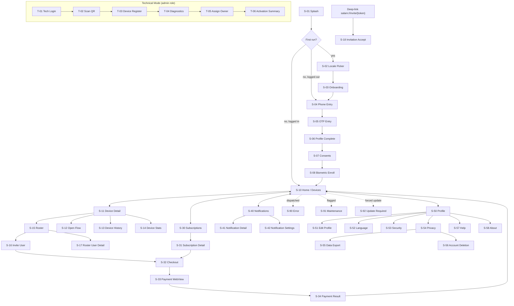
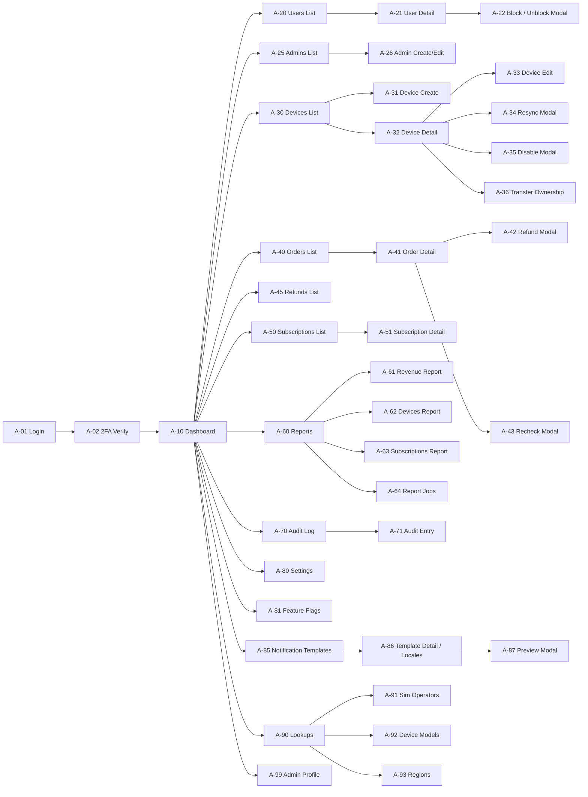
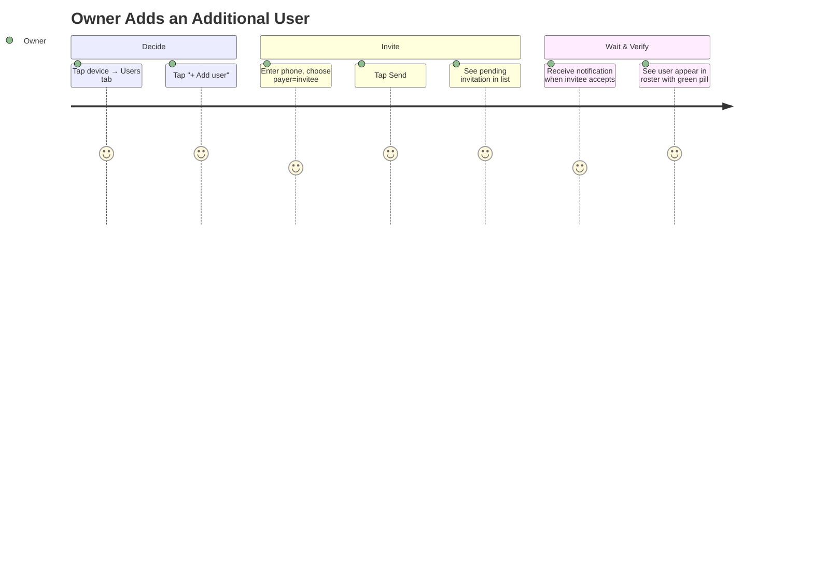
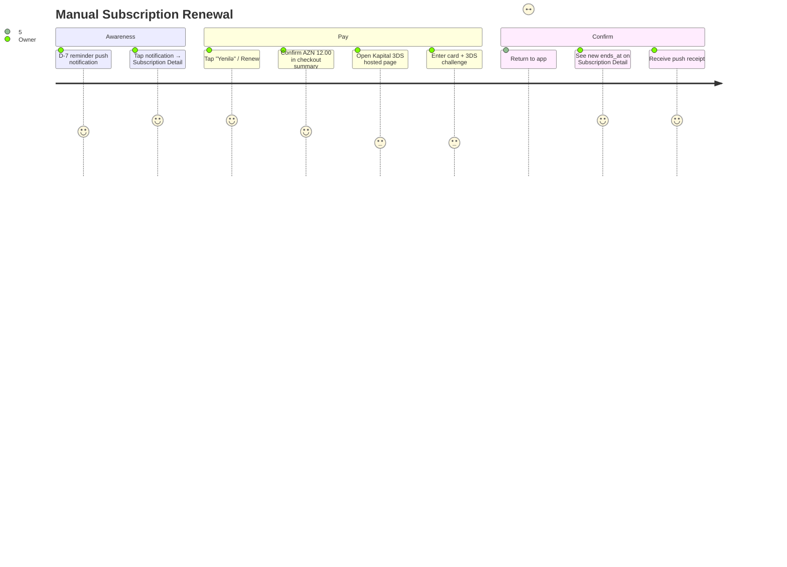

# Salam Həyətimiz — UI/UX Specification

**Version:** 1.1
**Status:** Post-audit revision; pre-Phase-1 baseline
**Changelog:** see [CHANGELOG.md](CHANGELOG.md). Version 1.1 applies the approved resolutions from [AUDIT_RESOLUTION_PLAN.md](AUDIT_RESOLUTION_PLAN.md).
**Cross-references:**
- [TECHNICAL_SPECIFICATION.md](TECHNICAL_SPECIFICATION.md) — §10 (Mobile), §11 (Admin)
- [DATABASE_ARCHITECTURE.md](DATABASE_ARCHITECTURE.md) — data model
- [openapi/v1.yaml](openapi/v1.yaml) — API contracts referenced as `API: <operationId>`

---

## Table of Contents

1. Document Purpose & Conventions
2. Design System
3. Cross-Cutting Patterns (states, errors, accessibility, motion)
4. Screen Map — Mobile
5. Screen Map — Admin
6. User Journey Diagrams
7. Flutter Mobile App — Screen Catalogue
   - 7.1 Boot & Onboarding
   - 7.2 Authentication
   - 7.3 Home & Devices
   - 7.4 Commands
   - 7.5 Roster & Invitations
   - 7.6 Subscriptions
   - 7.7 Orders & Payments
   - 7.8 Notifications
   - 7.9 Profile & Privacy
   - 7.10 Technical Mode
   - 7.11 System Screens (errors, maintenance, offline)
8. Laravel Admin Panel — Screen Catalogue
   - 8.1 Authentication
   - 8.2 Dashboard
   - 8.3 Users
   - 8.4 Admins
   - 8.5 Devices
   - 8.6 Orders & Payments
   - 8.7 Refunds
   - 8.8 Subscriptions
   - 8.9 Reports
   - 8.10 Audit Log
   - 8.11 Settings & Feature Flags
   - 8.12 Notification Templates
   - 8.13 Lookups (Sim Operators / Device Models / Regions)
   - 8.14 Admin Profile

---

## 1. Document Purpose & Conventions

This document specifies every screen across the two product surfaces — the Flutter mobile app and the Laravel Blade admin panel — at a level sufficient for design, engineering, and QA to share the same mental model. It is **not** a visual design (no mockups, no exact pixel values); it is the behavioural contract that the visual design will satisfy.

### 1.1 Per-Screen Schema

Every screen entry uses this consistent structure:

| Field | Definition |
|---|---|
| **Purpose** | One sentence on why this screen exists |
| **Components** | The structural anatomy — what the user sees |
| **User Actions** | Every interactive element and its outcome |
| **Validation** | Client-side rules and behaviours |
| **Loading State** | What appears while data is in-flight |
| **Empty State** | What appears when the list/data has zero items |
| **Error State** | What appears when an API call or action fails |
| **Success State** | What confirms a completed mutation |
| **Navigation** | Where this screen comes from and goes to |
| **API Dependencies** | OpenAPI `operationId`s consumed |

Screens are tagged `S-NN` (mobile) or `A-NN` (admin) to map to the §4–5 screen maps.

### 1.2 Conventions Used Throughout

- "Tap" = mobile click. "Press" = press-and-hold.
- "Sheet" = Material bottom sheet / iOS half-modal.
- "Toast" = transient non-blocking message, 3 s duration.
- "Snackbar" = same as toast with optional action.
- "Drawer" = side panel (admin).
- Asset placeholders: ⓘ info, ⚠ warn, ✕ destructive, ✓ success.

---

## 2. Design System

A lightweight system applied consistently across both surfaces. Concrete tokens (hex/sizes) are specified in the design file; this section names them.

### 2.1 Color Tokens (logical names)

| Token | Use |
|---|---|
| `brand-primary` | Primary CTAs, active nav, links |
| `brand-secondary` | Accents, secondary buttons |
| `surface-bg` | Page background |
| `surface-card` | Card / sheet background |
| `surface-overlay` | Modal scrim |
| `text-primary` | Body text, headings |
| `text-secondary` | Captions, helper text |
| `text-muted` | Disabled state |
| `text-inverse` | Text on dark/colored backgrounds |
| `border-default` | Card / divider edge |
| `border-strong` | Selected, focused inputs |
| `state-success` | ✓ success, "active" pills |
| `state-warning` | ⚠ near-expiry, soft warnings |
| `state-danger` | ✕ errors, destructive actions |
| `state-info` | ⓘ informational |

Dark mode supported via parallel token set. Contrast meets WCAG AA (4.5:1 for body, 3:1 for large text and meaningful icons).

### 2.2 Typography Scale

| Token | Use |
|---|---|
| `display` | Hero headings (rare; onboarding, payment success) |
| `headline` | Screen titles |
| `title-l / title-m / title-s` | Card titles, section headings |
| `body-l / body-m / body-s` | Body copy |
| `label-l / label-m / label-s` | Button labels, captions, pill text |
| `mono` | Codes (reference numbers, IDs) |

Fonts: **Inter** (Latin/Cyrillic) covers az + ru + en. Fallbacks: system default. Numerals tabular-aligned for monetary and time displays.

### 2.3 Spacing Scale

`4, 8, 12, 16, 24, 32, 48, 64` (4-pt base). All paddings, margins, and gaps use these values.

### 2.4 Radius / Elevation

- Radii: `4, 8, 12, 16, 24` (cards 12, sheets 16, FAB / pill chips full).
- Elevations: `0` (flat), `1` (card), `2` (sheet), `3` (dialog/popover), `4` (modal scrim sits below 4).

### 2.5 Component Library (logical)

Shared component names — implementation differs per surface but semantics align.

| Component | Purpose |
|---|---|
| `AppBar` | Top navigation bar with title, back, kebab |
| `BottomNav` (mobile) | Primary tab bar (Home, Subscriptions, Notifications, Profile) |
| `Sidebar` (admin) | Module navigation |
| `Card` | Container for a logical unit |
| `ListTile` | Row in a list |
| `StatusPill` | Colored compact badge (state-success/warning/danger/info) |
| `Button.primary / .secondary / .tertiary / .danger` | Action triggers |
| `IconButton` | Icon-only action |
| `TextField` | Validated input |
| `PhoneField` | Phone-specific input with +994 prefix locked |
| `OtpField` | 6-digit segmented input with paste support |
| `MoneyText` | Tabular-numeric formatted money |
| `DateText` | Locale-formatted timestamp |
| `Spinner` | Determinate / indeterminate progress |
| `Skeleton` | Shimmer placeholder while loading |
| `EmptyState` | Illustration + headline + CTA |
| `ErrorState` | Icon + message + retry CTA |
| `Toast / Snackbar` | Transient feedback |
| `Sheet` | Bottom modal (mobile) |
| `Dialog / Modal` | Confirmation / form (both) |
| `Drawer` | Side panel (admin) |
| `Table` (admin) | Sortable / paginated row collection |
| `Filter Bar` (admin) | Compose query filters |
| `Pagination Controls` (admin) | Cursor-based prev/next |

---

## 3. Cross-Cutting Patterns

### 3.1 The Six Required States

Every screen that hits an API must define behaviour for all of:

1. **Idle** — fresh paint, no in-flight requests.
2. **Loading** — initial fetch. Skeletons for layouts known in advance; spinner for actions.
3. **Empty** — query succeeded but returned zero rows. Always include an illustration, one-sentence explainer, and where applicable a primary CTA.
4. **Error** — request failed. Use `ErrorState` with retry button. Inline for content; toast for action.
5. **Success** — mutation acknowledged. Visual confirmation + appropriate next step.
6. **Offline** — connectivity lost. Banner at top of screen ("Offline — son sinxronizasiya 5 dəq əvvəl"); reads from cache where possible; mutations queued only for non-critical paths.

### 3.2 Error Surfacing Rules

| Source | Pattern |
|---|---|
| Field validation (client) | Inline below field, red text + outline |
| Field validation (server `422`) | Same field-level treatment; back-end key maps to client field |
| Auth error (`401`) | Force logout if refresh also fails; otherwise silent refresh |
| Authorization (`403`) | Toast + screen-level message; non-blocking |
| Cooldown (`429 cooldown`) | Inline countdown on the affected button |
| Rate limit (`429 rate_limited`) | Toast with `Retry-After` time |
| Payment provider (`503`) | Full-screen with retry and "contact support" |
| Network failure | `ErrorState` with retry |
| Server (`500`) | Generic error screen with request_id; "support" CTA |

### 3.3 Loading Patterns

- **Skeleton-first** for screens whose layout is predictable (lists, cards). Skeleton must be visually distinct from real content (gray, animated shimmer).
- **Optimistic UI** for: marking notifications read, toggling biometrics, toggling notification preferences. Roll back on error.
- **Pessimistic UI** for: open device, payments, refunds, role changes, account deletion. Always wait for server ack.

### 3.4 Pagination

Mobile uses **infinite scroll** atop cursor pagination — load next page when within 200 px of the bottom. Admin uses **explicit cursor pagination** (Prev / Next buttons) so URLs are shareable.

### 3.5 Accessibility (WCAG 2.1 AA target)

- Every interactive element has a non-visual label (`semanticsLabel` in Flutter, `aria-label` in Blade).
- Tap targets ≥ 44 × 44 pt mobile / 32 × 32 px admin.
- Contrast ≥ 4.5:1 for body, ≥ 3:1 for large text and meaningful icons.
- Keyboard navigation for admin: every form, table, and modal traversable without mouse.
- Screen reader: dynamic content announcements use polite live regions.
- Reduced motion: respect `prefers-reduced-motion` (system) — replace shimmer with static gray, drop FAB pulse.
- Text scaling: layout must hold up to 200 % font scale (mobile).

### 3.6 Motion & Haptics (Mobile)

- Page transitions: 200 ms cubic-out.
- Sheet present / dismiss: 220 ms ease.
- Success haptic on completed open (medium impact); error haptic on failed open (heavy impact); selection haptic on tab change.
- Open button: 1.5 s pulse loop while idle; replaced with progress arc while in-flight.

### 3.7 Localization

- Right-to-left support not required (az/ru/en all LTR).
- All copy lives in `lang/{az,ru,en}/*.php` (Laravel) and `intl_*.arb` (Flutter).
- Date and number formatting via `intl` package; currency `AZN` formatted as `12,00 ₼` per Azerbaijani convention.
- No string concatenation in code — use placeholders (`Salam {name}` not `"Salam " + name`).

### 3.8 Privacy in UI

- Phone numbers shown as `+994 50 *** 45 67` outside of self-profile.
- Card PAN shown as `**** 1234` only.
- No PII in screenshot / app-switcher preview: mobile sets `FLAG_SECURE` on Profile, Subscription, Payment screens; iOS hides content on backgrounding.

---

## 4. Screen Map — Mobile



### Mobile Bottom Nav

The bottom nav has exactly **four** entries, visible on top-level screens only:

| Order | Tab | Badge |
|---|---|---|
| 1 | Home (devices) | none |
| 2 | Subscriptions | dot when any sub expires in ≤ 7 days |
| 3 | Notifications | count of unread (max "9+") |
| 4 | Profile | dot if action required (e.g. unaccepted Terms version) |

---

## 5. Screen Map — Admin



### Admin Sidebar Modules

| Group | Modules |
|---|---|
| Operations | Dashboard, Devices, Users, Audit |
| Commerce | Orders, Refunds, Subscriptions, Reports |
| Configuration | Settings, Feature Flags, Notification Templates, Lookups |
| Security | Admins (super_admin only) |

Items are hidden when the role lacks any permission inside the module — never shown disabled.

---

## 6. User Journey Diagrams

### 6.1 New User Onboarding → First Open

```mermaid
journey
    title New User: Install → First Successful Open
    section Discovery
      Receive SMS invite link: 5: Invitee
      Tap deep link, install app from store: 4: Invitee
    section Auth
      Pick language: 5: Invitee
      Read 3 onboarding slides: 4: Invitee
      Enter phone: 4: Invitee
      Receive SMS OTP: 5: Invitee
      Enter OTP: 5: Invitee
      Provide name, accept Terms: 4: Invitee
      Enable biometrics: 4: Invitee
    section Activation
      Land on invitation card: 5: Invitee
      Accept invitation (sub paid by owner): 5: Invitee
      See device on Home: 5: Invitee
    section Use
      Tap device, biometric prompt: 5: Invitee
      Tap Open: 5: Invitee
      Hear gate move; success haptic: 5: Invitee
```

### 6.2 Device Owner: Add Additional User



### 6.3 Owner Pays For Renewal



### 6.4 Admin: Refund a Disputed Payment

```mermaid
journey
    title Admin Issues a Refund
    section Triage
      Open admin → Orders → filter status=paid: 4: Super Admin
      Search by user's phone or order reference: 4: Super Admin
      Open order detail: 5: Super Admin
    section Decision
      Read timeline, payment, audit context: 5: Super Admin
      Click Refund: 5: Super Admin
      Enter amount + reason: 4: Super Admin
    section Execute
      Confirm modal (with idempotency key): 5: Super Admin
      Refund initiated; status spinner: 4: Super Admin
      Bank acknowledges; status approved: 5: Super Admin
      Subscription shortened pro-rata (if full refund: cancelled): 5: Super Admin
      User receives push: refund processed: 5: User
```

### 6.5 Technical User: Provision a New Device

```mermaid
journey
    title Tech Installer Provisions a Device
    section Login
      Open app in Technical Mode (admin JWT): 5: Tech
      Scan QR on device label: 5: Tech
    section Register
      Form pre-fills serial; choose model + driver: 4: Tech
      Enter SIM phone; confirm with diagnostic ping: 4: Tech
      Ping succeeds; signal strength shown: 5: Tech
    section Assign
      Enter owner phone (creates user if needed): 4: Tech
      Activate device: 5: Tech
    section Verify
      Trigger test open: 5: Tech
      Confirm gate opens; status active: 5: Tech
```

---

## 7. Flutter Mobile App — Screen Catalogue

### 7.1 Boot & Onboarding

---

#### S-01 Splash

- **Purpose** — Bootstraps the app: reads stored auth, validates token, decides initial route.
- **Components** — Centred logo wordmark; subtle spinner under it; build version in fine print at bottom.
- **User Actions** — None. Auto-route.
- **Validation** — n/a.
- **Loading State** — Always loading; max 3 s before route. If still loading, transition to `S-90 Error` with retry.
- **Empty State** — n/a.
- **Error State** — If TLS cert pin fails or critical bootstrap config missing → `S-90 Error` with no retry, contact-support CTA.
- **Success State** — Routes to: `S-02 Locale` (first run) / `S-04 Phone` (logged out) / `S-10 Home` (logged in).
- **Navigation** — `entry` → one of the routes above.
- **API** — `GET /v1/health/live` (best effort, non-blocking), `POST /v1/auth/refresh` if a refresh token exists.

---

#### S-02 Locale Picker (first run only)

- **Purpose** — Allow user to choose UI language before reading anything else.
- **Components** — Title "Dil seçin / Выберите язык / Choose language", three large rectangular options (`AZ Azərbaycan`, `RU Русский`, `EN English`), Continue button.
- **User Actions** — Select one → Continue.
- **Validation** — Must select one before Continue is enabled.
- **Loading State** — n/a (no network).
- **Empty State** — n/a.
- **Error State** — n/a.
- **Success State** — Persist locale → `S-03 Onboarding`.
- **Navigation** — From `S-01` → `S-03`.
- **API** — None (preference stored locally; synced with `PATCH /v1/me` after login).

---

#### S-03 Onboarding (3 slides)

- **Purpose** — Communicate core value props (remote open, easy management, subscriptions).
- **Components** — PageView (3 slides); each slide: illustration, headline, body; bottom: dot indicator + "Skip" + "Next" (final slide: "Get started").
- **User Actions** — Swipe / tap Next; tap Skip (jumps to last and shows Get started); tap Get started → `S-04`.
- **Validation** — n/a.
- **Loading State** — n/a.
- **Empty / Error / Success / Offline** — n/a (purely local content).
- **Navigation** — From `S-02` → `S-04 Phone Entry`.
- **API** — None.

---

### 7.2 Authentication

---

#### S-04 Phone Entry

- **Purpose** — Collect phone number to send OTP.
- **Components** — Headline ("Telefon nömrəni daxil et"); `PhoneField` (locked +994 prefix, 9-digit body, formatted as `XX XXX XX XX`); Terms-of-use micro-copy with linked Terms & Privacy; Continue button.
- **User Actions** — Type phone digits; tap Continue; tap Terms / Privacy → opens external WebView; tap "Language" icon top-right → returns to `S-02`.
- **Validation** — Must be 9 digits; auto-format as user types; Continue disabled until pattern `^\d{9}$` matches.
- **Loading State** — Continue button shows inline spinner; field disabled.
- **Empty / Error States** — `429 rate_limited` → toast "Çox cəhd. {Retry-After}s sonra yenidən cəhd edin." `validation_failed` → inline field error.
- **Success State** — Navigate to `S-05 OTP Entry` with phone in route arguments.
- **Navigation** — `S-02 / S-03` → `S-04` → `S-05`.
- **API** — `requestOtp`.

---

#### S-05 OTP Entry

- **Purpose** — Verify the OTP and obtain tokens.
- **Components** — Headline showing masked phone "+994 50 *** 45 67"; `OtpField` (6 segmented digit boxes, auto-advance, paste-aware); Resend link with countdown (30 s before active); "Edit phone" link → back to `S-04`; bottom: "Don't have signal?" help link.
- **User Actions** — Type / paste 6 digits → auto-submits on completion; tap Resend (only after countdown); tap Edit phone.
- **Validation** — 6 digits only; pattern `^\d{6}$`.
- **Loading State** — Spinner overlay during submit (~500 ms typical); field disabled.
- **Error States** —
  - `wrong_code` → shake animation on field + inline "Kod yanlışdır. {n} cəhd qalıb."
  - `otp_expired` → inline "Kodun vaxtı bitib." with Resend immediately enabled
  - `otp_max_attempts` → blocking modal "Çox cəhd oldu. 10 dəq sonra yenidən cəhd edin." → back to `S-04` after dismiss
- **Success State** — Tokens persisted to secure storage; navigate to `S-06 Profile Complete` (if `full_name` null) or `S-08 Biometric Enroll` → `S-10 Home`.
- **Navigation** — `S-04` → `S-05` → `S-06 / S-08 / S-10`.
- **API** — `verifyOtp` → on 200 also dispatches `upsertPushToken` in background.

---

#### S-06 Profile Complete

- **Purpose** — Capture display name and locale (post-OTP, first login).
- **Components** — Headline "Səni necə tanıyaq?"; `TextField` for full name; locale selector (already pre-selected from S-02; can change); Save button.
- **User Actions** — Type name; change language; tap Save.
- **Validation** — Name length 1–120; trim whitespace.
- **Loading State** — Spinner in button.
- **Error State** — `422` → inline field error; `5xx` → toast + retry.
- **Success State** — Saved → `S-07 Consents`.
- **Navigation** — `S-05` → `S-06` → `S-07`.
- **API** — `updateMe`.

---

#### S-07 Consents

- **Purpose** — Collect explicit consent for Terms, Privacy, and optional marketing.
- **Components** — Three rows, each: title + short summary + checkbox. Required: Terms, Privacy. Optional: Marketing (push + SMS). "View document" link per row. Continue button.
- **User Actions** — Toggle checkboxes; tap "View document" → in-app WebView with the versioned document; tap Continue.
- **Validation** — Continue disabled until both required boxes are checked.
- **Loading State** — Spinner in Continue while persisting.
- **Error State** — Toast on failure; allows retry.
- **Success State** — Consents persisted → `S-08 Biometric Enroll`.
- **Navigation** — `S-06` → `S-07` → `S-08`.
- **API** — `recordConsent` (one call per consent kind).

---

#### S-08 Biometric Enroll

- **Purpose** — Optional opt-in to use Face ID / fingerprint to unlock the Open action.
- **Components** — Illustration of fingerprint/face; copy "Cihazları daha sürətli aç"; primary "Enable" button; secondary "Maybe later" link.
- **User Actions** — Tap Enable → triggers native biometric prompt; on success, persist locally and call `enrollBiometrics`. Tap Maybe later → skip to Home.
- **Validation** — n/a.
- **Loading State** — Native biometric UI handled by OS.
- **Error State** — User canceled or device lacks biometrics → toast "Biometrik mövcud deyil" → return to Maybe later behaviour.
- **Success State** — Settings flag set; navigate to `S-10 Home`.
- **Navigation** — `S-07` → `S-08` → `S-10`. Also reachable from `S-53 Security`.
- **API** — `enrollBiometrics`.

---

### 7.3 Home & Devices

---

#### S-10 Home / Devices

- **Purpose** — Default landing screen showing all devices the user can open or owns.
- **Components** —
  - `AppBar` with app name and notifications icon (badge count).
  - Filter chips: All / Owned / Used / Suspended.
  - Pull-to-refresh.
  - Vertical list of `DeviceCard` items: status pill, label, location, "Tap to open" hint, next-renewal chip (if ≤ 7 days).
  - Floating "+" if technical role (else hidden).
- **User Actions** — Tap card → `S-11 Device Detail`. Pull to refresh. Tap chip → filter. Tap notifications icon → `S-40 Inbox`.
- **Validation** — n/a.
- **Loading State** — 3 skeleton cards.
- **Empty State** — Empty illustration + "Hələ heç bir cihazın yoxdur" + "Owner cihaz əlavə edə bilər" + helper link to Help.
- **Error State** — `ErrorState` with retry button; chips remain visible.
- **Offline State** — Banner "Offline — son sinxronizasiya {time}"; uses cached list; opens disabled with inline tooltip.
- **Success State** — n/a (read-only screen).
- **Navigation** — Bottom-nav root. Pushes `S-11`.
- **API** — `listMyDevices`.

---

#### S-11 Device Detail

- **Purpose** — Detail view for a single device. Primary action: open.
- **Components** —
  - `AppBar` with device label + kebab (Rename if owner, Help).
  - Status row: `StatusPill` (Active / Suspended / Disabled / Offline), last online time.
  - Hero "Open" button (circular, brand-primary, large). Disabled with reason when not openable.
  - Subscription card: badge (`active` / `expiring soon` / `expired`), days remaining, Renew CTA.
  - Quick stats strip: Today's opens, Avg success rate.
  - Tabs / sections (sticky): **History** (last 10 of user's own opens), **Stats** (chart), **Users** (owner only).
  - Map snippet if lat/long present (read-only).
- **User Actions** —
  - Tap Open → biometric prompt → `S-12 Open Flow`.
  - Tap Renew → `S-31 Subscription Detail` (renew flow inline).
  - Tap Users tab → `S-15 Roster`.
  - Tap kebab → owner can rename inline.
  - Pull-to-refresh.
- **Validation** — Open disabled when sub expired (chip: "Subscription expired — Renew") / device disabled ("Disabled by admin") / cooldown active (countdown in seconds replaces label).
- **Loading State** — Skeleton hero + stat strip while initial fetch.
- **Empty State** — n/a.
- **Error State** — `403 subscription_required` → CTA flips to "Yenilə" linking to renewal. `403 device_disabled` → message + link to Help. `404` → toast and pop.
- **Success State** — Open success: button pulses green, success haptic, toast "Açıldı" *(only when `OpenCommand.driver_confirms_actuation = true`; see S-12 for CLIP-only nuance)*.
- **Per-caller suspension states** *(v1.1, CRIT-02)* — `Device.suspension_reason` drives copy and CTA:
  - `none` — device-wide active.
  - `subscription_expired` — caller's own sub expired; "Aboneliyiniz başa çatıb · Yenilə".
  - `owner_sub_expired_others_active` *(owners only)* — "Aboneliyiniz bitib. Cihaz hələ digər istifadəçilər üçün açıqdır. Aboneliyinizi yeniləyin." Owner can manage but not open.
  - `device_disabled` — "Admin tərəfindən bağlandı". Help link.
  - `device_suspended` — all users expired; same look as the user view above.
- **Navigation** — From `S-10`; pushes `S-12 / S-13 / S-14 / S-15 / S-31`.
- **API** — `getDevice`, `getDeviceStats`, `listDeviceCommands` (paged 10), and emits `openDevice` on Open.

---

#### S-12 Open Flow (Sheet)

- **Purpose** — Provide live feedback during an open command's lifecycle.
- **Components** — Bottom sheet, height ~40 % of viewport. Big circular progress arc; state label (e.g. "Göndərilir…" → "Dispatched…" → "Açıldı"); device name; Cancel link (only available while `queued`).
- **User Actions** — Tap Cancel (only valid pre-dispatch); tap outside to dismiss only after terminal state.
- **Validation** — n/a.
- **Loading / In-Flight State** — Arc spins; label updates from WebSocket events or 1 s polling fallback. Max display time 30 s; after that auto-collapses to `Failed`.
- **Empty State** — n/a.
- **Error State** — Arc turns red; label "Açılmadı — {reason}"; secondary "Yenidən cəhd et" button.
- **Success State** *(v1.1, CRIT-06)* — Driver-dependent:
  - `OpenCommand.driver_confirms_actuation = true` (Hybrid / MQTT, or CLIP+SMS with reply): arc green, check icon, medium-impact haptic, toast **"Açıldı"** — we have evidence the relay moved.
  - `driver_confirms_actuation = false` (CLIP-only, no feedback channel): arc green, **paper-plane icon**, soft haptic, toast **"Göndərildi"** — we sent the command but cannot confirm actuation. Optional inline prompt **"Qapı açıldı?"** with Yes / No — the answer persists to `open_command_feedback`. Used for the first 30 days post-launch to build per-device reliability metrics.
- **Navigation** — Modal over `S-11`. Dismisses back to `S-11`.
- **API** — `openDevice` (emit), then WebSocket channel `private-user.{id}` for `OpenCommand.updated`; fallback `getCommand` 1 s polling. Feedback POSTs to `submitOpenFeedback` (Phase 1 endpoint added by CRIT-06 resolution).

---

#### S-13 Device History

- **Purpose** — Show every open attempt by the current user on this device.
- **Components** — Date-range filter (default 30 d); state filter (All / Success / Failed); list of rows: timestamp, state pill, latency, driver. Tap row → details modal.
- **User Actions** — Adjust filters; scroll to load more; tap row.
- **Validation** — Date range max 90 d on a single query.
- **Loading State** — 5 skeleton rows.
- **Empty State** — "Bu cihaz üçün heç bir açılış tarixçəsi yoxdur."
- **Error State** — `ErrorState` + retry.
- **Success State** — n/a.
- **Navigation** — From `S-11`; modal for row detail.
- **API** — `listDeviceCommands` (paged 25, cursor-based).

---

#### S-14 Device Stats

- **Purpose** — Visualize device usage for the period.
- **Components** — Period switch (7d / 30d / 90d); bar chart of opens/day; KPI tiles: Total, Success rate, Avg latency, Last open.
- **User Actions** — Switch period; tap a bar → bottom sheet with that day's rows.
- **Loading / Empty / Error States** — Skeleton chart; "Seçilmiş dövr üçün məlumat yoxdur"; `ErrorState`.
- **Navigation** — From `S-11`.
- **API** — `getDeviceStats` + `listDeviceCommands` for drill-down.

---

### 7.4 Commands

(Open-flow specifics covered under `S-12`. No standalone "commands" screen at top level for users.)

---

### 7.5 Roster & Invitations

---

#### S-15 Roster (Owner only)

- **Purpose** — List users who have access to this device.
- **Components** —
  - Header: device name + capacity ("3 / 10 istifadəçi").
  - Tabs: **Active** | **Pending invitations** | **Revoked**.
  - List of rows: avatar (initials), masked phone, name, status pill, sub-status chip (active / expiring / expired).
  - Floating "+ Invite" button.
- **User Actions** — Tap row → `S-17 Roster User Detail`. Tap "+ Invite" → `S-16 Invite User`.
- **Validation** — Capacity guard: if at capacity → "+ Invite" disabled with tooltip. *(v1.1, HIGH-01)* Burst guard: if 5 whitelist changes are already pending on this device, "+ Invite" disabled with tooltip "Cihaza yazılmalı dəyişikliklər gözləyir — bir az sonra cəhd edin."
- **Loading State** — 3 skeleton rows.
- **Empty State** — Active tab: "Yalnız sən bu cihaza giriş hüququna malıksən" + Invite CTA. Pending: "Gözləyən dəvət yoxdur".
- **Error State** — `ErrorState`. `409 too_many_pending_changes` → inline banner above list. `409 roster_capacity_exceeded` → modal with the device's whitelist capacity.
- **Provisioning chip** *(v1.1, HIGH-01)* — Roster rows whose corresponding whitelist write is still `pending` / `in_progress` show a small "Provisioning…" chip on the avatar; tap reveals the queue position and ETA. Chip clears when `whitelist_changes.status = 'synced'`.
- **Success State** — After invite, snackbar "Dəvət göndərildi" with Undo (5 s window).
- **Navigation** — From `S-11`; pushes `S-16 / S-17`.
- **API** — `listDeviceRoster`, `listDeviceInvitations`.

---

#### S-16 Invite User (Owner)

- **Purpose** — Send an invitation to a phone number.
- **Components** —
  - `PhoneField`.
  - Role selector (currently always User).
  - **Payer** selector (radio): "Owner pays now" (default) / "Invitee pays later".
  - Price summary card (amount, currency, what gets activated).
  - Continue button → opens checkout if owner pays, or sends invite if invitee pays.
- **User Actions** — Enter phone; choose payer; tap Continue.
- **Validation** — Phone pattern `^\d{9}$`. Cannot invite an already-active roster member or oneself.
- **Loading State** — Spinner in Continue.
- **Error State** — `422` (already invited / on roster) → inline below phone field. Payment errors → see S-33.
- **Success State** — Owner pays: navigates to `S-32 Checkout`; on success, snackbar "Sub aktiv, dəvət göndərildi". Invitee pays: snackbar "Dəvət göndərildi", returns to `S-15` Pending tab.
- **Navigation** — From `S-15`. Returns to `S-15` (Pending tab); may detour through `S-32 / S-33 / S-34`.
- **API** — `createInvitation`; if owner pays, may chain into `createOrder` per server response.

---

#### S-17 Roster User Detail (Owner)

- **Purpose** — Show one user's status on this device with revoke action.
- **Components** — Masked phone, name, role, sub status, last open at, joined at; secondary "Revoke" button (destructive).
- **User Actions** — Tap Revoke → confirm modal "Bu istifadəçinin girişi ləğv ediləcək. Davam edək?" → confirm.
- **Validation** — Cannot revoke if user is the only owner (server enforces `409`).
- **Loading State** — Skeleton field rows.
- **Error State** — `409` → modal "Son sahibi ləğv edə bilməzsən."
- **Success State** — Snackbar "Giriş ləğv edildi"; pops back to `S-15`.
- **Navigation** — From `S-15`. Pops on success.
- **API** — `revokeRosterUser`.

---

#### S-18 Invitation Accept (Invitee)

- **Purpose** — Surface an incoming invitation and let the user accept or decline.
- **Components** — Inviting owner name + masked phone, device label, role, payer info; primary Accept button; secondary Decline link.
- **User Actions** — Tap Accept; tap Decline.
- **Validation** — n/a.
- **Loading State** — Spinner.
- **Error State** — `410` invitation expired / cancelled → "Bu dəvətin vaxtı bitib" + Close.
- **Success State** —
  - Owner pays already covered: snackbar "Cihazına xoş gəldin"; navigate to `S-11 Device Detail`.
  - Invitee pays: navigate to `S-32 Checkout`; on payment success → `S-11`.
- **Navigation** — Reached via deep link `salam://invite/{token}` or from `S-40 Inbox`. Pushes `S-32` on payer=invitee.
- **API** — `getInvitationByToken`, `acceptInvitation`, `declineInvitation`.

---

### 7.6 Subscriptions

---

#### S-30 Subscriptions

- **Purpose** — List user's subscriptions across all devices.
- **Components** — Filter chips (All / Active / Expiring / Expired); cards: device label, tier, status pill, days remaining bar, ends-at date.
- **User Actions** — Tap card → `S-31 Detail`; pull-to-refresh.
- **Loading State** — 3 skeleton cards.
- **Empty State** — "Heç bir abonelik tapılmadı".
- **Error State** — `ErrorState`.
- **Success State** — n/a.
- **Navigation** — Bottom-nav root; pushes `S-31`.
- **API** — `listMySubscriptions`.

---

#### S-31 Subscription Detail

- **Purpose** — Detail view with renewal action and period history.
- **Components** — Header: device label, tier, big "X days remaining" indicator; section: timeline of `subscription_periods`; CTA: Renew (manual) / Auto-renew toggle (disabled with info if Kapital token unavailable).
- **User Actions** — Tap Renew → `S-32 Checkout`. Toggle auto-renew → modal to confirm or pick saved card.
- **Loading State** — Skeleton sections.
- **Empty State** — n/a (period list shows at least one row if sub exists).
- **Error State** — `ErrorState`; toggle errors → toast.
- **Success State** — Renewal: navigate to `S-32`. Toggle: snackbar "Avtomatik yeniləmə aktivdir / söndürüldü".
- **Navigation** — From `S-30 / S-11 / S-40`. Pushes `S-32`.
- **API** — `getSubscription`, `toggleAutoRenew`.

---

### 7.7 Orders & Payments

---

#### S-32 Checkout

- **Purpose** — Confirm what will be charged and to whom; create an order.
- **Components** —
  - Line-item list (description, quantity, unit, total).
  - Total in `MoneyText`.
  - Payment method block (currently "Card via Kapital Bank"; future: saved cards).
  - Auto-renew toggle (default off) — locked off until tokenization available.
  - Terms reminder micro-copy.
  - Primary "Pay" button.
- **User Actions** — Toggle auto-renew (if eligible); tap Pay.
- **Validation** — Total ≥ 1 minor unit; user must be authenticated.
- **Loading State** — Spinner in Pay while creating order.
- **Error State** — `503` payment provider down → toast + retry. `422` → inline. `409` invalid state → toast.
- **Success State** — Order created → navigate to `S-33 Payment WebView` with `bank_redirect_url`.
- **Navigation** — Entry from `S-16 / S-31 / S-18`. Pushes `S-33`.
- **API** — `createOrder` with `Idempotency-Key`.

---

#### S-33 Payment WebView

- **Purpose** — Host the Kapital 3DS page and capture the return.
- **Components** — Full-screen WebView (no chrome except a top "Cancel" affordance); SSL lock + URL hostname shown small for trust.
- **User Actions** — Interact with bank page; tap Cancel → confirm modal "Ödənişi ləğv etmək istəyirsən?"
- **Validation** — n/a.
- **Loading State** — WebView built-in.
- **Error State** — Network loss → `ErrorState` with retry. Bank refused → return URL signals → `S-34`.
- **Success State** — Return URL captured (`salam://payment/return?orderId=...`) → `S-34 Payment Result`.
- **Navigation** — From `S-32`. Pushes `S-34` and pops itself.
- **API** — None directly; intercepts deep link and then `getOrder` to resolve final state.

---

#### S-34 Payment Result

- **Purpose** — Communicate the outcome of the payment with appropriate next step.
- **Components** —
  - Success: green check, "Ödəniş uğurludur", order reference, what got activated (device, sub).
  - Failure: red X, reason, support link, "Yenidən cəhd et" CTA.
  - Always: "Bağla" returns to whichever screen made sense (`S-30 / S-11`).
- **User Actions** — Tap CTA; tap Close.
- **Loading State** *(v1.1, HIGH-16)* — While `getOrder` resolves authoritative status (max 10 s). The `orderId` from the return URL is a **hint only**; the mobile app independently verifies the caller is the order's payer before rendering any detail. If the hint resolves to a 403 or 404, the app falls back to the user's most-recent in-flight order against the device or sub they were transacting on; if none exist, render the "indeterminate" state.
- **Error State** — If `getOrder` returns indeterminate after 10 s: orange info, "Status hələ təsdiqlənmədi. Bildirişlə xəbər verəcəyik." with Close.
- **Success State** — Confirmed paid → render success layout.
- **Navigation** — Pushed from `S-33`. Closing returns to the screen that initiated checkout.
- **API** — `getOrder`; on indeterminate, sets local flag so push notification handles confirmation later.

---

### 7.8 Notifications

---

#### S-40 Inbox

- **Purpose** — Show in-app notifications with unread count.
- **Components** — Tabs: All / Unread; rows: icon (by category), title, snippet, time-ago, unread dot; "Mark all as read" link in app bar.
- **User Actions** — Tap row → `S-41 Detail` (if it has detail) or deep link to relevant screen; tap mark-all.
- **Loading State** — 5 skeleton rows.
- **Empty State** — "Bildiriş yoxdur".
- **Error State** — `ErrorState`.
- **Success State** — Optimistic mark-read; reverts on error.
- **Navigation** — Bottom-nav. Pushes `S-41`.
- **API** — `listNotifications`, `markNotificationRead`, `markAllNotificationsRead`.

---

#### S-41 Notification Detail

- **Purpose** — Full read of a notification with deep CTA.
- **Components** — Title, body, related entity card (device/sub/order), action buttons (e.g. "Open subscription").
- **User Actions** — Tap CTA → deep route; back to inbox.
- **Loading / Error States** — Skeleton; `ErrorState`.
- **Success State** — Auto-marked read on view.
- **Navigation** — From `S-40`.
- **API** — `markNotificationRead` (auto on view).

---

#### S-42 Notification Settings

- **Purpose** — Toggle which marketing notifications the user receives.
- **Components** — Grouped list: per template_key/channel; non-mutable items shown disabled with lock icon and "Required" caption.
- **User Actions** — Toggle switches.
- **Validation** — n/a (server enforces immutability).
- **Loading State** — Skeleton rows.
- **Error State** — Toggle reverts + toast.
- **Success State** — Toast "Tənzimləmə saxlandı" (debounced).
- **Navigation** — From `S-53 Security` → "Notification preferences".
- **API** — `getNotificationSettings`, `updateNotificationSettings`.

---

### 7.9 Profile & Privacy

---

#### S-50 Profile (root)

- **Purpose** — Profile landing with edit and settings entry points.
- **Components** — Avatar (initials), name, masked phone; quick links: Edit profile, Language, Security, Privacy, Help, About, Log out.
- **User Actions** — Tap any link.
- **Loading / Error States** — Skeleton; `ErrorState`.
- **Success State** — n/a.
- **Navigation** — Bottom-nav. Pushes `S-51..S-58`.
- **API** — `getMe`.

---

#### S-51 Edit Profile

- **Purpose** — Edit name / email.
- **Components** — `TextField` for name; `TextField` for email (optional); Save button.
- **Validation** — Name 1–120; email RFC if present.
- **Loading State** — Spinner in Save.
- **Error State** — `422` → inline; `5xx` → toast.
- **Success State** — Snackbar "Yadda saxlandı".
- **Navigation** — Pops.
- **API** — `updateMe`.

---

#### S-52 Language

- **Purpose** — Switch UI language post-login.
- **Components** — Three radio rows.
- **User Actions** — Select → applies immediately, calls `PATCH /me`.
- **Loading State** — Brief spinner over radio.
- **Error State** — Toast; reverts.
- **Success State** — UI re-renders in new locale (no restart).
- **Navigation** — Pops.
- **API** — `updateMe`.

---

#### S-53 Security

- **Purpose** — Biometric and active-session controls.
- **Components** — Biometric toggle; "Active devices" subsection listing user installs (`user_devices`) with revoke; "Notification preferences" link → `S-42`.
- **User Actions** — Toggle biometric; revoke a session.
- **Validation** — Cannot revoke the current install from here.
- **Loading / Error / Success States** — Standard.
- **Navigation** — From `S-50`. Pushes `S-42`.
- **API** — `enrollBiometrics`, `disableBiometrics`; (active devices list will be added in P2; placeholder for MVP).

---

#### S-54 Privacy

- **Purpose** — Compliance entry: view consents, request export, delete account.
- **Components** — Consents card (latest state per kind, with timestamps); two CTAs: "Request data export", "Delete account".
- **User Actions** — Tap CTAs.
- **Loading / Error / Success States** — Standard.
- **Navigation** — Pushes `S-55 / S-56`.
- **API** — `listMyConsents`.

---

#### S-55 Data Export Request

- **Purpose** — Submit a personal-data export request.
- **Components** — Explainer copy (process, timing 7 days); confirmation checkbox; Submit button.
- **User Actions** — Tap Submit.
- **Validation** — Checkbox required.
- **Loading / Error States** — Standard.
- **Success State** — "Sorğun qəbul edildi. Hazır olanda bildiriş alacaqsan."
- **Navigation** — Pops to `S-54`.
- **API** — `requestDataExport`.

---

#### S-56 Account Deletion

- **Purpose** — Confirm and submit an account deletion request.
- **Components** — Two-step destructive flow: (1) Warning page with implications; (2) Phone confirm dialog requiring user to type their phone exactly.
- **User Actions** — Step through; type phone; Submit.
- **Validation** — Phone match exact; server blocks if any owned device has an active sub by the owner or any invitee (`409 successor_required`).
- **`successor_required` state** *(v1.1, HIGH-10)* — When the server returns 409 with `code=successor_required`, the screen presents:
  - A list of blocking devices (`error.details.devices`) with label and a "Transfer ownership" or "Contact support" CTA. Transfer is admin-mediated in MVP (the user contacts support; a self-service transfer flow is Phase 2).
  - Copy: "Cihazlarınızın yeni sahibi təyin edilməlidir. Dəstəklə əlaqə saxlayın."
  - The Submit button is replaced by Close until the situation resolves.
- **Loading / Error State** — `409` other code → toast.
- **Success State** — Soft-logged-out; PII anonymised immediately *(v1.1, HIGH-12)*; full-screen confirmation "Hesabınız silindi. 30 gün ərzində bərpa üçün dəstəklə əlaqə saxlaya bilərsiniz."
- **Navigation** — Terminal; closes app or returns to `S-04`.
- **API** — `requestDataDeletion` (alternative to `deleteMe`; we use the request flow for audit).

---

#### S-57 Help

- **Purpose** — Static FAQ + contact channels.
- **Components** — Categorised collapsible FAQ; "Contact us" with phone link and WhatsApp link.
- **API** — None (static / CMS-backed).

---

#### S-58 About

- **Purpose** — Show version, licenses, links to Terms / Privacy.
- **Components** — App name, version, build, links.
- **API** — None.

---

### 7.10 Technical Mode

Activated when the admin JWT for a `technical` role authenticates the app. Technical mode replaces the bottom nav with a single "Devices" entry and exposes the screens below.

---

#### T-01 Tech Login

- **Purpose** — Authenticate a technical / super-admin user inside the mobile app.
- **Components** — Email field, password field, "Login" button. After step 1, TOTP field appears.
- **Validation** — Email pattern, password ≥ 8.
- **Loading / Error States** — Spinner in button; standard error toasts.
- **Success State** — Tokens persisted; navigate to `T-02 Scan QR`.
- **API** — `adminLogin`, `adminVerify2fa`.

---

#### T-02 Scan QR

- **Purpose** — Scan the QR code on the device label to seed registration data.
- **Components** — Live camera viewfinder; manual-entry fallback link.
- **Validation** — QR payload schema (vendor, model_code, serial); rejected if doesn't match.
- **Loading State** — Camera initialising overlay.
- **Error State** — "QR oxunmadı" + manual fallback.
- **Success State** — Push to `T-03 Register` with fields pre-filled.
- **API** — None on this screen.

---

#### T-03 Device Register

- **Purpose** — Create the device record.
- **Components** — Form: serial (locked from QR), `device_model_id` (select), driver_type (select per model defaults), `sim_phone` (`PhoneField`), `sim_operator_id` (select), region (select), location label (text), latitude/longitude (auto from GPS, editable), firmware version (optional).
- **Validation** — All required; serial unique check via API; sim_phone uniqueness check.
- **Loading State** — Spinner on Save.
- **Error State** — `422 validation_failed` (serial dup) → inline; `5xx` → toast.
- **Success State** — Device created; auto-advance `T-04 Diagnostics`.
- **API** — `techRegisterDevice`.

---

#### T-04 Diagnostics

- **Purpose** — Verify connectivity to the device before assigning.
- **Components** — Big "Ping device" button; result panel: online status, signal strength bars, firmware reported, last response time.
- **User Actions** — Tap Ping; on success, Continue; on fail, Retry.
- **Loading State** — Pulsing radar animation.
- **Error State** — `502 device_offline` → red panel + reason; offer Retry and "Skip" with confirm.
- **Success State** — Green panel; Continue advances to `T-05`.
- **API** — `techDiagnosticsPing`.

---

#### T-05 Assign Owner

- **Purpose** — Bind the device to its owner (existing or new).
- **Components** — `PhoneField` for owner phone; status hint ("Existing user" / "New user — will receive invite SMS"); region selector (pre-filled), location label, GPS.
- **Validation** — Phone format; auto-resolves user on blur.
- **Error State** — `409` device already assigned → red panel + return.
- **Success State** — Device status → `active`; advance to `T-06`.
- **API** — `techAssignDevice`.

---

#### T-06 Activation Summary

- **Purpose** — Provide a final confirmation card with the option to test open.
- **Components** — Card recap: device, owner, region; primary "Test open" button; secondary "Done — register another" link.
- **User Actions** — Test open → backend issues test open (audited as `source=automation`); Done → loops back to `T-02`.
- **API** — `openDevice` (server treats with technical-user provenance), `getCommand`.

---

### 7.11 System Screens

---

#### S-90 Generic Error

- **Purpose** — Last-resort error for unhandled boot or critical failure.
- **Components** — Icon, headline, body, `request_id` if available, primary "Try again", secondary "Contact support".
- **API** — None.

---

#### S-91 Maintenance Mode

- **Purpose** — Inform user the platform is undergoing planned maintenance.
- **Components** — Illustration; window-end time; secondary "Status page" link.
- **API** — Read from `feature_flags` (`maintenance.mobile`) at app start.

---

#### S-92 Update Required

- **Purpose** — Force-upgrade for unsupported app versions.
- **Components** — Headline; current vs minimum version; primary "Update now" → store link; no skip.
- **API** — Read from app config endpoint at boot.

---

#### S-93 Offline Banner

- **Purpose** — Persistent banner at top of any tab indicating no connectivity.
- **Components** — Slim warning strip with last-sync time and Retry icon.
- **API** — None directly; emits a connectivity event.

---

## 8. Laravel Admin Panel — Screen Catalogue

Layout: persistent left `Sidebar`, top breadcrumb bar, content area. All tables use cursor pagination and server-side filtering. Standard CRUD modals reuse the same shape — referenced inline rather than redefined per module.

---

### 8.1 Authentication

---

#### A-01 Admin Login

- **Purpose** — Step 1 of admin authentication: email + password.
- **Components** — Centered card on neutral background; logo; email field; password field with show/hide; "Sign in" button; "Forgot password?" link.
- **User Actions** — Submit form; tap Forgot.
- **Validation** — Email format; password length ≥ 8.
- **Loading State** — Spinner in Sign-in.
- **Empty State** — n/a.
- **Error State** — Inline "Invalid credentials" (no enumeration of which field). Lockout banner after N failures.
- **Success State** — Push to `A-02 2FA`.
- **Navigation** — Entry point. → `A-02`.
- **API** — `adminLogin`.

---

#### A-02 2FA Verify

- **Purpose** — Submit TOTP from authenticator app, or a one-time recovery code.
- **Components** *(v1.1, CRIT-09)* — Mode toggle at top: **"Authenticator code"** (default) | **"Recovery code"**.
  - Authenticator mode: six-digit code field; "Verify" button.
  - Recovery mode: 10-hex-char field (formatted as `XXXX-XXXX-XX` while typing); helper copy "Bu kod yalnız bir dəfə istifadə oluna bilər."
- **User Actions** — Type code; submit. Optional: "Lost your phone?" link → support contact.
- **Validation** — TOTP `^\d{6}$`; recovery `^[0-9a-f]{10}$` (case-insensitive accepted; normalised before submit).
- **Loading / Error / Success States** — Standard. Expired challenge → back to `A-01` with toast. Used-up recovery → inline "Bu kod artıq istifadə olunub" + offer regenerate-after-login path.
- **Navigation** — → `A-10 Dashboard`. Successful login with recovery code prompts a banner on `A-99` to regenerate codes.
- **API** — `adminVerify2fa` accepts either `totp` or `recovery_code` in the body.

---

#### A-03 Forgot Password (P2)

- **Purpose** — Email-link password reset.
- (Out of MVP scope; provisioned for P2.)

---

### 8.2 Dashboard

---

#### A-10 Dashboard

- **Purpose** — Operator's heads-up view of system health and commerce KPIs.
- **Components** —
  - Period switcher (Today / 7d / 30d).
  - KPI tile grid (one per: Devices total, Devices online, Active subs, New users, Opens today, Open success rate, Gross revenue, Net revenue).
  - Section: "Devices needing attention" (offline > 24 h list, paginated).
  - Section: "Recent failed payments".
  - Section: "Subscriptions expiring in 7 days".
- **User Actions** — Switch period; tap any row → navigates to filtered list.
- **Loading State** — Skeleton tiles + 3 skeleton rows per section.
- **Empty State** — Per-section: "Nothing to look at — all good".
- **Error State** — Tile-level error placeholder; sections render independently.
- **Success State** — n/a.
- **Navigation** — Sidebar root. Pushes to A-20 / A-30 / A-40 / A-50.
- **API** — `adminMetricsOverview`, plus targeted list calls for inline sections.

---

### 8.3 Users

---

#### A-20 Users List

- **Purpose** — Find an end user.
- **Components** — Filter bar: search (`q` over phone/email/name), status (active / blocked / self_deleted); table columns: phone, name, email, status pill, devices count, active subs, created_at, last_login_at; row hover → "View" link; bulk action disabled (single-row workflows only).
- **User Actions** — Search; filter; click row → `A-21`.
- **Loading State** — Skeleton table rows.
- **Empty State** — "No users match these filters."
- **Error State** — Inline error + retry.
- **Success State** — n/a (read-only).
- **Navigation** — From `A-10` or sidebar.
- **API** — `adminListUsers`.

---

#### A-21 User Detail

- **Purpose** — Drill into one user.
- **Components** — Header card: avatar, phone, name, email, status, "Block / Unblock" button; Tabs: **Overview** (recent activity), **Devices** (roster across all devices), **Subscriptions**, **Orders**, **Installs** (devices/sessions), **Audit** (entries where actor is this user).
- **User Actions** — Tap Block → `A-22`; switch tabs; click cross-references (device, order).
- **Loading State** — Skeleton sections.
- **Empty State** — Per-tab.
- **Error State** — Per-section.
- **Success State** — After block/unblock: badge updates + toast.
- **Navigation** — From `A-20`. Cross-links to `A-32 / A-41 / A-51`.
- **API** — `adminGetUser`, plus tab-specific calls (`adminListOrders`, `adminListSubscriptions`, etc., with `payer_user_id` or analogous filter).

---

#### A-22 Block / Unblock Modal

- **Purpose** — Reason-captured destructive user action.
- **Components** — Modal: warning copy; reason `TextArea` (required for block); Confirm + Cancel.
- **Validation** — Reason 3–255 chars.
- **Loading / Error / Success States** — Spinner in Confirm; inline 422; closes with toast on success.
- **API** — `adminBlockUser` / `adminUnblockUser`. `Idempotency-Key` set client-side.

---

### 8.4 Admins

---

#### A-25 Admins List

- **Purpose** — Manage back-office accounts. Super-admin only.
- **Components** — Filter: role, status; table: email, name, role, 2FA enabled, status, last_login_at; row actions: Edit, Offboard.
- **API** — `adminListAdmins`.

---

#### A-26 Admin Create / Edit

- **Purpose** — Provision or update an admin.
- **Components** — Form: email (immutable on edit), name, role, phone, status; password fields (create only); enforce-2FA toggle.
- **Validation** — Email format; password ≥ 12 with complexity; phone E.164; role enum.
- **Error State** — `422` inline; specific message for email collision.
- **Success State** — Toast + back to list.
- **API** — `adminCreateAdmin`, `adminUpdateAdmin`, `adminOffboardAdmin`.

---

### 8.5 Devices

---

#### A-30 Devices List

- **Purpose** — Search the device fleet.
- **Components** — Filter bar: status, owner (phone search), region, search by serial or sim_phone; quick chips for "Offline > 24h", "Suspended"; table: serial, sim_phone, model, status pill, owner, region, last_online_at, signal strength sparkline (last 24 h).
- **User Actions** — Filter; click row → `A-32`; primary "Register device" → `A-31`.
- **Loading / Empty / Error States** — Standard.
- **API** — `adminListDevices`.

---

#### A-31 Device Create (admin form)

- **Purpose** — Web alternative to mobile technical mode.
- **Components** — Same fields as `T-03` plus initial owner phone (optional; can be assigned later).
- **Validation** — Same rules as `T-03`.
- **API** — `adminCreateDevice`.

---

#### A-32 Device Detail

- **Purpose** — Operator's full view of one device.
- **Components** —
  - Header: serial, model, status pill, owner badge, "last seen" age.
  - Action row: Edit, Resync whitelist, Test ping, Disable / Enable, Transfer, Decommission.
  - Tabs: **Overview** (location map, current driver, whitelist usage), **Users** (roster), **Commands** (paginated `listDeviceCommands`), **Diagnostics** (chart of last 30 d signal + recent rows), **Whitelist queue** (pending changes), **Audit** (this device's events).
- **User Actions** — Each action triggers its modal/screen (A-33 / A-34 / A-35 / A-36).
- **Loading / Error States** — Skeletons; sections render independently.
- **Success State** — Toast and refetch on action success.
- **Navigation** — From `A-30`; pushes / opens modals.
- **API** — `adminGetDevice`, `adminDeviceCommands`, `adminDeviceDiagnostics`, `adminWhitelistQueue`.

---

#### A-33 Device Edit

- **Purpose** — Modify mutable fields.
- **Components** — Form mirroring writable fields of `DeviceAdminUpdate`.
- **Validation** — Per schema.
- **API** — `adminUpdateDevice`.

---

#### A-34 Resync Whitelist Modal

- **Purpose** — Force a full whitelist re-push.
- **Components** — Modal: warning copy ("queues a refresh of the device's authorised phone list — may take up to 1 minute"); Idempotency note; Confirm + Cancel.
- **API** — `adminResyncWhitelist`.

---

#### A-35 Disable / Enable Modal

- **Purpose** — Toggle device-wide open block.
- **Components** — Modal: reason (required for disable); Confirm + Cancel.
- **Validation** — Reason 3–255.
- **API** — `adminDisableDevice` / `adminEnableDevice`.

---

#### A-36 Transfer Ownership

- **Purpose** — Move device to a new owner.
- **Components** — Form: new owner phone, reason, "Keep existing users" toggle (default on).
- **Validation** — Phone E.164; reason required.
- **Confirmation** — Two-step: review + confirm with phrase "transfer".
- **API** — `adminTransferDevice`.

---

### 8.6 Orders & Payments

---

#### A-40 Orders List

- **Purpose** — Search financial activity.
- **Components** — Filter: status, purpose, date range, payer phone; table: reference, payer, purpose, amount, status pill, created_at; export action queues a Report Job.
- **API** — `adminListOrders`, `adminCreateReportJob`.

---

#### A-41 Order Detail

- **Purpose** — Full payment timeline for one order.
- **Components** —
  - Header: reference, payer, status, amount, currency.
  - Items table.
  - Payments table (charges, refunds, reversals) with bank tx IDs.
  - Timeline of events (created → redirect → callback received → verified → paid → …).
  - Action buttons: Refund, Recheck (with rate-limit note).
- **API** — `adminGetOrder`.

---

#### A-42 Refund Modal

- **Purpose** — Initiate refund against the order.
- **Components** — Amount (defaults to full net), reason (required), preview of subscription-impact, confirm with re-typed "REFUND".
- **Validation** — Amount ≤ net; reason 3–255.
- **Loading / Error States** — Standard, with payment-provider-aware messaging (`503`).
- **API** — `adminRefundOrder` with `Idempotency-Key`.

---

#### A-43 Recheck Modal

- **Purpose** — Re-query Kapital for authoritative status.
- **Components** — Confirm + Cancel.
- **API** — `adminRecheckOrder`.

---

### 8.7 Refunds

---

#### A-45 Refunds List

- **Purpose** — Operational queue of refund workflows.
- **Components** — Filter: status; table: order ref, requested_by_admin, amount, reason snippet, status pill, created_at; row → A-41 underlying order.
- **API** — `adminListRefunds`.

---

### 8.8 Subscriptions

---

#### A-50 Subscriptions List

- **Purpose** — Find subscriptions.
- **Components** — Filter: status, expires_within_days; table: id, device, user, tier, status, ends_at; sub-row chip: auto-renew on/off.
- **API** — `adminListSubscriptions`.

---

#### A-51 Subscription Detail

- **Purpose** — Single sub with periods, related order, and renewal history.
- **Components** — Header, periods table (`subscription_periods`), order link, related device link.
- **API** — `getSubscription` (admin route uses same response shape with extended context).

---

### 8.9 Reports

---

#### A-60 Reports Home

- **Purpose** — Hub for the three pre-built reports + job history.
- **Components** — Four cards: Revenue, Devices, Subscriptions, Report Jobs (history).
- **API** — None directly.

---

#### A-61 Revenue Report

- **Purpose** — Daily revenue from materialised stats.
- **Components** — Date-range pickers (default last 30 d); purpose multi-select; KPI strip (gross, refunds, net, tx); stacked bar chart + table; "Export CSV" → spawns report job.
- **Validation** — `since` ≤ `until`; range ≤ 365 d.
- **Loading / Empty / Error States** — Standard.
- **API** — `adminReportsRevenue`, `adminCreateReportJob`.

---

#### A-62 Devices Report

- **Purpose** — Device-fleet health distribution.
- **Components** — Status-count pie chart; by-region table; offline-devices list with last-online age.
- **API** — `adminReportsDevices`.

---

#### A-63 Subscriptions Report

- **Purpose** — Sub status counts over a date range.
- **Components** — Date-range; daily stacked area chart; KPI strip (active end-of-period, new, renewed, expired, cancelled).
- **API** — `adminReportsSubscriptions`.

---

#### A-64 Report Jobs List

- **Purpose** — Track async exports.
- **Components** — Table: id, kind, status, requested_by, started/finished, "Download" link when `result_url` present; auto-refresh of `running` rows every 5 s.
- **API** — `adminListReportJobs`, `adminGetReportJob`.

---

### 8.10 Audit Log

---

#### A-70 Audit Log Search

- **Purpose** — Forensic search across all privileged actions.
- **Components** — Filter bar: actor_kind, actor_id, action key autocomplete, entity_type, entity_id, IP, date range; table: timestamp, actor (with avatar), action, entity, summary; row → `A-71`.
- **Validation** — Date range required; max 90 d per query.
- **API** — `adminAuditSearch`.

---

#### A-71 Audit Entry Detail

- **Purpose** — Full payload of a single audit row.
- **Components** — Metadata block; JSON viewer for `payload_redacted`; cross-link to entity if resolvable.
- **API** — Re-uses the row already in memory; no separate call.

---

### 8.11 Settings & Feature Flags

---

#### A-80 Settings

- **Purpose** — Edit runtime configuration (prices, cooldowns, timings).
- **Components** — Grouped table: key, value (typed editor depending on `value_type`), description, last updated; per-row "Edit" pencil → inline modal.
- **Validation** — Per `value_type` (int positive, money_minor positive, bool toggle, json valid).
- **Confirmation** — Two-step for money_minor and cooldowns (high blast radius).
- **API** — `adminListSettings`, `adminUpdateSetting` with `Idempotency-Key`.

---

#### A-81 Feature Flags

- **Purpose** — Toggle product flags or rollout percentages.
- **Components** — Per flag: enabled toggle, rollout slider (0–100 %), target user IDs (chips with phone search), description, last updated.
- **Validation** — Slider 0–100; target IDs must resolve to existing users.
- **API** — `adminListFeatureFlags`, `adminUpdateFeatureFlag`.

---

### 8.12 Notification Templates

---

#### A-85 Templates List

- **Purpose** — Browse all notification templates.
- **Components** — Table: template_key, category badge, channels chips (push/sms/inapp/email), user-mutable flag, active flag.
- **API** — `adminListNotificationTemplates`.

---

#### A-86 Template Detail & Locales

- **Purpose** — Edit per-locale bodies and channel configuration.
- **Components** — Header: template_key, category, channels mask editor, active toggle; Tabs for `az / ru / en`, each with subject (optional) + body (TextArea with placeholder syntax helper); "Preview" button.
- **Validation** — Body required, ≤ 4000 chars; placeholder reference doc shown alongside; lint warnings for unknown placeholders.
- **API** — `adminGetNotificationTemplate`, `adminUpdateNotificationTemplate`, `adminUpsertNotificationTemplateLocale`.

---

#### A-87 Template Preview Modal

- **Purpose** — Render template with sample variables before saving.
- **Components** — Locale switch; key/value input grid for variables; rendered subject + body preview.
- **API** — `adminPreviewNotificationTemplate`.

---

### 8.13 Lookups

---

#### A-90 Lookups Home

- **Purpose** — Single page index for the three lookup tables.
- **Components** — Three cards routing to A-91 / A-92 / A-93.

---

#### A-91 Sim Operators

- **Purpose** — Manage SIM operators.
- **Components** — Table: code, name, country, MCC-MNC, active toggle; "Add operator" button.
- **Validation** — Code unique; name 1–60.
- **API** — `adminListSimOperators`; create/update endpoints scoped to super_admin (admin routes; not exposed in mobile).

---

#### A-92 Device Models

- **Purpose** — Manage supported hardware models with capability flags.
- **Components** — Table: vendor, model_code, supports_clip, supports_sms, supports_mqtt, whitelist_capacity, sms_open_command, default_driver_type, active.
- **API** — `adminListDeviceModels` (CRUD endpoints same as A-91 pattern).

---

#### A-93 Regions

- **Purpose** — Manage city / district hierarchy.
- **Components** — Tree view (parent → children); per-node: code, name, active.
- **API** — `adminListRegions`.

---

### 8.14 Admin Profile

---

#### A-99 Admin Profile

- **Purpose** — Self-service profile for the current admin.
- **Components** — Name, email (immutable), phone, change password section (current + new + confirm), 2FA management (view secret QR for first enrollment, disable requires super_admin), **Recovery codes section** *(v1.1, CRIT-09)*, "Sign out everywhere" button.
- **Recovery codes section** —
  - Status row: "N of 8 codes remaining" (read from non-null entries in `recovery_codes_hashes`); warning chip when ≤ 2 remain.
  - Primary action: **"Generate new codes"** — opens a modal that requires re-entering the current TOTP, then shows the new 8 codes once (copyable / downloadable as `.txt`); the previous set is invalidated atomically.
  - Banner shown after login-with-recovery-code: "Bir bərpa kodundan istifadə etdiniz. Yeni bərpa kodları yaratmanız tövsiyə olunur."
- **Validation** — Password complexity per A-26. Recovery-code regeneration requires fresh TOTP confirmation (re-auth pattern).
- **API** — `adminMe`, password change endpoint (scoped under self), **`regenerateRecoveryCodes`** *(v1.1, new)*.

---

## 9. Cross-Surface Patterns Recap

| Concern | Mobile | Admin |
|---|---|---|
| Empty list | Illustration + headline + (optional CTA) | Plain message line in table |
| Loading list | Skeleton card rows | Skeleton table rows |
| Loading action | Inline button spinner | Inline button spinner + disabled form |
| Validation | Inline field error | Inline field error |
| Confirm destructive | Bottom sheet with explicit phrase OR re-typed value | Modal with re-typed value |
| Pagination | Infinite scroll | Cursor Prev/Next |
| Offline | Persistent banner | Banner + disable mutating actions |
| Locale switch | Persisted + applied without restart | Persisted + applied per-admin |
| Error envelope | `error.message` shown to user; `request_id` revealed in detail expansion | Toast + always-visible `request_id` link to audit |

---

## 10. Open UX Questions for Review

These decisions still need product sign-off:

1. **Bottom nav order** — Subscriptions vs Notifications as second tab? Spec uses Subscriptions second because billing actions are higher-stakes.
2. **Owner-as-user model** — Can an Owner also be a "User" on the device (e.g. for own access) without paying twice? Spec assumes owner's main-user sub also covers owner's opens (no double charge).
3. **Push permission timing** — Ask immediately after biometric enrolment, or after first device tile renders? Spec defers to first device load.
4. **Map snippet on S-11** — Static thumbnail (cheap) or interactive (richer)? Spec uses static for MVP.
5. **Admin role for technical-mode mobile** — Should a `technical` admin also see the regular mobile experience for their own personal devices? Spec assumes yes; mode toggle is a button in Admin Profile.
6. **Recovery code for admin 2FA** — Out of MVP; P2 placeholder shown on `A-02`.
7. **Account-deletion wait period** — Spec uses 30-day reversible window. Confirm legally with counsel for AZ Personal Data Law specifics.

---

*End of UI/UX Specification v1.0.*
